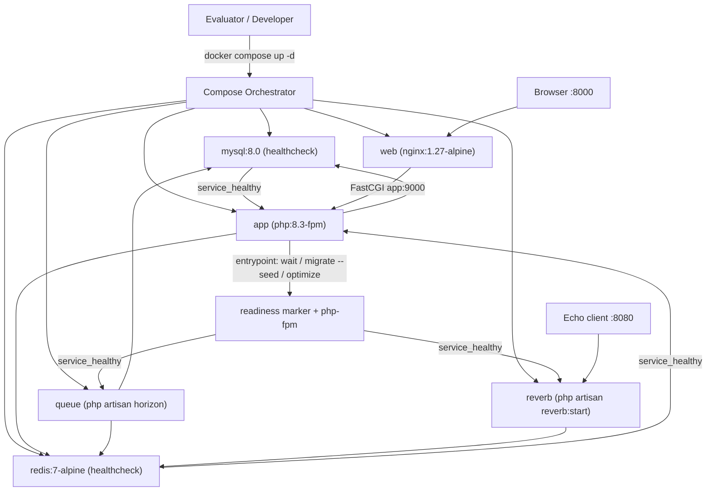
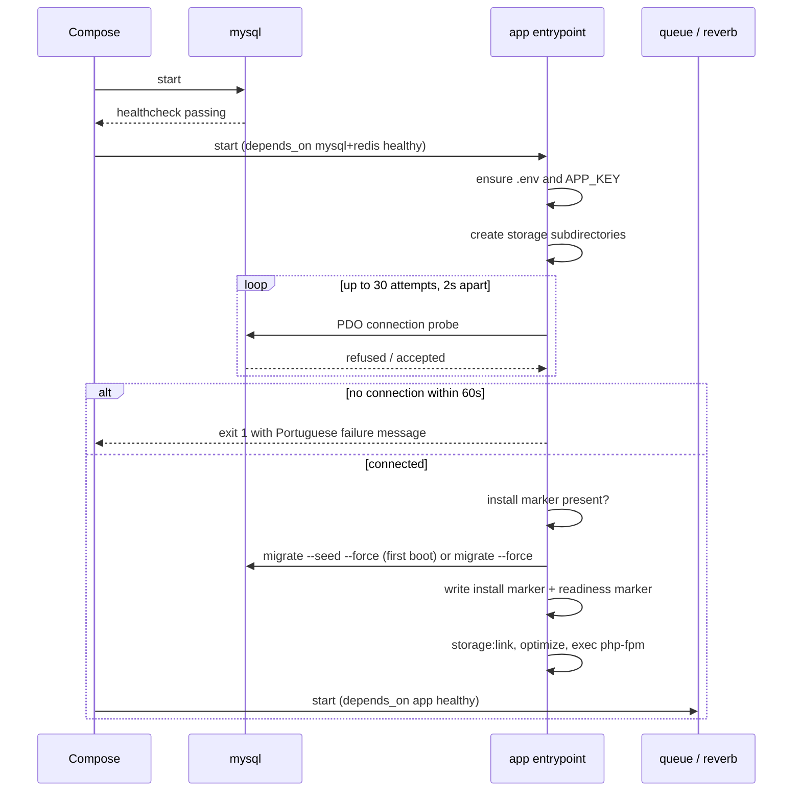

# Technical Specification: Application Environment and Delivery

## 1. Technical Overview

**What:** A six-service `docker-compose` stack that boots the entire PokéLink application from a single `docker compose up -d`, together with the Laravel 12 project skeleton it runs, the Breeze/Livewire authentication scaffold, a self-healing container entrypoint that waits on MySQL before migrating and seeding, a complete `.env.example` that works verbatim inside Compose, and the `README.md` that documents the whole procedure.

**Why:** Every subsequent feature (F02–F13) executes inside this stack and inherits its conventions. The Redis cache store that F05 caches PokeAPI payloads into, the Redis queue connection and Horizon worker that F06 dispatches the catalog sync onto, the Reverb WebSocket server that F12 broadcasts messages through, the database-backed session store F02 authenticates against, and the Vite/Tailwind pipeline F04 builds its component primitives on are all established here. Getting the boot sequence deterministic matters more than any single service: an evaluator who has to run a second command, edit a placeholder, or wait out a crash-loop has already formed a judgement about the codebase before seeing a line of it.

**Complexity:** complex — six orchestrated services, a multi-stage image build, a cross-service readiness protocol, three package installations that each publish configuration and providers, and a boot path whose failure modes must all surface as explicit Portuguese messages rather than as a 500 page later.

The central design tension is that this stack serves two audiences with opposite needs. The evaluator wants an immutable artifact that boots identically from a clean clone. The developer building F02–F13 wants to edit a PHP file and see the change without rebuilding an image. The resolution is a multi-stage image that bakes `vendor/` and `public/build/` at build time, combined with a source bind mount whose two build-artifact paths are overlaid by named volumes — so PHP edits are live, while the artifacts that require a toolchain absent from the runtime image survive the mount.

### Scope

**Included:**
- Laravel 12 project skeleton (`composer create-project laravel/laravel:^12.0`) with its stock migrations — the framework version was moved off the Laravel 11 originally specified here, see [ADR 0001](../adr/0001-laravel-12-instead-of-laravel-11.md)
- Laravel Breeze installed on the **Livewire** stack: login/register/profile routes, Blade views, Tailwind + Vite asset pipeline
- Laravel Horizon installed and exposed at `/horizon`, backed by the Redis queue connection
- Laravel Reverb installed and configured, with broadcasting wired through `install:broadcasting`
- `docker-compose.yml` defining the 6 services `app`, `web`, `mysql`, `redis`, `queue`, `reverb`
- Multi-stage `Dockerfile` for the shared PHP image, plus Nginx and PHP configuration files
- Container entrypoint implementing the wait → migrate → seed → link → optimize → serve sequence
- `UserSeeder` creating exactly the two documented accounts
- Complete `.env.example`, `.dockerignore`, and `README.md`
- Pest smoke tests covering seeder correctness, idempotency, and `.env.example` completeness

**Excluded (owned by other features):**
- Authentication *behaviour* — throttling, generic failure messages, intended-URL restore, guest/auth redirects, remember-me lifetime, 419/503 handling (F02)
- Registration validation rules, Form Requests, and `lang/pt_BR` message files (F03)
- The application shell layout, navigation, and shared UI primitives (F04); Breeze ships its own default layout, which F04 replaces
- The PokeAPI client, its config keys, and its Redis cache conventions (F05)
- The catalog sync job and the seeder line that dispatches it (F06) — the seeder is built as the documented extension point
- Broadcast channel definitions and chat components (F12); F01 only proves the Reverb transport boots
- The full 35-case Pest suite and the SQLite test connection (F13)

---

## 2. Architecture Impact

All components in this feature are new — the project is greenfield.

| Layer | Components |
|---|---|
| Orchestration | `docker-compose.yml`, named volumes, service healthchecks and dependency conditions |
| Image | 3-stage `Dockerfile`, PHP extension set, entrypoint script |
| Web tier | Nginx 1.27 → PHP-FPM 8.3 over FastCGI on port 9000 |
| Application | Laravel 12 skeleton, Breeze/Livewire scaffold, Horizon provider, Reverb config |
| Data tier | MySQL 8.0 (schema + sessions), Redis 7 (cache store + queue connection) |
| Delivery | `.env.example`, `README.md`, `.dockerignore` |



**Boot-time readiness protocol**



---

## 3. Technical Decisions

| Decision | Chosen Approach | Alternative Considered | Trade-off |
|---|---|---|---|
| Auth scaffold boundary | F01 installs Breeze (Livewire stack) so the login screen answers at boot; F02 owns throttling, redirects, intended-URL restore, remember-me | Defer all auth to F02 and let `/` render the Laravel welcome page | Two PRD acceptance criteria for F01 (login screen answers, both accounts log in) become verifiable at F01 rather than deferred; the cost is that Breeze's default layout is thrown away when F04 lands |
| Image build | 3-stage Dockerfile: `node:20` builds assets, `composer:2` resolves dependencies, `php:8.3-fpm` copies both | Immutable COPY-only image; or entrypoint running `composer install`/`npm run build` at boot | Reviewer gets a working stack from a clean clone with no toolchain on the host, and PHP edits stay live during F02–F13; the cost is that JS/CSS changes require an image rebuild |
| Bind mount vs immutable | Source bind-mounted at `/var/www/html`, with named volumes overlaying `vendor/`, `public/build/`, and `storage/` | No bind mount at all | Image-built artifacts survive the mount and the host needs no PHP/Node; the cost is three extra named volumes and one non-obvious rule — a `composer require` must be run inside the container, not on the host |
| Cross-service ordering | `app` writes a container-local readiness marker after bootstrap; its Compose healthcheck tests that marker plus a live FPM socket; `queue` and `reverb` declare `depends_on: app: service_healthy` | Shared entrypoint on all three services with a file lock or `migrate --isolated` | Exactly one service migrates, Horizon never boots against an empty schema, and a failed boot is legible in `docker compose ps`; the cost is that restarting `app` alone briefly marks its dependants stale |
| Reseed prevention | Two distinct markers: a persisted install marker on the `storage` named volume, and an ephemeral readiness marker in the container filesystem | One marker serving both purposes | `docker compose down -v` wipes the storage volume so a clean environment reseeds, while a plain restart re-runs `migrate --force` without reseeding; a single marker would either reseed on every restart or report the container healthy before migrations finished |
| Composer dev dependencies | `composer install` **including** `require-dev` | `--no-dev --optimize-autoloader` | F13's acceptance criterion runs `php artisan test` inside the container, which needs Pest and Faker present; the delivered artifact is explicitly a local reviewer environment, not a production image |
| MySQL host-port override | Host publishing uses `FORWARD_DB_PORT`; `DB_PORT` stays bound to the in-network connection port | Reuse `DB_PORT` for host publishing, as the PRD's wording implies | Overriding the host port no longer breaks the application's own database connection; deviates from the PRD's literal key name, so the README documents both keys explicitly |
| Redis client | `phpredis` via PECL, `REDIS_CLIENT=phpredis` | `predis/predis` (pure PHP, no extension) | Lower latency and Horizon's preferred client; the cost is a PECL build step in the image, which the multi-stage build already absorbs |
| Seeder scope | `UserSeeder` only; `DatabaseSeeder` carries a documented comment marking where F06 adds the sync dispatch | Ship a throwaway no-op job so Horizon shows a completed job at F01 | No stub code that F06 immediately deletes; the queue path is still observably alive because Horizon connects to Redis and shows an idle supervisor |

---

## 4. Component Overview

### Orchestration and image

| File Path | New/Modified | Purpose | Key Responsibilities |
|---|---|---|---|
| `docker-compose.yml` | New | Defines the 6-service stack | Service definitions, port publishing with env overrides, healthchecks, `depends_on` conditions, named volumes and the shared network |
| `docker/php/Dockerfile` | New | Multi-stage build for the shared PHP image | `assets` stage builds Vite output; `vendor` stage resolves Composer dependencies; final stage installs PHP extensions and copies both artifact sets |
| `docker/php/entrypoint.sh` | New | Container bootstrap | Ensures `.env` and `APP_KEY`, creates storage subdirectories, polls MySQL, runs migrate/seed per marker state, links storage, optimizes, writes the readiness marker, execs the passed command |
| `docker/php/php.ini` | New | PHP runtime configuration | `memory_limit`, `upload_max_filesize`, `post_max_size`, opcache settings, `date.timezone` |
| `docker/php/www.conf` | New | PHP-FPM pool configuration | Listen on `0.0.0.0:9000`, process manager sizing, `clear_env = no` so container env reaches the application |
| `docker/nginx/default.conf` | New | Nginx server block | Document root at `public/`, `try_files` front-controller routing, FastCGI pass to `app:9000`, static asset handling, `client_max_body_size` |
| `.dockerignore` | New | Build context filter | Excludes `vendor/`, `node_modules/`, `storage/`, `.git/`, `.env`, and `docs/` from the build context |

### Application

| File Path | New/Modified | Purpose | Key Responsibilities |
|---|---|---|---|
| `composer.json` | New | PHP dependency manifest | Laravel 12 skeleton plus `laravel/horizon`, `laravel/reverb`, `laravel/breeze` (dev), `livewire/livewire` |
| `package.json` | New | Node dependency manifest | Vite, Tailwind, Alpine, `laravel-echo`, `pusher-js` |
| `vite.config.js` | New | Asset build configuration | Laravel Vite plugin entry points for `resources/css/app.css` and `resources/js/app.js` |
| `tailwind.config.js` | New | Tailwind configuration | Content globs covering Blade views, Livewire components, and `resources/js` |
| `resources/js/echo.js` | New | Echo client bootstrap | Reverb broadcaster configuration read from `VITE_REVERB_*` keys; consumed by F12 |
| `config/horizon.php` | New | Horizon configuration | Supervisor definition on the `default` queue, `HORIZON_PREFIX`, worker balance and process counts |
| `config/reverb.php` | New | Reverb configuration | Application id/key/secret, server host and port bindings |
| `app/Providers/HorizonServiceProvider.php` | New | Horizon dashboard access gate | Defines `viewHorizon`; open in `local`, restricted to authenticated users otherwise |
| `routes/auth.php` | New (Breeze) | Authentication routes | Login, register, logout, password routes generated by Breeze; F02 hardens the behaviour behind them |
| `database/seeders/DatabaseSeeder.php` | New | Seeder entry point | Calls `UserSeeder`; carries the documented extension point where F06 dispatches the catalog sync |
| `database/seeders/UserSeeder.php` | New | Documented accounts | Creates the two accounts idempotently via `updateOrCreate` keyed on e-mail, so a re-run never duplicates them |
| `.env.example` | New | Boot-ready configuration contract | Every key the application reads, with values that work verbatim inside Compose |
| `README.md` | New | Delivery documentation | Prerequisites, boot command, URL, both credential pairs, technical decisions, port-conflict overrides, and the explicit delivered/omitted list |

### Database

| Migration File | Tables Affected | Operation | Notes |
|---|---|---|---|
| `0001_01_01_000000_create_users_table.php` | `users`, `password_reset_tokens`, `sessions` | CREATE | Laravel 12 skeleton default; `sessions` backs `SESSION_DRIVER=database` per F02's requirement |
| `0001_01_01_000001_create_cache_table.php` | `cache`, `cache_locks` | CREATE | Skeleton default; retained though `CACHE_STORE=redis`, so the store can be switched without a migration |
| `0001_01_01_000002_create_jobs_table.php` | `jobs`, `job_batches`, `failed_jobs` | CREATE | Skeleton default; `failed_jobs` is required by F06's error-handling contract |

No new migrations are authored by this feature — the skeleton's defaults satisfy every F01 requirement.

---

## 5. Exposed Interfaces

F01 exposes no JSON API of its own. Its contract is the set of network surfaces the stack publishes and the boot-time guarantees behind them.

### Published ports

| Service | Host port | Container port | Env override | Purpose |
|---|---|---|---|---|
| `web` | 8000 | 80 | `APP_PORT` | Application HTTP entry point |
| `mysql` | 3306 | 3306 | `FORWARD_DB_PORT` | Optional host access for a GUI client |
| `redis` | 6379 | 6379 | `FORWARD_REDIS_PORT` | Optional host access for `redis-cli` |
| `reverb` | 8080 | 8080 | `REVERB_PORT` | WebSocket endpoint for Echo |

`app` (FastCGI 9000) and `queue` publish no host ports; they are reachable only on the Compose network.

### Endpoint: Application health probe

- **Method:** GET
- **Path:** `/up`
- **Authentication:** none

Laravel 12's built-in health route. Used by the `web` service healthcheck and documented in the README as the first thing to curl when diagnosing a boot problem.

**Response (Success — 200):**

| Field | Type | Description |
|---|---|---|
| body | `text/html` | Laravel's health-check page; a 200 status is the contract, not the body |

**Error responses:**

| Condition | HTTP Status | Meaning |
|---|---|---|
| `app` container not yet healthy | 502 | Nginx reached, PHP-FPM not accepting FastCGI yet |
| Application boot exception | 500 | Bootstrap succeeded but the framework failed to start; check `docker compose logs app` |

### Endpoint: Root

- **Method:** GET
- **Path:** `/`
- **Authentication:** `auth` middleware

**Response:**

| Condition | HTTP Status | Location |
|---|---|---|
| Guest | 302 | `/login` |
| Authenticated | 200 | Breeze's default dashboard view — replaced by F04's shell and F07's search |

### Endpoint: Login submission

- **Method:** POST (Livewire round-trip)
- **Path:** `/login`
- **Authentication:** guest

Provided by Breeze's Livewire scaffold. F01's contract is limited to the happy path; F02 owns throttling, message genericity, and intended-URL restore.

**Request:**

| Field | Type | Required | Validation | Description |
|---|---|---|---|---|
| `email` | `string` | Yes | required, e-mail format | Account e-mail |
| `password` | `string` | Yes | required | Plaintext, verified against the stored bcrypt hash |
| `remember` | `boolean` | No | — | Long-lived session; the 30-day lifetime is set in F02 |

**Response:**

| Condition | HTTP Status | Result |
|---|---|---|
| Valid credentials | 302 → `/` | Session regenerated, user authenticated |
| Invalid credentials | 422 | Validation error rendered on the Livewire component |

### Endpoint: Horizon dashboard

- **Method:** GET
- **Path:** `/horizon`
- **Authentication:** `viewHorizon` gate — open in `local`, authenticated users only in any other environment

Serves the queue dashboard the evaluator uses in F06 to watch the catalog sync. At F01 it shows an idle supervisor on the `default` queue, which is itself the proof that Horizon connected to Redis.

### WebSocket: Reverb handshake

- **Scheme:** `ws://localhost:8080/app/{REVERB_APP_KEY}`
- **Authentication:** application key; per-channel authorization is defined in F12

**Client configuration** (read by `resources/js/echo.js` from the Vite-exposed env):

```json
{
  "broadcaster": "reverb",
  "key": "pokelink-key",
  "wsHost": "localhost",
  "wsPort": 8080,
  "forceTLS": false,
  "enabledTransports": ["ws"]
}
```

F01's contract is that the handshake succeeds and the connection stays open. No channels are subscribed until F12.

### Configuration contract: `.env.example`

Every key below ships with a value that boots without editing. The acceptance criterion is that a straight copy to `.env` requires no manual change.

| Group | Keys |
|---|---|
| Application | `APP_NAME`, `APP_ENV`, `APP_KEY`, `APP_DEBUG`, `APP_URL`, `APP_LOCALE`, `APP_FALLBACK_LOCALE`, `APP_FAKER_LOCALE`, `APP_TIMEZONE`, `APP_PORT` |
| Logging | `LOG_CHANNEL`, `LOG_STACK`, `LOG_LEVEL`, `LOG_DEPRECATIONS_CHANNEL` |
| Database | `DB_CONNECTION`, `DB_HOST`, `DB_PORT`, `DB_DATABASE`, `DB_USERNAME`, `DB_PASSWORD`, `DB_ROOT_PASSWORD`, `FORWARD_DB_PORT` |
| Session | `SESSION_DRIVER`, `SESSION_LIFETIME`, `SESSION_ENCRYPT`, `SESSION_PATH`, `SESSION_DOMAIN` |
| Cache / queue | `CACHE_STORE`, `CACHE_PREFIX`, `QUEUE_CONNECTION` |
| Redis | `REDIS_CLIENT`, `REDIS_HOST`, `REDIS_PASSWORD`, `REDIS_PORT`, `FORWARD_REDIS_PORT` |
| Broadcasting | `BROADCAST_CONNECTION` |
| Reverb (server) | `REVERB_APP_ID`, `REVERB_APP_KEY`, `REVERB_APP_SECRET`, `REVERB_HOST`, `REVERB_PORT`, `REVERB_SCHEME`, `REVERB_SERVER_HOST`, `REVERB_SERVER_PORT` |
| Reverb (client) | `VITE_APP_NAME`, `VITE_REVERB_APP_KEY`, `VITE_REVERB_HOST`, `VITE_REVERB_PORT`, `VITE_REVERB_SCHEME` |
| Horizon | `HORIZON_PREFIX` |
| Filesystem / mail | `FILESYSTEM_DISK`, `MAIL_MAILER` |

Values fixed by this feature: `DB_HOST=mysql`, `REDIS_HOST=redis`, `CACHE_STORE=redis`, `QUEUE_CONNECTION=redis`, `SESSION_DRIVER=database`, `BROADCAST_CONNECTION=reverb`, `REDIS_CLIENT=phpredis`, `APP_LOCALE=pt_BR`, `APP_TIMEZONE=America/Sao_Paulo`, `REVERB_SERVER_HOST=0.0.0.0`.

`POKEAPI_*` keys are **not** shipped here — F05 introduces them, and the acceptance criterion is that `.env.example` contains every key *the application reads*, which at F01 it does not.

### Entrypoint sequence contract

| Step | Action | Failure behaviour |
|---|---|---|
| 1 | Copy `.env.example` to `.env` if `.env` is absent | — |
| 2 | Generate `APP_KEY` if empty | Abort with the artisan error |
| 3 | Create `storage/framework/{cache,sessions,views}`, `storage/logs`, `storage/app/public`; fix ownership to the FPM user | Abort on permission failure |
| 4 | Poll MySQL with a connection probe, 30 attempts at 2-second intervals, printing `aguardando banco de dados...` each attempt | After 60s: print `banco de dados não respondeu em 60s — verifique os logs do serviço mysql` to stderr and exit non-zero |
| 5a | Install marker absent → `php artisan migrate --seed --force`, then write the install marker | Abort before seeding on migration failure, printing the failing migration name; marker not written, so the next boot retries cleanly |
| 5b | Install marker present → `php artisan migrate --force` only | Abort on failure |
| 6 | `php artisan storage:link` | Non-fatal if the link already exists |
| 7 | `php artisan optimize` | Abort on failure |
| 8 | Write the readiness marker, then `exec` the service command (`php-fpm`, `horizon`, or `reverb:start`) | — |

Marker locations: install marker at `storage/app/.pokelink-installed` (on the `pokelink_storage` named volume, removed by `docker compose down -v`); readiness marker in the container filesystem outside any volume, so it never survives a container recreation.

The `queue` and `reverb` services run the same image with different commands and skip steps 4–7 entirely, because `depends_on: app: service_healthy` already guarantees the schema exists.

---

## 6. Data Model

No tables are authored by this feature; the Laravel 12 skeleton's default migrations are the schema. They are documented here because F02, F06, and F12 build directly on them and the seeder writes into `users`.

### Table: `users`

| Column | Type | Nullable | Default | Description |
|---|---|---|---|---|
| `id` | `bigint unsigned` | No | auto-increment | Primary key |
| `name` | `varchar(255)` | No | — | Display name; shown in navigation (F04) and the chat user list (F12) |
| `email` | `varchar(255)` | No | — | Login identifier; unique |
| `email_verified_at` | `timestamp` | Yes | `NULL` | Unused — e-mail verification is out of scope per PRD Section 7 |
| `password` | `varchar(255)` | No | — | Bcrypt hash written through the model's `hashed` cast |
| `remember_token` | `varchar(100)` | Yes | `NULL` | Populated by F02's "lembrar-me" |
| `created_at` | `timestamp` | Yes | `NULL` | Shown as the account creation date on the profile page (F11) |
| `updated_at` | `timestamp` | Yes | `NULL` | — |

**Indexes:**

| Index Name | Columns | Type | Purpose |
|---|---|---|---|
| `users_pkey` | `id` | btree (PK) | Unique identifier |
| `users_email_unique` | `email` | btree (unique) | Login lookup; also the database-level guard that makes double registration impossible (F03) |

### Table: `sessions`

| Column | Type | Nullable | Default | Description |
|---|---|---|---|---|
| `id` | `varchar(255)` | No | — | Session identifier, primary key |
| `user_id` | `bigint unsigned` | Yes | `NULL` | Owning user; nullable for guest sessions |
| `ip_address` | `varchar(45)` | Yes | `NULL` | Client address |
| `user_agent` | `text` | Yes | `NULL` | Client user agent |
| `payload` | `longtext` | No | — | Serialized session data |
| `last_activity` | `integer` | No | — | Unix timestamp, used for garbage collection |

**Indexes:**

| Index Name | Columns | Type | Purpose |
|---|---|---|---|
| `sessions_user_id_index` | `user_id` | btree | Supports `logoutOtherDevices` in F11 |
| `sessions_last_activity_index` | `last_activity` | btree | Session garbage collection |

### Tables: `password_reset_tokens`, `cache`, `cache_locks`, `jobs`, `job_batches`, `failed_jobs`

Created unmodified by the skeleton migrations. `password_reset_tokens` stays unused (password recovery is out of scope). `cache`/`cache_locks` stay unused while `CACHE_STORE=redis` but are retained so the store can be switched without a migration. `jobs`/`job_batches` stay unused while `QUEUE_CONNECTION=redis`. `failed_jobs` **is** used: Horizon writes failed sync attempts there, which F06's error handling depends on.

### Seeded data

`UserSeeder` writes exactly two rows via `updateOrCreate` keyed on `email`, so a re-run updates rather than duplicates:

| `name` | `email` | password (plaintext, documented in README) | Notes |
|---|---|---|---|
| `Admin` | `admin@pokelink.test` | `password` | Ordinary account; the ADMIN label carries no extra permissions per PRD Section 7 |
| `Usuário` | `user@pokelink.test` | `password` | Ordinary account; exists so the reviewer can hold two sessions side by side and verify data isolation |

Passwords are assigned as plaintext to the model and hashed by the `hashed` cast, so no plaintext value is ever written to the database.

### MySQL configuration

| Setting | Value | Rationale |
|---|---|---|
| Character set | `utf8mb4` | MySQL 8.0 default; required for the pt-BR accented labels stored in F06 |
| Collation | `utf8mb4_unicode_ci` | Case-insensitive comparison, which F07's `LIKE` search relies on |
| Storage engine | InnoDB | Transactional writes required by F03 and F12 |

---

## 7. Failure Modes and Error Handling

Derived from the PRD's F01 Error Handling block. Every failure below must be legible from `docker compose logs` or `docker compose ps` without reading source.

| Failure | Detection | Behaviour | Surfaced as |
|---|---|---|---|
| Host port 8000 or 3306 already bound | Compose fails at bind time | Stack does not start | Compose's `address already in use` error; README documents the `APP_PORT` and `FORWARD_DB_PORT` overrides and quotes the exact error string |
| MySQL not accepting connections within 60s | Entrypoint probe exhausts 30 attempts | `app` exits non-zero; `queue` and `reverb` never start because `app` never reports healthy | `banco de dados não respondeu em 60s — verifique os logs do serviço mysql` on stderr, and `app` visible as `Exited (1)` in `docker compose ps` |
| Migration failure | Non-zero exit from `migrate` | Entrypoint aborts **before** seeding; install marker is not written, so the database is left untouched by the seeder and the next boot retries from a clean state | Artisan's failing migration name in the `app` log |
| Redis unreachable at boot | `depends_on: redis: service_healthy` | `app` does not start until Redis is healthy | Compose dependency state |
| Reverb container down | Independent service | Application remains fully usable; the chat disconnection banner is F12's concern | `reverb` shown as exited; no effect on `web` or `app` |
| Queue worker down | Independent service | Application boots and login works; jobs accumulate in Redis and drain when Horizon returns | `queue` shown as exited; `/horizon` unreachable |
| `.env` absent on first boot | Entrypoint step 1 | `.env.example` copied automatically, so the documented copy step is a convenience rather than a requirement | Log line noting the copy |
| `APP_KEY` empty | Entrypoint step 2 | Key generated in place | Log line noting generation |
| Catalog sync failing while the app is healthy | Not applicable at F01 | Documented as F06's behaviour; the seeder's extension point is the only F01 surface | — |

---

## 8. Testing Strategy

Container orchestration cannot be asserted from Pest, so this feature's verification splits into an automated layer covering everything reachable from inside the application, and an operational checklist covering the stack itself. F13 owns the full 35-case suite; the tests below are F01's own smoke layer and count toward it.

### Test files

| Test File | Test Type | Target | Coverage Goal |
|---|---|---|---|
| `tests/Feature/EnvironmentConfigTest.php` | Feature | `.env.example` completeness and boot-critical config | 100% of the documented key groups |
| `tests/Feature/UserSeederTest.php` | Feature | `Database\Seeders\UserSeeder` | 100% |
| `tests/Feature/BootSmokeTest.php` | Feature | Health route and Breeze auth scaffold | Happy path only |

### `tests/Feature/EnvironmentConfigTest.php`

| Test Function | Description | Assertions |
|---|---|---|
| `o .env.example contém todas as chaves lidas pela aplicação` | Parses `.env.example` and compares its key set against every key referenced by `env()` in `config/` | No config-referenced key is missing from `.env.example` |
| `o .env.example não contém placeholders que exigem edição manual` | Scans values for empty or placeholder patterns | Only `APP_KEY` is empty; no value matches a `your-`/`changeme`/`<...>` pattern |
| `as conexões de cache, fila e broadcast apontam para os serviços do compose` | Reads resolved config | `cache.default` is `redis`, `queue.default` is `redis`, `broadcasting.default` is `reverb`, `session.driver` is `database` |
| `o locale da aplicação é pt_BR` | Reads resolved config | `app.locale` and `app.fallback_locale` are `pt_BR`; `app.timezone` is `America/Sao_Paulo` |

### `tests/Feature/UserSeederTest.php`

| Test Function | Description | Assertions |
|---|---|---|
| `o seeder cria exatamente duas contas documentadas` | Runs `UserSeeder` on a fresh database | `users` holds exactly 2 rows with the two documented e-mails |
| `as senhas são persistidas como hash bcrypt` | Inspects the persisted `password` column | Value is not the plaintext `password`, matches the bcrypt prefix, and `Hash::check` succeeds |
| `executar o seeder duas vezes não duplica contas` | Runs `UserSeeder` twice | Row count stays at 2; no `QueryException` from the unique index |
| `ambas as contas conseguem autenticar com as credenciais do README` | Attempts `Auth::attempt` for both pairs | Both attempts succeed |
| `o DatabaseSeeder executa sem depender de rede` | Runs `db:seed` with `Http::preventStrayRequests` | No outbound request is attempted |

### `tests/Feature/BootSmokeTest.php`

| Test Function | Description | Assertions |
|---|---|---|
| `a rota de health responde 200` | `GET /up` | Status 200 |
| `um visitante é redirecionado para o login` | `GET /` as a guest | Redirect to `/login` |
| `a tela de login renderiza` | `GET /login` | Status 200, response contains the e-mail and password fields |
| `um usuário autenticado alcança a raiz` | `GET /` as a seeded user | Status 200 |

### Operational verification checklist

Executed manually against a clean clone; each item maps to a PRD Section 9 acceptance criterion for F01.

| Check | Command | Expected |
|---|---|---|
| Single-command boot | `docker compose up -d` | 6 services running; `http://localhost:8000` answers with the login screen and no further commands |
| Automatic migrate and seed | `docker compose logs app` | Migration and seeding output present on first boot |
| No reseed on restart | `docker compose restart app` then count users | Still exactly 2 accounts; no duplicate rows |
| Documented credentials | Log in as both accounts using only the README | Both succeed |
| Clean rebuild | `docker compose down -v && docker compose up -d` | Clean, migrated, seeded environment |
| Explicit database timeout | Start `app` with `mysql` stopped | Exits within ~60s with the Portuguese message, not a later 500 |
| Boot budget | Time from `git clone` to rendered login screen | Under 5 minutes on a 50 Mbps connection |
| Dependant gating | `docker compose ps` during first boot | `queue` and `reverb` start only after `app` reports healthy |
| Queue transport alive | Open `/horizon` | Dashboard reachable, supervisor on the `default` queue idle |
| WebSocket transport alive | Connect to `ws://localhost:8080/app/pokelink-key` | Handshake succeeds, connection stays open |

No Cross-Feature Integration criterion in PRD Section 9 references F01, so this feature inherits no integration tests.

---

## Appendix: PRD Traceability

| PRD block | Spec destination |
|---|---|
| F01 Capabilities | Section 1 Scope, Section 4 Component Overview, Section 5 Exposed Interfaces |
| F01 Experience | Section 2 boot-time readiness protocol, Section 5 entrypoint sequence contract |
| F01 Error Handling | Section 7 Failure Modes and Error Handling |
| Section 8 Foundation Features (F01 entry) | Section 1 Why, Section 1 Scope exclusions |
| Section 9 F01 acceptance criteria | Section 8 operational verification checklist |
| Section 9 Cross-Feature Integration | None reference F01 — noted in Section 8 |
| F02 Capabilities (session driver, Breeze/Livewire) | Section 6 `sessions` table, Section 5 login endpoint |
| F05/F06 Capabilities (Redis cache, Horizon queue) | Section 5 `.env.example` contract, Section 6 `failed_jobs` |
| F12 Capabilities (Reverb transport) | Section 5 Reverb handshake |
| F13 Capabilities (`php artisan test` in-container) | Section 3 Composer dev-dependency decision |

## Appendix: Assumptions Requiring Review

Recorded so they can be corrected before implementation:

1. **Composer dev dependencies are installed.** Driven by F13's requirement to run `php artisan test` inside the container. If a production-shaped image is wanted later, it needs a separate build target.
2. **`FORWARD_DB_PORT` replaces the PRD's `DB_PORT` as the host-publish override.** `DB_PORT` cannot serve both roles without breaking the application's own connection when overridden. Follows Laravel Sail's naming; README documents both.
3. **Breeze's default layout and dashboard view are temporary.** F04 replaces them wholesale. F01 does not invest in styling them.
4. **`APP_DEBUG=true` and `APP_ENV=local` ship in `.env.example`.** The delivery target is a local evaluation stack, and debug output helps the reviewer diagnose. The README states this explicitly rather than leaving it implicit.
5. **Horizon's dashboard is ungated in `local`.** The PRD's F06 experience has the evaluator watching the sync during first boot, potentially before logging in. Any non-local environment requires authentication.
6. **JS and CSS changes require an image rebuild.** A consequence of having no `node` service in the PRD's fixed six. The README documents running Vite in a throwaway container as the development workaround.
7. **`docker compose down` without `-v` preserves the install marker and the database.** Only `down -v` produces the clean reseeded environment the acceptance criterion describes.
