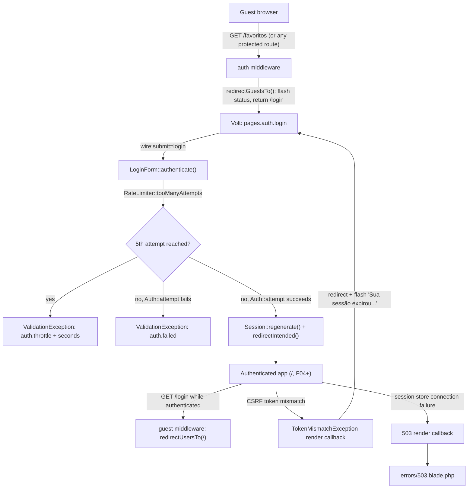

# Technical Specification: Authentication and Session Management

## 1. Technical Overview

**What:** Harden the Breeze/Livewire authentication scaffold F01 installed into the actual F02 contract: Portuguese generic-failure and throttle-lockout messaging with a live countdown, a flashed "please log in" message on the guest redirect, custom rendering for an expired session (419) and an unreachable session store (503), and removal of the four Breeze flows — password recovery by e-mail, e-mail verification, and password confirmation — that PRD Section 7 puts out of scope. It also documents the `users` table as the registered-user directory F12 reads from later.

**Why:** Every authenticated route in F03–F13 sits behind the `auth` middleware configured here, and the login/logout round-trip is the first interaction both product audiences have with the application (PRD §3: "both judge the product within the first 60 seconds"). The evaluating engineer reads code before clicking and deliberately probes edges — an English error message on a pt-BR-locale product, or four dead routes left over from scaffolding, is exactly the kind of inconsistency that first 60 seconds surfaces.

**Complexity:** medium — no new database schema and a small file surface, but the behavior spans middleware configuration, exception rendering, localization, and a scope-reduction pass across routes, views, a controller, and three test files.

The scaffold F01 installed already contains most of the happy path: `LoginForm` throttles at 5 attempts per e-mail+IP and calls `trans('auth.failed')`/`trans('auth.throttle')` on failure, `Logout` invalidates the session and regenerates the CSRF token, and the login Volt page already calls `redirectIntended()`. What is missing is everything that makes those calls actually observable as the PRD describes them: there is no `lang/pt_BR` directory yet, so both messages currently render in English; there is no flashed message on the guest redirect; there is no handling for a token-mismatch (419) or a session-store connection failure (503) beyond Laravel's default English error pages; and the scaffold still exposes four routes — `forgot-password`, `reset-password`, `verify-email`, `confirm-password` — that no PRD capability or acceptance criterion references.

### Scope

**Included:**
- `lang/pt_BR/auth.php` overriding the framework's `failed` and `throttle` message keys with the PRD's exact Portuguese copy
- A live client-side countdown on the throttle lockout message, driven by a raw seconds value exposed alongside the translated string
- A flashed "Faça login para continuar." status when an unauthenticated visitor is redirected away from a protected route
- Exception rendering for an expired CSRF/session token (419): redirect to `/login` with a flashed "Sua sessão expirou. Faça login novamente." status
- Exception rendering for a session-store connection failure (503): a dedicated Portuguese error view
- Removal of the `forgot-password`, `reset-password`, `verify-email`, and `confirm-password` routes, their Volt pages, `VerifyEmailController`, and the three Pest test files exercising them — confirmed with the project owner as out of scope per PRD §7
- Expanded Pest coverage for the behaviors above, on top of the existing `AuthenticationTest.php`

**Excluded (owned by other features):**
- Registration itself and `lang/pt_BR/validation.php` (F03)
- The navigation shell and shared UI primitives surrounding the auth pages (F04) — F02 ships against Breeze's default guest layout
- The chat feature's consumption of the registered-user directory this feature exposes (F12)
- Password change and current-password confirmation UI (F11) — unrelated to the `confirm-password` route being removed here, which is Breeze's separate "re-authenticate before a sensitive action" gate, unused by any F02–F13 capability
- The full 35-case cross-feature suite and the SQLite test-connection convention (F13), though this feature's own tests count toward it

---

## 2. Architecture Impact

| Layer | Components |
|---|---|
| Middleware configuration | `bootstrap/app.php` — `redirectGuestsTo`/`redirectUsersTo` closures |
| Exception handling | `bootstrap/app.php` — render callbacks for `TokenMismatchException` and session-store connection failures |
| Livewire | `LoginForm` (modified: exposes raw lockout seconds), `login` Volt page (modified: countdown), `Logout` action (unchanged) |
| Localization | `lang/pt_BR/auth.php` (new) |
| Views | `resources/views/errors/503.blade.php` (new) |
| Routes | `routes/auth.php` (pruned to `login` and `register`) |
| Removed | 4 Volt pages, `VerifyEmailController`, 3 Pest test files |

---

## 3. Technical Decisions

| Decision | Chosen Approach | Alternative Considered | Trade-off |
|---|---|---|---|
| Out-of-scope Breeze flows | Remove `forgot-password`, `reset-password`, `verify-email`, `confirm-password` routes, Volt pages, `VerifyEmailController`, and their 3 Pest tests | Leave them scaffolded but unlinked from navigation | Confirmed with the project owner. Matches PRD §7 exactly and removes flows that would need mail configuration outside this project's scope; the cost is a larger deletion diff on this feature |
| Guest-redirect flash message | `bootstrap/app.php`'s `redirectGuestsTo()` closure flashes the status string before returning `route('login')` | A custom `Authenticate` middleware subclass overriding `redirectTo()` | The closure form needs no new file and only fires when a protected route actually redirects a guest — a direct visit to `/login` shows no message, matching the PRD's "Faça login para continuar." only appearing on redirect |
| Throttle countdown mechanism | `LoginForm` exposes the raw remaining-seconds value as a public property alongside the translated message; the Volt page renders it inside an Alpine `x-data` component that ticks the number down client-side | Re-render the static server message on every keystroke via `wire:poll` | Livewire's bundled Alpine (shipped since Livewire 3, no separate install) gives a smooth per-second countdown without a network round-trip every second; `wire:poll` would hit the server 60 times during one lockout for no reason |
| Session-expired (419) handling | An exception render callback for `TokenMismatchException` in `bootstrap/app.php` converts it into a redirect to `/login` with a flashed pt-BR status | Publish a custom 419 Blade view | The PRD's described experience is a redirect to the login screen with a message, not a standalone error page; a render callback produces that directly. See the assumption below about the Livewire-originated case |
| Session-store-unreachable (503) scope | The render callback catches connection-class exceptions (`PDOException`, `Illuminate\Database\QueryException`) raised while the framework is reading or writing the session, and renders a dedicated Portuguese 503 view | Catch `\Throwable` broadly and render the same page for any unhandled error | Scoping to connection-class exceptions keeps Laravel's normal (debug-mode) error page for genuine application bugs during development; only real infrastructure unavailability gets the friendly page, matching the PRD's specific "MySQL down" scenario |
| pt-BR translation scope for this feature | Only `lang/pt_BR/auth.php`, overriding the two framework keys (`failed`, `throttle`) this feature's code calls; all other new Portuguese copy (flash messages, the 503 view) is written directly as literal strings, not translation keys | Stand up the full `lang/pt_BR` directory (validation, pagination, passwords) now | PRD §7 explicitly excludes internationalization ("pt-BR only, no language switcher"), so a translation-key layer for one-off strings is unneeded ceremony; the broader `lang/pt_BR` set is explicitly F03's Capabilities bullet and is left for that feature |

---

## 4. Component Overview

### Application

| File Path | New/Modified | Purpose | Key Responsibilities |
|---|---|---|---|
| `bootstrap/app.php` | Modified | Middleware and exception configuration | `redirectGuestsTo()` flashes the login-required status; `redirectUsersTo()` sends an authenticated visitor away from `/login`/`/register`; `withExceptions()` registers the 419 and 503 render callbacks |
| `app/Livewire/Forms/LoginForm.php` | Modified | Login form object | Adds a public property carrying the raw remaining-lockout-seconds value so the UI can animate the countdown independent of the static translated message |
| `resources/views/livewire/pages/auth/login.blade.php` | Modified | Login Volt page | Renders the countdown via Alpine when a throttle error is present |
| `lang/pt_BR/auth.php` | New | Framework auth string overrides | Portuguese text for the `failed` and `throttle` keys `LoginForm` already calls via `trans()` |
| `resources/views/errors/503.blade.php` | New | Session-store-unreachable page | Portuguese copy, no stack trace, consistent with the guest layout's visual style |
| `routes/auth.php` | Modified | Authentication routes | Pruned to `login` (this feature) and `register` (F03); the 4 out-of-scope routes are removed |

### Removed

| File Path | Reason |
|---|---|
| `resources/views/livewire/pages/auth/forgot-password.blade.php` | Password recovery by e-mail is out of scope (PRD §7) |
| `resources/views/livewire/pages/auth/reset-password.blade.php` | Same |
| `resources/views/livewire/pages/auth/verify-email.blade.php` | E-mail verification is out of scope (PRD §7); `User` never implements `MustVerifyEmail` |
| `resources/views/livewire/pages/auth/confirm-password.blade.php` | Unused Breeze "re-authenticate before a sensitive action" gate; no F02–F13 capability applies `password.confirm` to any route |
| `app/Http/Controllers/Auth/VerifyEmailController.php` | Only consumer was the removed `verification.verify` route |
| `tests/Feature/Auth/EmailVerificationTest.php` | Exercises the removed flow |
| `tests/Feature/Auth/PasswordResetTest.php` | Exercises the removed flow |
| `tests/Feature/Auth/PasswordConfirmationTest.php` | Exercises the removed flow |

### Database

No migration changes. This feature reads and writes the `users` and `sessions` tables the Laravel 12 skeleton already created (documented in [F01's spec, Section 6](../F01-application-environment-and-delivery/spec.md#6-data-model)); see Section 6 below for the columns this feature specifically depends on.

---

## 5. Exposed Interfaces

F02 exposes no JSON API. Its contract is the middleware behavior, the Livewire round-trips Breeze already wires, and the error responses layered on top.

### Endpoint: Login submission

- **Method:** POST (Livewire component round-trip)
- **Path:** `/login`
- **Authentication:** `guest`

**Request:**

| Field | Type | Required | Validation | Description |
|---|---|---|---|---|
| `form.email` | `string` | Yes | required, string, email | Account e-mail |
| `form.password` | `string` | Yes | required, string | Verified against the stored bcrypt hash |
| `form.remember` | `boolean` | No | boolean | Extends the session cookie to 30 days |

**Response:**

| Condition | HTTP Status | Result |
|---|---|---|
| Valid credentials | 302 → intended URL or `/` | `Session::regenerate()`, rate limiter cleared, `RateLimiter::clear()` |
| Invalid credentials, under the throttle ceiling | 422 | `form.email` error: `auth.failed` ("As credenciais informadas não conferem.") |
| 5 failed attempts reached | 422 | `form.email` error: `auth.throttle` ("Muitas tentativas. Tente novamente em :seconds segundos."), `Lockout` event fired |

### Endpoint: Logout

- **Method:** Livewire action invocation (`wire:click="logout"`), CSRF-protected by Livewire's own request signing — not a discrete named route
- **Authentication:** `auth`

**Response:** session invalidated, CSRF token regenerated, client redirected to `/`.

### Middleware contract: `auth`

| Condition | Behavior |
|---|---|
| Guest requests a protected route | `redirectGuestsTo()` flashes `status = "Faça login para continuar."`, redirects to `/login`; the intended URL is stored by the framework's standard guest-redirect mechanism and restored by `redirectIntended()` on successful login |
| Session already authenticated | Request proceeds |

### Middleware contract: `guest`

| Condition | Behavior |
|---|---|
| Authenticated user requests `/login` or `/register` | `redirectUsersTo()` sends them to `/` |
| No authenticated session | Request proceeds |

### Error responses

| Condition | HTTP Status | Behavior |
|---|---|---|
| CSRF/session token mismatch (`TokenMismatchException`) | 302 → `/login` | Flashed status: "Sua sessão expirou. Faça login novamente." |
| 6th+ login attempt within 60s | 429 semantics via Livewire's 422 validation channel | `auth.throttle` message with remaining seconds |
| Session store (MySQL) unreachable | 503 | `resources/views/errors/503.blade.php`, no stack trace |

---

## 6. Data Model

No new migrations. This feature depends on and, for `sessions`, configures the behavior of two tables the Laravel 12 skeleton already created.

### Table: `users` (existing — see F01 §6 for the full column list)

| Column | Relevant to F02 because |
|---|---|
| `email` | Login identifier; unique index is the database-level guard behind the generic failure message (no enumeration signal even on a duplicate) |
| `password` | Verified via `Auth::attempt()` against the bcrypt hash |
| `remember_token` | Populated when "lembrar-me" is checked; backs the 30-day persistent cookie |
| `email_verified_at` | Confirmed unused — the column stays in the schema (skeleton default) but no code path reads or requires it after `VerifyEmailController`'s removal |

### Table: `sessions` (existing — see F01 §6 for the full column list)

| Setting | Value | Relevant because |
|---|---|---|
| `SESSION_DRIVER` | `database` | This table is the literal "session store" the 503 handling protects; its unavailability means MySQL is unreachable, not Redis |
| `SESSION_LIFETIME` | 120 minutes | Default inactivity timeout for a session without "lembrar-me" |
| Remember-me cookie | 30 days (`Auth::attempt($credentials, remember: true)`) | Independent of `SESSION_LIFETIME` — it re-authenticates a new session from the persistent cookie rather than extending the row's `last_activity` window |

### Table: `password_reset_tokens` (existing, unmodified)

Stays in the schema as a skeleton default. After this feature's cleanup, no code path writes to or reads from it — password recovery by e-mail is out of scope per PRD §7.

---

## 7. Testing Strategy

### Test files

| Test File | Test Type | Target | Coverage Goal |
|---|---|---|---|
| `tests/Feature/Auth/AuthenticationTest.php` | Feature | Login, logout, throttling, guest/auth redirects | All F02 Section 9 acceptance criteria |
| `tests/Feature/Auth/SessionExpiryTest.php` | Feature | 419 and 503 exception rendering | The two custom render callbacks introduced in Section 3 |

### `tests/Feature/Auth/AuthenticationTest.php` (existing file, extended)

| Test Function | Description | Assertions |
|---|---|---|
| `a tela de login renderiza` *(existing)* | `GET /login` | 200, Volt component `pages.auth.login` present |
| `um usuário pode autenticar pela tela de login` *(existing)* | Valid credentials via `Volt::test()` | No errors, redirect to intended default, `assertAuthenticated()` |
| `um usuário não pode autenticar com senha inválida` *(existing)* | Wrong password | Has errors, no redirect, `assertGuest()` |
| `um convidado que acessa uma rota protegida é redirecionado para o login com uma mensagem` | `GET` each of `/`, `/favoritos`, `/chat`, `/perfil` as guest (routes stubbed where the target feature isn't built yet, per each route's current definition) | Redirect to `/login`; flashed `status` equals "Faça login para continuar." |
| `o login bem-sucedido restaura a url originalmente pretendida` | Guest hits a protected route, then submits valid credentials | Redirect target is the originally requested URL, not the default |
| `login com senha errada e login com e-mail inexistente retornam a mesma mensagem genérica` | Two failed attempts, one with a registered e-mail, one with an unregistered one | Both `form.email` errors equal the identical `auth.failed` pt-BR string |
| `a sexta tentativa de login em um minuto é bloqueada com o tempo restante` | 5 failed attempts, then a 6th | 6th attempt's error is the `auth.throttle` pt-BR string interpolated with the remaining seconds |
| `um usuário autenticado que acessa login ou register é redirecionado` | `GET /login` and `GET /register` while authenticated | Both redirect to `/` |
| `logout invalida a sessão e o botão voltar não reexibe conteúdo autenticado` | `actingAs()`, call `logout`, then `GET` a protected route | Session guest after logout; the protected route redirects to `/login` rather than serving cached authenticated content |
| `lembrar-me estende a duração do cookie de sessão` *(existing, `navigation menu can be rendered` renamed/kept)* | Login with `remember = true` | Remember cookie present with a ~30-day expiry |

### `tests/Feature/Auth/SessionExpiryTest.php` (new)

| Test Function | Description | Assertions |
|---|---|---|
| `um token csrf incompatível redireciona para o login com mensagem de sessão expirada` | Simulate a `TokenMismatchException` on a protected POST | Redirect to `/login`; flashed `status` equals "Sua sessão expirou. Faça login novamente." |
| `uma falha de conexão com o banco de dados durante a sessão exibe a página 503 em português` | Force a connection-class exception during session handling | 503 response rendering `errors/503.blade.php`; no stack trace in the body |

No Cross-Feature Integration criterion in PRD Section 9 explicitly names F02 as the criterion under test, but the "registered user directory" criterion (F02 → F12) is satisfied structurally by the unmodified `users` table — F12's own spec owns the assertion that a registered user appears in another user's chat list.

---

## Appendix: PRD Traceability

| PRD block | Spec destination |
|---|---|
| F02 Provides (registered user directory) | Section 6 `users` table |
| F02 Capabilities | Section 1 Scope, Section 4 Component Overview, Section 5 Exposed Interfaces |
| F02 Experience | Section 2 diagram, Section 5 middleware contracts |
| F02 Error Handling | Section 3 Technical Decisions, Section 5 Error responses |
| Section 8 Foundation Features (F02 entry) | Section 1 Why |
| Section 9 F02 acceptance criteria | Section 7 `AuthenticationTest.php` |
| Section 7 Out of Scope (no e-mail password recovery/verification) | Section 3 first decision row, Section 4 Removed table |

## Appendix: Assumptions Requiring Review

1. **Livewire's own request-expired handling on a 419 originating from a component update.** The `TokenMismatchException` render callback covers a standard form POST cleanly. Whether Livewire's JS layer automatically follows a 302 redirect returned for its own AJAX component-update request, or shows its default English "page expired" confirm dialog first, needs verification during implementation. If the redirect isn't followed automatically, a small client-side listener overriding Livewire's default request-expired handling (reading the response's `Location` header and navigating there) closes the gap.
2. **"Session store unreachable" is scoped to MySQL, not Redis.** The PRD's Error Handling prose says "Session store unreachable (Redis/MySQL down)," but `SESSION_DRIVER=database` means the actual session store is MySQL; Redis unavailability is F05's cache-degradation concern, not this feature's.
3. **`password_reset_tokens` stays in the schema, unused.** No migration removes it — only the code paths that would read/write it are removed. Matches F01's precedent of retaining skeleton-default tables that a later feature doesn't activate.
4. **The `/`, `/favoritos`, `/chat`, `/perfil` routes referenced in the guest-redirect test may not all exist yet** at F02's point in the execution wave (F04/F07/F10/F11/F12 land in later waves). The test targets whichever of these routes are already registered at implementation time, using `Route::has()` guards or route-existence checks, and is expected to be extended as later features add their own protected routes.
