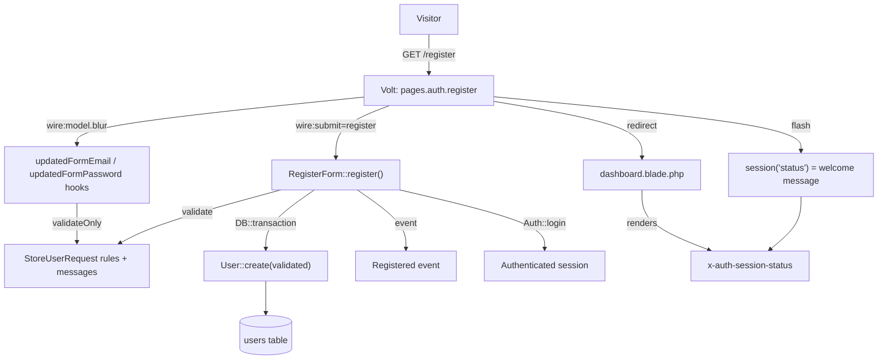

# Technical Specification: User Registration

## 1. Technical Overview

**What:** Replace Breeze's scaffolded registration Volt page with the PRD's actual F03 contract: a `StoreUserRequest` Form Request as the authoritative validation source, a `RegisterForm` Livewire Form object (mirroring F02's `LoginForm`) that binds the Volt page to it, on-blur field validation for e-mail and password, `lang/pt_BR/validation.php` for every pt-BR message the PRD specifies verbatim, and a transactional, event-driven creation path that logs the new user in and flashes a welcome message on redirect.

**Why:** Registration is the only entry point into the product besides login, and it is the evaluating engineer's first opportunity to probe validation, localization, and idempotency at once (PRD §3: "favorites the same Pokémon twice to test idempotency" — the same scrutiny applies to "submit the registration form twice"). F02 already proved the pattern this feature reuses: a Livewire Form object encapsulating the auth side-effect, `lang/pt_BR` overriding framework message keys, and a flashed `session('status')` rendered through `<x-auth-session-status>`. F03 extends that pattern to the one auth flow F02 explicitly left untouched.

**Complexity:** simple — no new database schema, a single endpoint, and five files, but the validation architecture has a genuine design tension (PRD names a Form Request; the codebase's established pattern is a Livewire Form object) that this spec resolves explicitly rather than picking one and hiding the other.

The scaffold F01 installed still contains Breeze's original, untranslated registration component: inline validation rules typed directly into the Volt component, a manual `Hash::make()` call that duplicates work the `User` model's `hashed` cast already does, and no field-level pt-BR messages. F03 replaces all of it while keeping the same route, the same Volt page path, and the same post-registration destination (`/`, via `route('dashboard')`) that F02's `redirectUsersTo()` and the eventual F04/F07 handoff already assume.

### Scope

**Included:**
- `app/Http/Requests/StoreUserRequest.php` — the single source of truth for name/e-mail/password validation rules, never bound to a route
- `app/Livewire/Forms/RegisterForm.php` — the Form object the Volt page binds against, delegating validation to `StoreUserRequest` and encapsulating the transactional creation path
- Rewritten `resources/views/livewire/pages/auth/register.blade.php` — on-blur validation, a disabled/spinner submit state, and the post-success flash
- `lang/pt_BR/validation.php` — generic rule templates, the PRD's exact custom overrides, and pt-BR field labels
- A temporary `<x-auth-session-status>` render on `dashboard.blade.php` so the welcome message is visible before F04 lands
- Pest coverage for every F03 Section 9 acceptance criterion and Error Handling bullet, replacing the existing Breeze-default `RegistrationTest.php`

**Excluded (owned by other features):**
- The real toast/stacking notification component (F04) — this feature uses F02's flash-message mechanism as an explicitly temporary stand-in, documented in Section 3
- The application shell, navigation, and shared UI primitives surrounding the auth pages (F04) — this feature ships against the existing guest layout, same as F02
- `lang/pt_BR/auth.php`'s `failed`/`throttle` keys and the login flow itself (F02, already implemented)
- Anything reachable only after authentication — the search page, favorites, chat, profile (F07–F12)

---

## 2. Architecture Impact

| Layer | Components |
|---|---|
| Validation | `app/Http/Requests/StoreUserRequest.php` (new) |
| Livewire | `app/Livewire/Forms/RegisterForm.php` (new), `register` Volt page (rewritten) |
| Localization | `lang/pt_BR/validation.php` (new) |
| Views | `resources/views/dashboard.blade.php` (modified — temporary flash render) |
| Routes | `routes/auth.php` (unchanged — `register` already points at the same Volt path) |

---

## 3. Technical Decisions

| Decision | Chosen Approach | Alternative Considered | Trade-off |
|---|---|---|---|
| Validation architecture | `RegisterForm` (Livewire Form object, mirrors `LoginForm`) delegates its rule set, messages, and attribute labels to a real `StoreUserRequest` FormRequest that is instantiated directly and never bound to a route | A traditional POST route to a controller using `StoreUserRequest` the standard Laravel way | Confirmed with the project owner. Keeps registration on the same Volt/Livewire pattern as every other auth page while still giving the PRD's named class real, single-source authority over the rules |
| On-blur live validation | `wire:model.blur` on `form.email`, `form.password`, and `form.password_confirmation`, paired with `updatedFormEmail()` / `updatedFormPassword()` / `updatedFormPasswordConfirmation()` hooks on the Volt component that call `$this->validateOnly('form.X')` | `#[Validate]` attributes directly on `RegisterForm`'s properties, as `LoginForm` uses for its own (submit-time) rules | Attributes would create a second, competing rule source alongside `StoreUserRequest`. The `updated*` hook approach keeps the Form Request as the single source of truth while still validating on blur instead of on every keystroke |
| Success feedback without F04's toast | Flash `session('status')` on redirect and render it with the existing `<x-auth-session-status>` component — the same mechanism F02 already uses for the guest-redirect message — temporarily added to `dashboard.blade.php` | A one-off toast partial scoped to this feature, styled per the PRD's top-right/auto-dismiss spec | Confirmed with the project owner. Zero new UI surface and nothing to unwind when F04 lands with the real stacking toast — only the flash call site's rendering target changes |
| Password hashing | Rely exclusively on `User`'s `hashed` cast; no `Hash::make()` call anywhere in `RegisterForm` or `StoreUserRequest` | Manually hash before `User::create()`, as the current Breeze scaffold does | Matches the PRD's exact wording ("hashed with bcrypt through the model's `hashed` cast") and removes a redundant, easy-to-get-wrong second hashing step |
| Registration write path | `RegisterForm::register()` wraps validation, `User::create()`, and the `Registered` event dispatch inside `DB::transaction()`; a caught failure leaves no row and re-throws as a generic, friendly validation error | Let a mid-write failure surface as Laravel's default exception page | Matches the PRD's explicit rollback requirement ("the transaction rolls back, no partial user row remains"). A single-row insert is already atomic, but the transaction boundary keeps the contract correct if the `Registered` event ever gains a listener with its own write |
| Mass-assignment guard | `RegisterForm` exposes exactly four typed public properties (`name`, `email`, `password`, `password_confirmation`); only `StoreUserRequest`'s validated output is ever passed to `User::create()` | Accept a raw associative payload and rely solely on `$fillable` | Two independent guards instead of one: Livewire's typed property list structurally cannot carry an extra field like `role` or `id` from the client, and `validated()` only returns what `StoreUserRequest::rules()` declares regardless |

---

## 4. Component Overview

### Application

| File Path | New/Modified | Purpose | Key Responsibilities |
|---|---|---|---|
| `app/Http/Requests/StoreUserRequest.php` | New | Authoritative registration validation | `authorize()` returns `true` (public route); `rules()` defines `name`, `email`, `password`; supplies the pt-BR attribute labels and message keys `lang/pt_BR/validation.php` resolves against |
| `app/Livewire/Forms/RegisterForm.php` | New | Registration form object, mirrors `LoginForm` | Holds `name`, `email`, `password`, `password_confirmation`; exposes `rules()`/`messages()` delegating to `StoreUserRequest`; `register()` wraps validation, `User::create()`, the `Registered` event, and `Auth::login()` in a transaction; clears the two password properties on a validation failure |
| `resources/views/livewire/pages/auth/register.blade.php` | Modified | Registration Volt page | Binds to `RegisterForm` via `wire:model`/`wire:model.blur`; `updatedFormEmail()`/`updatedFormPassword()`/`updatedFormPasswordConfirmation()` hooks call `validateOnly()`; submit button disables and shows a spinner via `wire:loading`; on success flashes the welcome status and redirects to `route('dashboard')` |
| `lang/pt_BR/validation.php` | New | Portuguese validation strings | Generic rule templates (`required`, `string`, `min`, `max`, `email`, `unique`, `confirmed`); `custom` overrides for the PRD's exact wording on `email.email`, `password.min`, `password.confirmed`, `email.unique`; `attributes` mapping `name` → `nome`, `email` → `e-mail`, `password` → `senha`, `password_confirmation` → `confirmação de senha` |
| `resources/views/dashboard.blade.php` | Modified | Temporary landing view | Renders `<x-auth-session-status :status="session('status')" />` so the post-registration welcome message is visible; the addition is removed the moment F04/F07 replace this view |

### Database

No migration. Registration writes into the existing `users` table created by F01's skeleton migrations; `users_email_unique` (already in place) is the database-level backstop behind the "e-mail já cadastrado" message.

### Removed

None. `register.blade.php` and `routes/auth.php`'s `register` entry stay at their current paths — only the Volt component's internals change.

---

## 5. Exposed Interfaces

F03 exposes no JSON API. Its contract is the single Livewire round-trip Breeze already wires at `/register`.

### Endpoint: Registration submission

- **Method:** POST (Livewire component round-trip)
- **Path:** `/register`
- **Authentication:** `guest`

**Request:**

| Field | Type | Required | Validation | Description |
|---|---|---|---|---|
| `form.name` | `string` | Yes | `required`, `string`, `min:2`, `max:255` | Display name |
| `form.email` | `string` | Yes | `required`, `string`, `email:rfc`, `max:255`, `unique:users,email` | Login identifier |
| `form.password` | `string` | Yes | `required`, `confirmed`, `Password::defaults()` (minimum 8 characters) | Plaintext in transit; hashed by the model's `hashed` cast before the write |
| `form.password_confirmation` | `string` | Yes | Implicit via the `confirmed` rule on `form.password` | Must match `form.password` exactly |

**Response:**

| Condition | HTTP Status | Result |
|---|---|---|
| Valid payload | 302 → `/` | User row created inside a transaction, `Registered` event fired, `Auth::login()`, `session('status')` flashed with the welcome message, redirect to `route('dashboard')` |
| Validation failure | 422 | Field-level errors on the failing `form.*` key(s), all resolved from `lang/pt_BR/validation.php` |
| Duplicate e-mail | 422 | `form.email` error: "Este e-mail já está cadastrado." — no row created |
| Password confirmation mismatch | 422 | `form.password_confirmation` error: "A confirmação de senha não confere."; `form.password` and `form.password_confirmation` are reset to empty server-side |
| DB write failure inside the transaction | 422 | Transaction rolled back (zero rows), generic error: "Não foi possível criar sua conta agora. Tente novamente." |

---

## 6. Data Model

No new migrations. This feature writes into a table the Laravel 12 skeleton already created (documented in full in [F01's spec, Section 6](../F01-application-environment-and-delivery/spec.md#6-data-model)).

### Table: `users` (existing)

| Column | Relevant to F03 because |
|---|---|
| `name` | Set directly from `StoreUserRequest`'s validated `name` |
| `email` | Set from validated `email`; `users_email_unique` is the database-level guard behind the duplicate-e-mail message, independent of the application-level `unique` validation rule |
| `password` | Assigned the plaintext validated value; the `hashed` cast converts it to a bcrypt hash before the `INSERT` — no application code calls `Hash::make()` |
| `email_verified_at` | Left `null` — e-mail verification is out of scope (PRD §7), consistent with F02's removal of the verification flow |

No new indexes or constraints.

---

## 7. Failure Modes and Error Handling

Derived from the PRD's F03 Error Handling block.

| Failure | Detection | Behaviour | Surfaced as |
|---|---|---|---|
| E-mail already registered | `StoreUserRequest`'s `unique:users,email` rule fails | No row created; the Volt page offers a path to `/login` | `form.email` error: "Este e-mail já está cadastrado." plus a link to `/login` |
| Password confirmation mismatch | The `confirmed` rule on `password` fails | `RegisterForm` resets `password` and `password_confirmation` to `''`; `name` and `email` are preserved | `form.password_confirmation` error: "A confirmação de senha não confere." |
| Fast double-click / duplicated submit | The submit button disables on `wire:submit`; if a second request still lands, `users_email_unique` rejects the second insert | Exactly one row exists no matter how many submissions reach the server | The second attempt renders the same duplicate-e-mail error as any other repeat registration |
| Database write failure mid-registration | An exception is thrown inside `RegisterForm::register()`'s `DB::transaction()` | The transaction rolls back; no partial `users` row remains | Generic error: "Não foi possível criar sua conta agora. Tente novamente." |
| Payload carrying unexpected fields (`role`, `id`, …) | Structural — `RegisterForm` exposes exactly 4 typed properties, and `StoreUserRequest::validated()` only ever returns declared keys | No code path can pass an undeclared field to `User::create()` | No error surfaced — the extra field is silently absent, never reaching the model |

---

## 8. Testing Strategy

### Test files

| Test File | Test Type | Target | Coverage Goal |
|---|---|---|---|
| `tests/Feature/Auth/RegistrationTest.php` | Feature | Registration Volt page, `RegisterForm`, `StoreUserRequest` | All F03 Section 9 acceptance criteria and Error Handling bullets |

### `tests/Feature/Auth/RegistrationTest.php` (existing file, rewritten)

| Test Function | Description | Assertions |
|---|---|---|
| `a tela de registro renderiza` | `GET /register` | 200, Volt component `pages.auth.register` present |
| `um visitante pode se registrar com dados válidos e é autenticado automaticamente` | `Volt::test()` with valid name/e-mail/password/confirmation, call `register` | No errors, redirect to `route('dashboard')`, `assertAuthenticated()`, flashed `status` contains the new user's name |
| `a senha é persistida como hash bcrypt e nunca em texto puro` | Inspect the created row's `password` column | Value differs from the plaintext, matches the bcrypt prefix, `Hash::check()` succeeds |
| `um e-mail já cadastrado é rejeitado e nenhuma segunda conta é criada` | Seed an existing user, register again with the same e-mail | `form.email` error equals "Este e-mail já está cadastrado."; `User::count()` unchanged |
| `uma senha com menos de 8 caracteres é rejeitada com a mensagem específica` | Submit a 6-character password | `form.password` error equals the pt-BR minimum-length message |
| `a confirmação de senha divergente é rejeitada e os campos de senha são limpos` | Submit mismatched `password`/`password_confirmation` | `form.password_confirmation` error equals "A confirmação de senha não confere."; both password properties reset to `''` after the failed call; `name`/`email` unchanged |
| `duas submissões rápidas com o mesmo e-mail criam exatamente um usuário` | Two sequential `Volt::test()` calls with identical payloads | First succeeds; second fails validation on `form.email`; `User::count()` is 1 |
| `um payload com campos inesperados nunca alcança o modelo` | Inspect `StoreUserRequest::rules()`/the created row's attributes | Only `name`, `email`, `password` (plus timestamps) are ever written — no `role`, `id`, or other unexpected key reaches `User::create()` |
| `uma falha ao gravar no banco não deixa conta parcial` | Force an exception during the transactional write (e.g., a query exception thrown mid-`User::create()`) | `User::count()` is 0 after the attempt; a generic pt-BR error is surfaced instead of an unhandled exception |

No Cross-Feature Integration criterion in PRD Section 9 names F03 as either side of the relationship, so this feature inherits no integration tests.

---

## Appendix: PRD Traceability

| PRD block | Spec destination |
|---|---|
| F03 Capabilities | Section 1 Scope, Section 4 Component Overview, Section 5 Exposed Interfaces |
| F03 Experience | Section 3 (success-feedback decision), Section 5 Response table |
| F03 Error Handling | Section 7 Failure Modes and Error Handling |
| Section 9 F03 acceptance criteria | Section 8 test functions |
| Section 9 Cross-Feature Integration | None reference F03 — noted in Section 8 |
| F02 established patterns (`LoginForm`, `lang/pt_BR`, flash-message mechanism) | Section 3 Technical Decisions, reused throughout |

## Appendix: Assumptions Requiring Review

Recorded so they can be corrected before or during implementation:

1. **`dashboard.blade.php`'s `<x-auth-session-status>` addition is deliberately throwaway.** It exists only so the PRD's welcome message is visible before F04 replaces this view entirely. No test should depend on `dashboard.blade.php`'s markup beyond that one render.
2. **`email:rfc` without `:dns`.** The PRD asks for "RFC-valid" e-mail format; a `dns` check would perform a live MX lookup, which is inappropriate for an offline-capable, containerized evaluation environment and would make tests network-dependent.
3. **The "two rapid submissions create one user" test is sequential, not concurrent.** A true race between two overlapping requests can't be exercised deterministically in Pest; the test instead proves the guard's *effect* (the unique index plus `unique` validation rule reject the second attempt) rather than simulating simultaneous requests, matching the pragmatic approach F01/F02 already took for similar guarantees.
4. **The forced-write-failure test needs a seam.** `RegisterForm::register()`'s transaction must be interrupted in a way Pest can trigger deterministically (for example, a partial mock on the `User` model or a `DB::transaction()` callback double) — the exact mechanism is an implementation detail left open here, as the spec only fixes the observable behavior (zero rows, friendly message).
