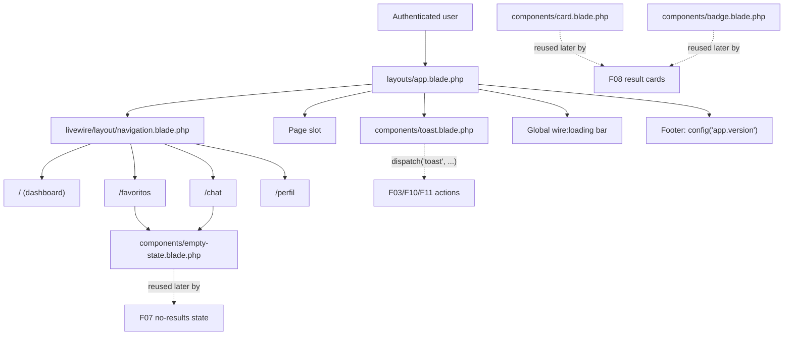

# Technical Specification: Application Shell and Navigation

## 1. Technical Overview

**What:** The single Blade layout every authenticated PokéLink page renders inside, the primary navigation exposing the four PRD destinations (Início, Favoritos, Chat, Meu Perfil), the shared UI primitives later features compose on (`card`, `badge`, `empty-state`, `toast`), a global Livewire loading indicator, and the routing changes needed so every navigation link resolves to a real page — including placeholder pages for the two destinations owned by later-wave features.

**Why:** F04 is a Foundation feature (PRD §8): every screen built by F07–F12 mounts inside the shell this feature establishes, and every result grid, empty state, and success/error notification those features render is expected to reuse the primitives built here rather than inventing new ones. The current codebase — post wave 2 (F01 environment, F02 auth) — still ships Breeze's stock scaffold: `dashboard.blade.php` and `profile.blade.php` both render through the class-based `App\View\Components\AppLayout` component (`app/View/Components/AppLayout.php`, unmodified by this feature), which points at the plain view `resources/views/layouts/app.blade.php`; that view is still Breeze's untouched default (single English "Dashboard" link, no footer, no loading indicator), and there is no card/badge/empty-state/toast primitive anywhere in `resources/views/components/`. F04 rebuilds that view into the PRD-mandated shell.

**Complexity:** medium — no database schema and no JSON API surface, but the feature touches a layout, a Livewire component, four new shared primitives, three route changes (two new placeholder pages, one path rename), and two pre-existing F02 test files that hardcode a path this feature renames.

### Scope

**Included:**
- The application shell: one Blade component wrapping every authenticated page, with a 1280px-capped main content area and a footer showing the application version
- The primary navigation: four Portuguese destinations (Início, Favoritos, Chat, Meu Perfil), active-route highlighting, the existing Alpine-driven hamburger menu extended to the new link set, and the existing user dropdown (name + logout)
- A global `wire:loading`-based progress bar for any Livewire round-trip exceeding 200 ms
- Four shared UI primitives: `card`, `badge`, `empty-state`, `toast` — added alongside Breeze's existing `primary-button`/`secondary-button`/`danger-button`/`text-input`/`input-label`/`input-error`/`modal`, which are left unmodified
- A toast notification system: Livewire-dispatched browser event, Alpine-managed queue, capped at 3, 4-second auto-dismiss, top-right stacking
- Routing: rename `/profile` (name `profile`) to `/perfil` (name `perfil`); add `/favoritos` and `/chat` as placeholder routes built on the new `empty-state` primitive, so every nav destination resolves to a working page before F10/F12/F11 ship their real content
- Portuguese placeholder copy on the root (`/`) page's visible text, since F07 (wave 4) replaces its content but the page is live in the meantime

**Excluded (owned by other features):**
- The actual content of Favoritos (F10, wave 7), Chat (F12, wave 4), and the profile forms' behavior beyond their new path (F11, wave 4, including whether the Breeze-default account-deletion form stays in scope)
- The Pokémon search screen that replaces the root page's content (F07, wave 4)
- Pokémon-specific badge colors (type-to-color mapping) and card content (sprite, name, number) — F04 ships the generic primitives only; F08/F09 supply the Pokémon-specific usage
- Any PokeAPI client, cache, or queue concern (F05, already implemented)
- Toast triggers themselves — F04 ships the container and the event contract; each feature that needs a toast (F03 registration, F10 favorites, F11 profile) calls `dispatch('toast', ...)` from its own component

---

## 2. Architecture Impact

| Layer | Components |
|---|---|
| Shell | `resources/views/layouts/app.blade.php` (modified — rendered by the pre-existing `App\View\Components\AppLayout` class component, itself unmodified) |
| Navigation | `resources/views/livewire/layout/navigation.blade.php` (modified Volt component) |
| Shared primitives | `resources/views/components/card.blade.php`, `badge.blade.php`, `empty-state.blade.php`, `toast.blade.php` (all new) |
| Routes | `routes/web.php` (modified: rename `profile`, add `favoritos`, `chat`) |
| Pages | `resources/views/dashboard.blade.php` (modified copy), `resources/views/perfil.blade.php` (renamed from `profile.blade.php`), `resources/views/favoritos.blade.php`, `resources/views/chat.blade.php` (new placeholders) |
| Config | `config/app.php`, `.env.example` (new `APP_VERSION` key) |
| Cross-feature test fix | `tests/Feature/ProfileTest.php`, `tests/Feature/Auth/AuthenticationTest.php` (path literals updated from `/profile` to `/perfil`) |

---

## 3. Technical Decisions

| Decision | Chosen Approach | Alternative Considered | Trade-off |
|---|---|---|---|
| Shell entry point | Rebuild the shell in place at `resources/views/layouts/app.blade.php` — the view the pre-existing `App\View\Components\AppLayout` class component (`app/View/Components/AppLayout.php`) already renders for every `<x-app-layout>` usage | Move the layout under `resources/views/components/` so `<x-app-layout>` resolves as a plain anonymous component | The class component already resolves `<x-app-layout>` to `layouts.app` explicitly (`return view('layouts.app')` in its `render()` method); moving the file would orphan that class instead of fixing anything |
| Active-nav highlighting | `request()->routeIs()` checks per destination, including a forward-looking group for Início (`dashboard` route plus a not-yet-existing `pokemon.*` name pattern) | Hardcode only the routes that exist today, revisit when F09 ships | `routeIs()` against a non-existent name pattern safely returns `false`; wiring the pattern now means F09 (wave 6) needs zero navigation changes when it ships, satisfying the PRD's `/pokemon/{slug}` acceptance criterion up front |
| Shared UI primitive scope | Keep Breeze's existing `primary-button`/`secondary-button`/`danger-button`/`text-input`/`input-label`/`input-error`/`modal` untouched; add only `card`, `badge`, `empty-state`, `toast` | Consolidate everything into a new `<x-ui.*>` namespace | Touching the existing components would ripple into every F02/F03 view that already depends on them; the PRD's primitive list is satisfied either way |
| Toast delivery | Livewire `dispatch()` of a browser event, caught by a single Alpine component mounted once in the shell, client-side queue capped at 3 with a 4 s auto-dismiss timer | A JS toast library (e.g. Toastify) wired through an Alpine wrapper | No new frontend dependency; the event contract (`dispatch('toast', message: ..., type: ...)`) is trivial for any future feature to call |
| Placeholder routes for Favoritos/Chat | Create `/favoritos` and `/chat` now as real routes rendering the new `empty-state` primitive with "Em construção" copy | Leave the routes undefined until F10/F12 ship, accepting a routing exception when the nav links are clicked | The PRD requires every destination to be "one click away" (F04 user story); an undefined route would make the shell itself feel broken during waves 3–6 |
| `/profile` → `/perfil` rename | Rename both the route path and route name (`profile` stays the only consumer of the route name, confined to `navigation.blade.php`, which this feature already rewrites); update the two F02 test files that hardcode the old path | Keep the path at `/profile` and only change the nav label | The PRD's own F02 acceptance criteria (§9) enumerate `/perfil` as a protected route to test; keeping the English path would leave that criterion permanently unverifiable |
| Application version source | New `APP_VERSION` env key (default `1.0.0`), surfaced as `config('app.version')`, read by `.env.example`'s completeness test | Parse `composer.json` at runtime, or hardcode the string in the Blade file | Matches the existing `config('app.name', ...)` / `APP_NAME` pattern already used project-wide; keeps the value bumpable without a code change |

---

## 4. Component Overview

**Views and Components:**

| File Path | New/Modified | Purpose | Key Responsibilities |
|---|---|---|---|
| `resources/views/layouts/app.blade.php` | Modified | Application shell | Full HTML document; mounts navigation, `$slot`, optional `$header` slot, toast container, global loading bar, footer with version. Rendered via the pre-existing `App\View\Components\AppLayout` class component (unmodified) |
| `resources/views/livewire/layout/navigation.blade.php` | Modified | Primary navigation (Volt component) | Renders 4 pt-BR destinations with active-state highlighting; renders the responsive hamburger menu; renders the user dropdown (name + Sair), unchanged from F02's `Logout` action |
| `resources/views/components/card.blade.php` | New | Generic content-card primitive | Padding/shadow/rounded container with a default slot; no Pokémon-specific markup |
| `resources/views/components/badge.blade.php` | New | Colored label primitive | Pill-shaped label; accepts a `color` prop resolved to a Tailwind color pair, defaults to a neutral gray |
| `resources/views/components/empty-state.blade.php` | New | Empty/placeholder state primitive | Icon or illustration slot, a message, and an optional action slot (link or button) |
| `resources/views/components/toast.blade.php` | New | Toast notification container | Alpine `x-data` component mounted once in the shell; listens for the `toast` window event; renders a capped, auto-dismissing stack |
| `resources/views/dashboard.blade.php` | Modified | Início page (placeholder content) | Header and body copy translated to Portuguese; still wrapped by `<x-app-layout>`; content fully replaced by F07 |
| `resources/views/perfil.blade.php` | New (renamed from `profile.blade.php`) | Meu Perfil page | Same three Livewire forms Breeze scaffolded (name update, password update, delete account); no behavioral change, only the file/route rename |
| `resources/views/favoritos.blade.php` | New | Favoritos placeholder page | `<x-app-layout>` wrapping an `<x-empty-state>` with "Em construção" copy and a link back to Início; replaced by F10 |
| `resources/views/chat.blade.php` | New | Chat placeholder page | Same pattern as Favoritos; replaced by F12 |

**Routes and Config:**

| File Path | New/Modified | Purpose | Key Responsibilities |
|---|---|---|---|
| `routes/web.php` | Modified | Route table | Rename `profile` route to path `/perfil`, name `perfil`; add `GET /favoritos` (name `favoritos`) and `GET /chat` (name `chat`), both behind `auth` |
| `config/app.php` | Modified | App configuration | Add `'version' => env('APP_VERSION', '1.0.0')` alongside the existing `'name'` key |
| `.env.example` | Modified | Environment contract | Add `APP_VERSION=1.0.0` under the existing Application section, keeping `EnvironmentConfigTest.php`'s key-completeness check green |

**Tests:**

| File Path | New/Modified | Purpose | Key Responsibilities |
|---|---|---|---|
| `tests/Feature/ShellTest.php` | New | Shell and navigation coverage | See Testing Strategy |
| `tests/Feature/PlaceholderPagesTest.php` | New | Favoritos/Chat placeholder coverage | See Testing Strategy |
| `tests/Feature/ProfileTest.php` | Modified | Fix path literal | `/profile` → `/perfil` (single occurrence); no other change — content/behavior stays F11's territory |
| `tests/Feature/Auth/AuthenticationTest.php` | Modified | Fix path literals + extend guest-redirect coverage | `/profile` → `/perfil` (3 occurrences); add `/favoritos` and `/chat` to the guest-redirect dataset, completing F02's own acceptance criterion that lists them |

**Database:** No new tables, columns, or migrations. This feature is presentation-only.

---

## 5. Page Routes

F04 has no JSON API surface — it defines page routes rendered as Blade/Livewire views, not REST/JSON endpoints. All routes below sit behind the `auth` middleware (unchanged from F02).

| Method | Path | Route Name | View | Auth | Notes |
|---|---|---|---|---|---|
| GET | `/` | `dashboard` | `dashboard` | Yes | Unchanged path/name (F02/F03 code and tests already reference `route('dashboard')`); content becomes pt-BR placeholder, replaced by F07 |
| GET | `/favoritos` | `favoritos` | `favoritos` | Yes | New; placeholder content until F10 |
| GET | `/chat` | `chat` | `chat` | Yes | New; placeholder content until F12 |
| GET | `/perfil` | `perfil` | `perfil` | Yes | Renamed from `/profile` / `profile`; same Livewire forms |

No error codes table applies — unauthenticated requests to any of the above redirect to `/login` per F02's existing guest-redirect behavior (unchanged by this feature).

---

## 6. Data Model

Not applicable. F04 introduces no database tables, columns, indexes, or migrations — every artifact in this feature is a view, a Livewire component, a route definition, or a configuration key.

---

## 7. Testing Strategy

**Test File Structure:**

| Test File | Test Type | Target | Coverage Goal |
|---|---|---|---|
| `tests/Feature/ShellTest.php` | Feature | `app-layout` + `navigation` | Shell renders on an authenticated page; all 4 destinations present; active highlighting per route; footer shows the configured version; loading-bar markup present |
| `tests/Feature/PlaceholderPagesTest.php` | Feature | `/favoritos`, `/chat` | Both routes are guest-protected; both render the empty-state placeholder for an authenticated user; the corresponding nav destination is highlighted |
| `tests/Feature/ProfileTest.php` | Feature | `/perfil` | Existing Breeze coverage keeps passing at the new path |
| `tests/Feature/Auth/AuthenticationTest.php` | Feature | Guest redirect, intended-URL restore | Existing coverage keeps passing at the new path; extended to cover the two new protected routes |

**Test functions — `tests/Feature/ShellTest.php`:**

| Test Function | Description | Assertions |
|---|---|---|
| `'a barra de navegação exibe os quatro destinos'` | Renders the nav on an authenticated page | `assertSee` for Início, Favoritos, Chat, Meu Perfil |
| `'início fica destacado na página inicial'` | Active state on `/` | Início link carries the active marker; the other three do not |
| `'meu perfil fica destacado em /perfil'` | Active state on `/perfil` | Meu Perfil link carries the active marker; the other three do not |
| `'o rodapé exibe a versão configurada da aplicação'` | Footer reads `config('app.version')` | `assertSee(config('app.version'))` on any authenticated page |
| `'a barra de carregamento global está presente no shell'` | Global `wire:loading` element exists | Loading-bar markup is present in the rendered shell |

**Test functions — `tests/Feature/PlaceholderPagesTest.php`:**

| Test Function | Description | Assertions |
|---|---|---|
| `'a página de favoritos exige autenticação'` | Guest hits `/favoritos` | `assertRedirect(route('login'))` |
| `'um usuário autenticado vê o placeholder de favoritos'` | Authenticated view of `/favoritos` | `assertOk`; `assertSee('Em construção')`; Favoritos nav item active |
| `'a página de chat exige autenticação'` | Guest hits `/chat` | `assertRedirect(route('login'))` |
| `'um usuário autenticado vê o placeholder de chat'` | Authenticated view of `/chat` | `assertOk`; `assertSee('Em construção')`; Chat nav item active |

**Modified existing tests:**

- `tests/Feature/ProfileTest.php` — the `'profile page is displayed'` test's `$this->get('/profile')` becomes `$this->get('/perfil')`. No other line changes; the account-deletion coverage in this file is left as-is for F11 to reassess against PRD scope.
- `tests/Feature/Auth/AuthenticationTest.php` — the three `/profile` literals (guest-redirect dataset, intended-URL test) become `/perfil`; the guest-redirect dataset gains `/favoritos` and `/chat`, so the F02 acceptance criterion "a guest opening `/`, `/favoritos`, `/chat`, `/perfil`, or `/pokemon/{slug}` is redirected to `/login`" is fully exercised for the three destinations that exist as of this feature.

**Acceptance-criteria traceability (PRD §9, F04):**
- "Every authenticated page renders the same shell with the 4 destinations" → `ShellTest`
- "The active destination is highlighted, and `/pokemon/{slug}` keeps Início highlighted" → `ShellTest` active-state tests + the forward-looking `pokemon.*` route-group decision (Section 3)
- "At 375px width the navigation collapses to a hamburger menu exposing the same 4 destinations" → manual/visual verification during implementation (Blade/Alpine markup, no server-renderable breakpoint assertion in Pest)
- "The global loading bar appears for any Livewire round-trip longer than 200 ms and disappears on completion" → `ShellTest` loading-bar markup test (behavioral timing is Alpine/Livewire's own `wire:loading.delay`, not independently unit-testable in Pest)
- "Toasts appear top-right, auto-dismiss after 4 seconds, and never stack more than 3" → contract documented in Section 3; exercised end-to-end by the first feature that dispatches one (F03 registration)
