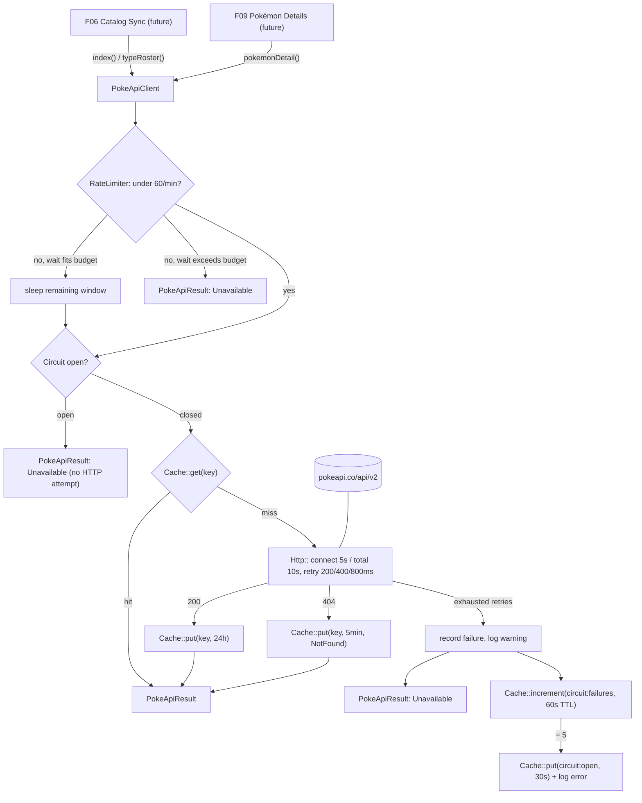
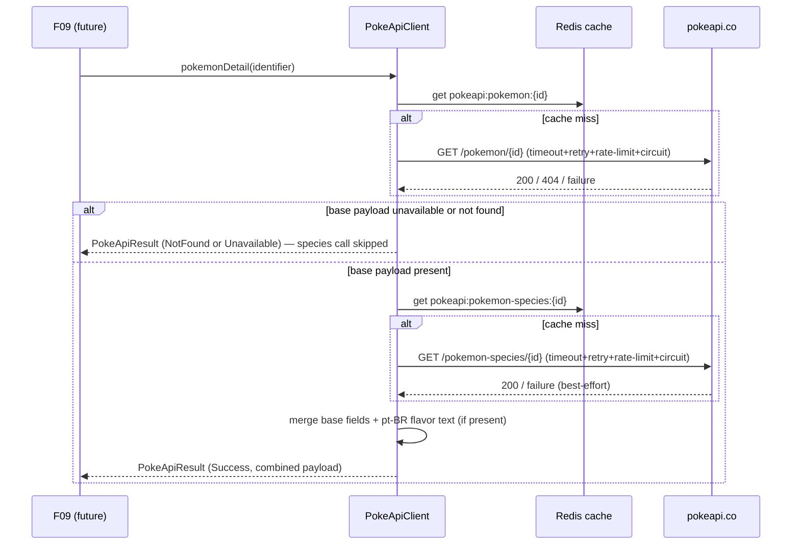

# Technical Specification: Resilient PokeAPI Client

## 1. Technical Overview

**What:** A single `PokeApiClient` service that is the only code in the codebase allowed to reach `https://pokeapi.co/api/v2`. It wraps Laravel's `Http::` client with a connect/total timeout, a bounded retry with exponential backoff, an outbound rate limiter that waits rather than fails, a Redis read-through cache with per-resource TTLs, and a short-circuit that stops spending retry budget after a run of consecutive failures. Every outcome — success, not found, or unavailable — is returned as an explicit typed value; the client never lets a PokeAPI exception escape to a caller.

**Why:** F05 is a Foundation feature (PRD Section 8): F06's catalog sync, F09's detail page, and every future integration with PokeAPI depend on it existing first and depend on it behaving identically everywhere it is called. Centralizing timeout, retry, rate limiting, and caching in one class is what makes the PRD's resilience claims — "search works with PokeAPI offline," "a repeated view triggers zero outbound calls," "no request blocks a worker indefinitely" — true by construction rather than by convention that could drift the second a second call site is added.

**Complexity:** medium — one new service directory, three new small classes (client, result DTO, status enum), a dedicated config file and log channel, and a Redis-backed rate limiter/circuit breaker, but no HTTP-facing endpoints, no database migration, and no UI. The design weight is concentrated in getting five independent resilience behaviors (timeout, retry, rate limit, cache, circuit breaker) to compose correctly around two upstream resource shapes (index/type-roster lookups, and a two-call detail assembly), not in the number of files.

### Scope

**Included (Core Scope):**
- `PokeApiClient` wrapping `Http::` with a 5-second connect timeout and 10-second total timeout per attempt
- Retry with exponential backoff (200/400/800 ms) on connection errors and HTTP 429/500/502/503/504; HTTP 404 is never retried
- Redis read-through cache keyed as `pokeapi:{resource}:{identifier}`, with a 24-hour TTL for Pokémon details, the index listing, and type rosters

**Included (Full Scope additions):**
- Outbound rate limiting at 60 requests/minute that waits for the window to clear (up to the per-request time budget) instead of failing
- A short-circuit that opens for 30 seconds after 5 consecutive failures within 60 seconds
- Structured logging of every upstream failure (endpoint, status, attempt number, elapsed ms) at `warning`, and short-circuit trips at `error`, on a dedicated log channel

Both blocks are included per the confirmed interview decision: PRD Section 9's F05 acceptance criteria test the short-circuit behavior and the once-per-minute cache-failure log directly, so Core Scope alone would leave two acceptance criteria unsatisfiable.

**Excluded (owned by other features):**
- Persisting fetched data anywhere (F06 writes the `pokemon`/`types` tables from what this client returns; F09 renders the detail payload — this client never touches a database)
- Any UI state (loading skeletons, unavailable banners, "não encontrado" pages) — F07/F08/F09 render those from the outcomes this client produces
- The catalog sync job's scheduling, batching, and idempotent writes (F06)
- Deciding what a cache miss means for the interface (F09's retry button, F07's "catálogo sincronizando" state)

---

## 2. Architecture Impact

| Layer | Components |
|---|---|
| Configuration | `config/pokeapi.php` (new), `.env.example` (modified), `config/logging.php` (modified — new `pokeapi` channel) |
| Service | `app/Services/PokeApi/PokeApiClient.php`, `PokeApiResult.php`, `PokeApiStatus.php` (all new) |
| Infrastructure reused | `Http::` facade (retry/timeout), `Cache::` facade on the `redis` store (response cache + circuit breaker counters), `Cache::store('file')` (cache-outage log throttle, deliberately not Redis), `RateLimiter::` facade, `Log::channel('pokeapi')` |
| Consumers (future) | F06 (`index()`, `typeRoster()`), F09 (`pokemonDetail()`) — not built yet; this spec only guarantees the contract they will call |
| Tests | `tests/Unit/Services/PokeApiClientTest.php` (new), `tests/Pest.php` (modified — binds `Unit` suite to the app-aware test case) |



**Detail payload assembly (`pokemonDetail()`)**



---

## 3. Technical Decisions

| Decision | Chosen Approach | Alternative Considered | Trade-off |
|---|---|---|---|
| Outcome representation | `PokeApiStatus` backed enum (`Success`, `NotFound`, `Unavailable`) paired with an immutable `PokeApiResult` DTO | Plain associative array (`['status' => ..., 'data' => ...]`) | Confirmed in interview. Typed, IDE-navigable, and impossible to typo a status string; costs two small classes for a codebase that has none yet |
| Circuit breaker state | Redis cache counters: `Cache::increment()` on a 60s-TTL failure count, a separate 30s-TTL open flag | Dedicated database table of failure timestamps | Confirmed in interview. Reuses the store already backing the response cache, needs no migration; the trade-off is that a `Cache::flush()` (never done in this project outside tests) would silently reset an open circuit |
| Failure/short-circuit log channel | New dedicated `pokeapi` channel (`storage/logs/pokeapi.log`) in `config/logging.php` | Default `stack` channel with a message prefix | Confirmed in interview. Upstream incidents are grep-able independent of `laravel.log`; costs one new channel definition |
| Config location | Dedicated `config/pokeapi.php` (timeouts, retry, rate limit, cache TTLs, circuit breaker thresholds, log channel name) | Add a `pokeapi` block to `config/services.php` | Follows this codebase's own precedent — `config/horizon.php` and `config/reverb.php` are already dedicated per-integration files rather than entries in `services.php`. `services.php` in this project holds only bare credential pairs (Postmark, SES, Slack); F05 has ~10 tunable values, which would crowd that file |
| Cache-outage log throttle store | `Cache::store('file')`, independent of the `redis` default store | An in-process static flag | The whole point of this log-throttle is to survive Redis being down, so it cannot itself live in Redis; `file` already exists (`storage/framework/cache/data`, created by the F01 entrypoint) and persists across PHP-FPM requests within the same worker, unlike a static property reset in an isolated `queue`/`web` process |
| Detail payload assembly | `pokemonDetail()` internally issues two upstream calls — `GET /pokemon/{id}` and `GET /pokemon-species/{id}` — cached and rate-limited independently under their own resource keys, merged into one `PokeApiResult` | Expose two separate client methods (`pokemon()`, `species()`) and let F09 assemble them | PokeAPI's base `/pokemon/{id}` response has no flavor text; it lives only on `/pokemon-species/{id}`. The PRD's F05 Provides block frames "full detail payload including species flavor text" as one unit consumed by F09, so the assembly belongs in the client, not duplicated at every call site. The base call's outcome (Success/NotFound/Unavailable) determines the overall result; a species-call failure degrades gracefully — flavor text is simply absent from the merged payload rather than failing the whole request, matching F09's Error Handling ("Informação indisponível." for missing sections rather than a hard failure) |
| Rate-limiter wait strategy | Before each upstream attempt, check `RateLimiter::tooManyAttempts('pokeapi-outbound', 60)`; if throttled, sleep `RateLimiter::availableIn()` only when that wait still fits inside the request's remaining time budget, otherwise return `Unavailable` immediately without ever calling upstream | `RateLimiter::attempt()`, which refuses immediately with no wait | Laravel's `RateLimiter` facade has no built-in blocking mode; PRD Capabilities explicitly require waiting ("the client waits for the window instead of failing, up to the 10-second budget"), so the wait/budget check has to be hand-rolled around the facade's primitives |
| Container resolution | No service provider binding; `PokeApiClient` has a no-argument constructor and reads `config()`/`Http::`/`Cache::`/`RateLimiter::`/`Log::` facades internally, so Laravel's container resolves it automatically wherever it is type-hinted | Bind as a singleton in `AppServiceProvider` | One less file to touch; nothing in the class needs request-scoped or manually-configured state that would justify an explicit binding |

---

## 4. Component Overview

### Service

| File Path | New/Modified | Purpose | Key Responsibilities |
|---|---|---|---|
| `app/Services/PokeApi/PokeApiClient.php` | New | The only class permitted to call `pokeapi.co` | Exposes `index()`, `typeRoster(string $type)`, `pokemonDetail(int\|string $identifier)`; wires timeout, retry, rate-limit wait, circuit breaker check, cache read-through, and failure logging around every upstream call |
| `app/Services/PokeApi/PokeApiResult.php` | New | Immutable outcome value object | Readonly `status` (`PokeApiStatus`), `data` (`array\|null`), `resource` (`string`), `identifier` (`string\|null`); no behavior beyond construction and a `successful()`/`data()` convenience accessor pair |
| `app/Services/PokeApi/PokeApiStatus.php` | New | Backed enum | Cases `Success`, `NotFound`, `Unavailable` — the three outcomes the PRD requires callers to branch on instead of catching exceptions |

### Configuration

| File Path | New/Modified | Purpose | Key Responsibilities |
|---|---|---|---|
| `config/pokeapi.php` | New | Every tunable the client reads | `base_uri` (env-backed, default `https://pokeapi.co/api/v2`); fixed defaults for `connect_timeout` (5), `timeout` (10), `retry.times` (3), `retry.backoff_ms` (`[200, 400, 800]`); `rate_limit.max_attempts` (60), `rate_limit.decay_seconds` (60); `cache.ttl_hours` (24), `cache.not_found_ttl_minutes` (5); `circuit_breaker.failure_threshold` (5), `circuit_breaker.failure_window_seconds` (60), `circuit_breaker.cooldown_seconds` (30); `log_channel` (`pokeapi`) |
| `config/logging.php` | Modified | Adds the `pokeapi` channel | `single`-driver channel writing to `storage/logs/pokeapi.log` at `warning` level, mirroring the existing `single` channel's shape |
| `.env.example` | Modified | Adds the one env key this feature introduces | `POKEAPI_BASE_URI=https://pokeapi.co/api/v2` — F01's own spec explicitly reserved these keys for F05; every other tunable is a fixed PRD-mandated number, not exposed as env, so a careless edit cannot silently violate an acceptance criterion |

### Tests

| File Path | New/Modified | Purpose | Key Responsibilities |
|---|---|---|---|
| `tests/Unit/Services/PokeApiClientTest.php` | New | Full behavioral coverage of the client | See Section 8 |
| `tests/Pest.php` | Modified | Binds `tests/Unit` to an app-aware test case | Adds `pest()->extend(Tests\TestCase::class)->in('Unit')` alongside the existing `Feature` binding — no `RefreshDatabase`, since this suite never touches the database, but it still needs the full container for `Http::fake()`, `Cache::`, `RateLimiter::`, and `Log::` |

No migration, model, controller, Livewire component, or Blade view is authored by this feature.

---

## 5. Exposed Interfaces

F05 exposes no HTTP endpoint or Livewire component — the PRD's own Experience section says as much ("this feature has no direct interface"). Its contract is the public method surface of `PokeApiClient`, consumed in-process by F06 and F09.

### Method: `index()`

- **Signature:** `index(): PokeApiResult`
- **Upstream call:** `GET /pokemon?limit=100000&offset=0`
- **Cache key:** `pokeapi:index:all`, TTL 24h

Normalizes PokeAPI's raw `{name, url}` list into entries carrying the national number extracted from the trailing path segment of `url`, since the raw response has no numeric field.

**Result data shape (Success):**
```json
{
  "count": 1302,
  "entries": [
    { "number": 1, "name": "bulbasaur", "url": "https://pokeapi.co/api/v2/pokemon/1/" },
    { "number": 2, "name": "ivysaur", "url": "https://pokeapi.co/api/v2/pokemon/2/" }
  ]
}
```

### Method: `typeRoster(string $type)`

- **Signature:** `typeRoster(string $type): PokeApiResult`
- **Upstream call:** `GET /type/{type}`
- **Cache key:** `pokeapi:type:{type}`, TTL 24h

**Result data shape (Success):**
```json
{
  "type": "fire",
  "members": ["charmander", "charmeleon", "charizard", "vulpix"]
}
```

**Error responses:**

| Condition | `PokeApiStatus` | Notes |
|---|---|---|
| Unknown type name | `NotFound` | PokeAPI returns 404 for a type slug it does not recognize |
| Upstream unreachable/exhausted retries/circuit open/rate-limit budget exceeded | `Unavailable` | Caller (F06) is expected to leave the sync job to its own retry/backoff per its spec |

### Method: `pokemonDetail(int|string $identifier)`

- **Signature:** `pokemonDetail(int\|string $identifier): PokeApiResult`
- **Upstream calls:** `GET /pokemon/{identifier}`, then (only if the first succeeds) `GET /pokemon-species/{identifier}`
- **Cache keys:** `pokeapi:pokemon:{identifier}` and `pokeapi:pokemon-species:{identifier}`, each TTL 24h independently; not-found results cached 5 minutes

**Result data shape (Success):**
```json
{
  "number": 6,
  "name": "charizard",
  "sprite_url": "https://raw.githubusercontent.com/PokeAPI/sprites/master/sprites/pokemon/other/official-artwork/6.png",
  "types": ["fire", "flying"],
  "abilities": [
    { "name": "blaze", "hidden": false },
    { "name": "solar-power", "hidden": true }
  ],
  "stats": { "hp": 78, "attack": 84, "defense": 78, "special_attack": 109, "special_defense": 85, "speed": 100 },
  "height_m": 1.7,
  "weight_kg": 90.5,
  "flavor_text": "Charizard voa pelo céu em busca de oponentes fortes."
}
```

`flavor_text` is present only when the `pt-BR` entry exists in the species payload's `flavor_text_entries`; otherwise the key is simply absent (F09 renders "Informação indisponível." for it, per its own spec).

**Outcome contract (applies to every method):**

| `PokeApiStatus` | When | `data` |
|---|---|---|
| `Success` | Upstream 200 (or cache hit) | The normalized shape above |
| `NotFound` | Upstream 404 on the base resource | `null` |
| `Unavailable` | Retries exhausted, malformed body, circuit open, or rate-limit wait would exceed budget | `null` |

---

## 6. Data Model

No database migration — this feature owns no table. Its persistent state is entirely in Redis, described here in place of a schema because F06 and F09 rely on its exact shape.

### Redis cache keys (via `Cache::` on the `redis` store, prefixed by the application's existing `CACHE_PREFIX=pokelink_cache`)

| Key pattern | Example | TTL | Written on |
|---|---|---|---|
| `pokeapi:index:all` | `pokeapi:index:all` | 24h | `index()` success |
| `pokeapi:type:{type}` | `pokeapi:type:fire` | 24h | `typeRoster()` success |
| `pokeapi:pokemon:{identifier}` | `pokeapi:pokemon:6` | 24h (success) / 5min (not found) | `pokemonDetail()` base call |
| `pokeapi:pokemon-species:{identifier}` | `pokeapi:pokemon-species:6` | 24h | `pokemonDetail()` species call (best-effort; not written on species failure) |
| `pokeapi:circuit:failures` | `pokeapi:circuit:failures` | 60s, reset on any success | Incremented on each terminal (post-retry) failure |
| `pokeapi:circuit:open` | `pokeapi:circuit:open` | 30s | Written once when `pokeapi:circuit:failures` reaches 5 |

`Unavailable` outcomes are never cached under any key — a malformed body or an exhausted retry must not poison a future request within the TTL window.

### File-store cache key (via `Cache::store('file')`, deliberately not Redis)

| Key | TTL | Purpose |
|---|---|---|
| `pokeapi:cache-degraded-logged` | 60s | Gates the "cache failure" warning to at most once per minute even while Redis stays down for the whole outage |

### Rate limiter key (via `RateLimiter::`, itself backed by the default cache store)

| Key | Window | Purpose |
|---|---|---|
| `pokeapi-outbound` | 60 requests / 60s | Shared across every method and every caller — the PRD's 60/min budget is application-wide, not per-resource |

---

## 7. Failure Modes and Error Handling

Derived from the PRD's F05 Error Handling block.

| Failure | Detection | Behavior | Outcome / Log |
|---|---|---|---|
| Connection refused or DNS failure | `Http::` connection exception | 3 attempts with 200/400/800ms backoff, then give up | `Unavailable`; each attempt logs endpoint, status (`connection_error`), attempt number, elapsed ms at `warning` on `pokeapi` |
| HTTP 429 from PokeAPI | Response status | Treated as retryable, same backoff; if all 3 attempts return 429 | `Unavailable`; final attempt logged at `error` |
| HTTP 500/502/503/504 | Response status | Same retry/backoff as 429 | `Unavailable` after exhaustion; `warning` per attempt |
| HTTP 404 | Response status | Returned immediately, no retry, no backoff delay | `NotFound`; cached 5 minutes so a repeated bad slug does not re-hit upstream; not logged (expected outcome, not a failure) |
| Malformed or non-JSON response body | JSON decode failure on an otherwise-200 response | Treated as unavailable; nothing written to cache | `Unavailable`; first 500 characters of the raw body logged at `warning` |
| Request exceeding the 10s total or 5s connect budget | `Http::` timeout exception | Counted the same as a connection error for retry purposes | `Unavailable` once retries are exhausted; logged at `warning` |
| Redis unavailable | `Cache::` throws on the `redis` store | Client bypasses the cache read/write for that call and goes straight to (or from) upstream; the request itself still succeeds | Outcome unaffected by the cache outage; the outage itself logged at `warning` on `pokeapi`, gated to once per 60s via the file-store flag |
| 5 consecutive failures within 60s | `pokeapi:circuit:failures` reaches 5 | Circuit opens for 30s; every call during that window returns immediately with no HTTP attempt, no retry budget spent, no rate-limiter check | `Unavailable`; the trip itself logged once at `error`; calls short-circuited while the breaker stays open are not individually logged, to avoid flooding the channel |
| Rate limit window exhausted, but the wait fits the remaining request budget | `RateLimiter::tooManyAttempts()` | Client sleeps until the window clears, then proceeds | No outcome change, no log — this is normal backpressure, not a failure |
| Rate limit window exhausted, wait would exceed the remaining request budget | `RateLimiter::availableIn()` compared against the budget | Client returns immediately without attempting the request | `Unavailable`; logged at `warning` with reason `rate_limited` |
| Species call fails during `pokemonDetail()` after the base call succeeded | Base call `Success`, species call exhausts retries or 404s | Merge proceeds with the base payload; `flavor_text` key simply absent | Overall `Success`; species failure logged at `warning` same as any other failed attempt |

---

## 8. Testing Strategy

### Test files

| Test File | Test Type | Target | Coverage Goal |
|---|---|---|---|
| `tests/Unit/Services/PokeApiClientTest.php` | Unit | `App\Services\PokeApi\PokeApiClient` | Every branch in Section 7's failure table, plus the three success shapes from Section 5 |
| `tests/Unit/PokeApiArchitectureTest.php` | Unit (Pest arch) | Whole codebase | Enforces "no file outside the service reaches PokeAPI" as a running test, not just a convention |

All tests use `Http::fake()` — no test in this suite reaches the network, consistent with F13's project-wide rule.

### `tests/Unit/Services/PokeApiClientTest.php`

| Test Function | Description | Assertions |
|---|---|---|
| `index retorna a listagem paginada e extrai o número nacional da URL` | Fakes a 200 index response | `Success`, `data.entries` carries a `number` derived from each entry's URL |
| `typeRoster retorna os membros de um tipo` | Fakes a 200 type response | `Success`, `data.members` matches the faked payload |
| `pokemonDetail combina o payload base com o texto da espécie em pt-BR` | Fakes 200 on both `/pokemon/{id}` and `/pokemon-species/{id}` with a `pt-BR` flavor entry | `Success`; merged `data` contains stats, abilities, height in metres, weight in kilograms, and `flavor_text` |
| `pokemonDetail funciona sem texto de sabor quando a espécie não tem entrada pt-BR` | Fakes species response with no `pt-BR` entry | `Success`; `data` has no `flavor_text` key |
| `pokemonDetail não chama a espécie quando o payload base não é encontrado` | Fakes 404 on `/pokemon/{id}` | `NotFound`; `Http::assertNotSent` for the species endpoint |
| `uma falha de conexão é tentada 3 vezes com o backoff 200/400/800ms e depois reportada como indisponível` | Fakes a connection exception on every attempt | `Http::assertSentCount(3)`; result is `Unavailable`; no exception escapes the call |
| `um 404 não é retentado` | Fakes a single 404 response | `Http::assertSentCount(1)`; result is `NotFound` |
| `um 500 é retentado e reportado indisponível após esgotar as tentativas` | Fakes 500 on all 3 attempts | `Http::assertSentCount(3)`; `Unavailable`; 3 `warning` log entries on the `pokeapi` channel (`Log::spy()`) |
| `uma resposta bem-sucedida é escrita no cache e a segunda chamada não faz requisição` | Fakes one 200 response, calls `pokemonDetail()` twice | `Http::assertSentCount(1)` across both calls |
| `um resultado não encontrado é cacheado por 5 minutos, não 24 horas` | Fakes 404, asserts the cache entry's TTL | `Cache::get()` returns the cached `NotFound` result immediately after; travels 6 minutes forward, cache entry gone |
| `um corpo malformado é tratado como indisponível e nada é escrito no cache` | Fakes a 200 response with a non-JSON body | `Unavailable`; `Cache::has()` is false for that key afterward |
| `nenhuma tentativa ultrapassa o orçamento de tempo configurado` | Asserts client configuration | `config('pokeapi.connect_timeout') === 5`, `config('pokeapi.timeout') === 10`, and the `Http::` request built by the client carries those values |
| `com Redis indisponível a requisição ainda é bem-sucedida e a falha de cache é logada no máximo uma vez por minuto` | Forces the `redis` cache store to throw (`Cache::shouldReceive` / a swapped failing store), fakes 3 successful upstream calls in sequence | All 3 calls return `Success`; `Log::spy()` shows exactly 1 `warning` about the cache outage, not 3 |
| `após 5 falhas consecutivas em 60 segundos o circuito abre e a próxima chamada não tenta a rede` | Fakes 5 consecutive failing responses, then a 6th call | The 6th call returns `Unavailable` with `Http::assertSentCount(5)` (no 6th attempt); one `error` log entry for the trip |
| `o circuito fecha novamente após o cooldown de 30 segundos` | Trips the circuit, travels 31 seconds forward (`Carbon::setTestNow`), fakes a 200 response | The next call reaches upstream and returns `Success` |
| `o rate limiter aguarda a janela quando a espera cabe no orçamento da requisição` | Pre-fills the limiter to its 60/min ceiling with the window closing in under 10s, fakes a 200 response after the wait | Call still returns `Success`; elapsed test time reflects the wait |
| `o rate limiter reporta indisponível quando a espera excederia o orçamento` | Pre-fills the limiter with a window closing beyond 10s | `Unavailable`; `Http::assertNothingSent()` |

### `tests/Unit/PokeApiArchitectureTest.php`

| Test Function | Description | Assertions |
|---|---|---|
| `apenas o serviço PokeApi usa o cliente Http para falar com a PokeAPI` | Pest arch preset | `Illuminate\Support\Facades\Http` is used only inside `App\Services\PokeApi` |

### Cross-Feature Integration criteria (PRD Section 9)

Two integration criteria name F05 as producer:
- *"The index and type roster responses returned by the PokeAPI client (F05) populate the local catalog rows and type vocabulary written by the sync job (F06)..."*
- *"The full detail payload returned by the PokeAPI client (F05) renders on the detail page (F09)..."*

Neither F06 nor F09 exists yet in this codebase, so the assertions that exercise the actual hand-off belong to those features' own test suites once built — the same treatment F01's spec gave criteria it could not yet verify end-to-end. F05's responsibility, verified here, is that `index()`, `typeRoster()`, and `pokemonDetail()` return exactly the payload shapes Section 5 documents, since that shape is the contract F06 and F09 will build their own tests against.

---

## Appendix: PRD Traceability

| PRD block | Spec destination |
|---|---|
| F05 Provides | Section 5 Exposed Interfaces, Section 6 Data Model (cache keys F06/F09 read) |
| F05 Core Scope | Section 1 Scope → Included (Core), Section 4 Component Overview |
| F05 Full Scope additions | Section 1 Scope → Included (Full), Section 3 (rate limit, circuit breaker, logging decisions), Section 7 |
| F05 Capabilities | Section 2 Architecture Impact, Section 3 Technical Decisions, Section 5, Section 6 |
| F05 Experience ("no direct interface") | Section 5 opening note |
| F05 Error Handling | Section 7 Failure Modes and Error Handling |
| Section 8 Foundation Features (F05 entry) | Section 1 Why |
| Section 9 F05 acceptance criteria | Section 8 test list (each of the 7 criteria maps to one or more named tests) |
| Section 9 Cross-Feature Integration (F05→F06, F05→F09) | Section 8 "Cross-Feature Integration criteria" subsection |
| F09 Capabilities (species flavor text field) | Section 3 detail-payload-assembly decision, Section 5 `pokemonDetail()` shape |
| F06 Capabilities (19 exact upstream calls via index + type roster only) | Section 5 confirms `pokemonDetail()` is not part of that call budget |

## Appendix: Assumptions Requiring Review

Recorded so they can be corrected before implementation. The first four were confirmed directly in the spec interview; the rest were decided against PRD wording and existing codebase precedent because they had a single defensible answer.

1. **Core + Full Scope, both in this pass.** Confirmed in interview — Section 9's short-circuit and cache-failure-log criteria require Full Scope behavior, so splitting them into a later feature would leave F05 unable to pass its own acceptance criteria.
2. **Outcome shape is an enum + DTO, not an array.** Confirmed in interview.
3. **Circuit breaker state lives in Redis cache counters, not a database table.** Confirmed in interview.
4. **Failure logs go to a dedicated `pokeapi` channel.** Confirmed in interview.
5. **Config lives in a dedicated `config/pokeapi.php`, not `config/services.php`.** Follows this codebase's own `config/horizon.php`/`config/reverb.php` precedent.
6. **Only `POKEAPI_BASE_URI` is env-configurable; every timing/threshold value is a fixed config default.** The PRD prescribes exact numbers as acceptance criteria (200/400/800ms, 60/min, 5-in-60s, 30s cooldown); making them env-overridable would let a `.env` edit silently break a criterion the README claims is met.
7. **`pokemonDetail()` internally issues two upstream calls (`/pokemon/{id}` and `/pokemon-species/{id}`) to source flavor text.** PokeAPI's base pokémon resource has no flavor text field; it only exists on the species resource. This is not visible from the PRD text alone and was found by cross-referencing F09's Capabilities (species flavor text) against the actual PokeAPI response shape.
8. **A species-call failure does not fail the whole `pokemonDetail()` result.** Only the base call's outcome determines Success/NotFound/Unavailable; flavor text is best-effort, consistent with F09's "Informação indisponível." handling for missing sections.
9. **`tests/Pest.php` needs a new binding for the `Unit` suite.** Today only `Feature` is bound to `Tests\TestCase`; `Http::fake()`/`Cache::`/`RateLimiter::` need the full container, so `Unit` must bind to the same test case (without `RefreshDatabase`, since nothing here touches a database).
10. **Not-found results are cached for 5 minutes.** The PRD's phrase "without caching a negative result for more than 5 minutes" is read as permitting — not forbidding — a short negative cache, to stop a persistently bad slug from re-hitting upstream on every request.
