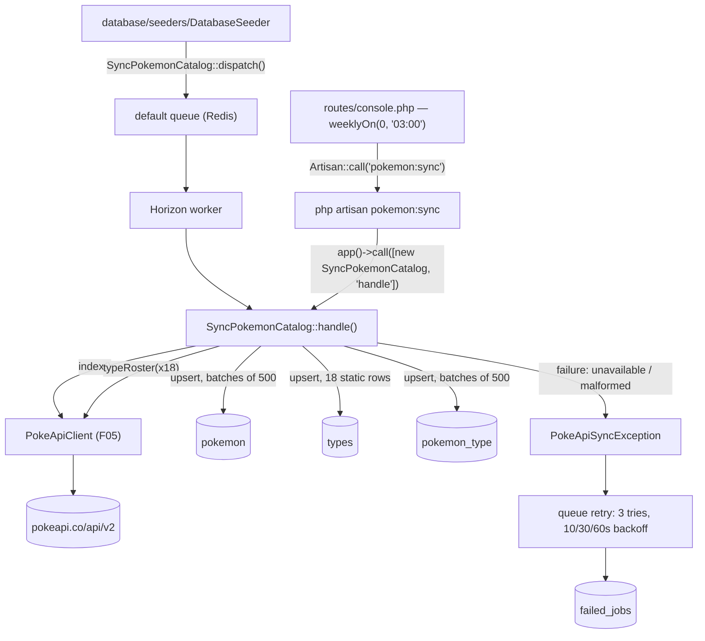
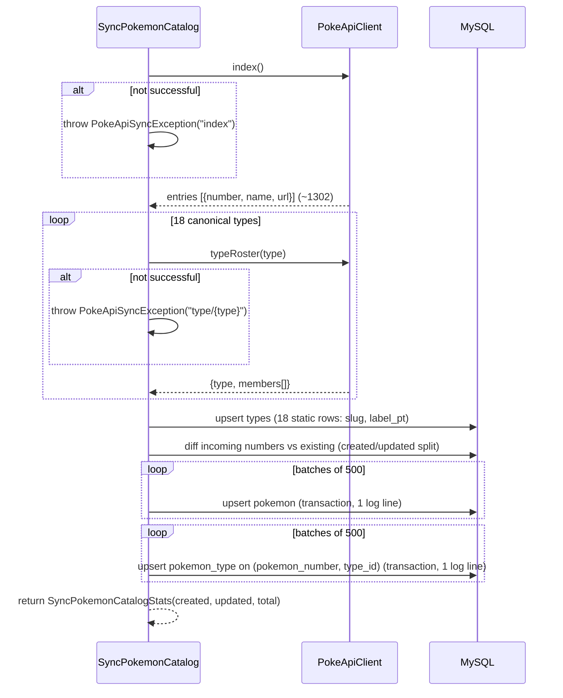

# Technical Specification: Pokémon Catalog Sync

## 1. Technical Overview

**What:** A single queued job, `SyncPokemonCatalog`, that populates the local `pokemon`, `types`, and `pokemon_type` tables from exactly 19 calls through F05's `PokeApiClient` — one `index()` call and eighteen `typeRoster()` calls, one per canonical type. The job is dispatched onto the `default` queue by the database seeder on first boot, is re-runnable on demand through `php artisan pokemon:sync` (which executes the identical job logic synchronously so it can print a summary), and is registered for a weekly refresh through Laravel's scheduler. Every write goes through `upsert`, so a re-run changes the row count by zero and never duplicates a pivot row.

**Why:** F06 is what makes the PRD's central resilience claim true: search, filtering, and pagination (F07/F08) never touch PokeAPI, because by the time a user reaches the search screen the catalog already lives in MySQL. F10's favorites also read exclusively from these tables. This feature is the one and only place in the codebase that turns F05's transient, cache-backed `PokeApiResult` payloads into durable, queryable rows — everything downstream of it (F07, F08, F09's local-data fallback, F10) depends on this sync having run at least once and on it being safe to run again without side effects.

**Complexity:** complex — three new tables (one with a non-standard primary key), a queued job with strict call-budget and idempotency constraints, a shared synchronous/asynchronous execution path, Horizon-visible batch progress logging, a scheduler registration, and a broad test matrix covering idempotency, retry/backoff, malformed-schema failure, and exact call counts.

### Scope

**Included (Core Scope):**
- `SyncPokemonCatalog` job (`ShouldQueue`) that calls `PokeApiClient::index()` once and `PokeApiClient::typeRoster()` eighteen times, builds `pokemon` and `pokemon_type` rows, and writes both in batches of 500 via `upsert`
- `pokemon`, `types`, `pokemon_type` migrations, `Pokemon` and `Type` Eloquent models with a `belongsToMany` relationship between them
- Dispatch from `database/seeders/DatabaseSeeder.php` at the documented extension point, onto the `default` queue, processed by the existing Horizon worker
- `php artisan pokemon:sync` artisan command that runs the same job logic synchronously and prints the PRD's exact summary sentence
- Full idempotency: re-running the sync changes the `pokemon` row count by zero and creates no duplicate `pokemon_type` rows

**Included (Full Scope additions — confirmed in interview):**
- Horizon-visible progress: the job is tagged `pokemon-sync`, and each 500-row batch write logs one line (table, batch index, row count) to the default log channel, readable via `docker compose logs -f queue` and the job's Horizon detail view
- `Schedule::command('pokemon:sync')->weeklyOn(0, '03:00')` registered in `routes/console.php`

**Excluded (owned by other features):**
- Reading/filtering the synced catalog — F07 owns the search query, F08 owns rendering and pagination
- Fetching full Pokémon detail payloads (abilities, stats, flavor text) — F09 calls `PokeApiClient::pokemonDetail()` directly and never touches this feature's tables for that purpose
- The `pokemon_type` pivot being used for favorites display — F10 reads these tables but does not write them
- Any HTTP-facing route or UI — this feature's only interfaces are a queued job, an artisan command, and a scheduler entry

---

## 2. Architecture Impact

| Layer | Components |
|---|---|
| Queue | `app/Jobs/SyncPokemonCatalog.php`, `app/Jobs/SyncPokemonCatalogStats.php` (new) |
| Console | `app/Console/Commands/SyncPokemonCommand.php` (new), `routes/console.php` (modified — schedule registration) |
| Configuration | `config/pokemon.php` (new — type labels, batch size, retry/backoff/timeout, schedule) |
| Domain | `app/Models/Pokemon.php`, `app/Models/Type.php` (new) |
| Errors | `app/Exceptions/PokeApiSyncException.php` (new) |
| Database | 3 new migrations (`types`, `pokemon`, `pokemon_type`), `database/factories/PokemonFactory.php`, `database/factories/TypeFactory.php` (new) |
| Delivery | `database/seeders/DatabaseSeeder.php` (modified — dispatch call replaces the F01 extension-point comment) |
| Consumed | `App\Services\PokeApi\PokeApiClient::index()`, `::typeRoster(string $type)` (F05, already shipped) |
| Consumers (future) | F07 (`pokemon`/`types`/`pokemon_type` queries), F09 (local fallback fields on `pokemon`), F10 (`pokemon`/`pokemon_type` for favorited-card rendering) |



**Sync sequence**



---

## 3. Technical Decisions

| Decision | Chosen Approach | Alternative Considered | Trade-off |
|---|---|---|---|
| `name`/`slug` derivation | Confirmed in interview. Both columns store the identical raw PokeAPI string returned by `index()` (e.g. `"mr-mime"`) | Compute a title-cased display name at sync time (`"Mr Mime"`) | Keeps formatting logic in one place (F08's render layer per its own "name capitalized" wording) instead of duplicating a capitalization rule between the sync job and the card component; the two columns exist so `slug` (routing) and `name` (display source) can diverge later without a migration, even though they agree today |
| `pokemon_type` idempotency | Confirmed in interview. Composite unique index on `(pokemon_number, type_id)`; batched `upsert()` with `type_id` as the (self-referential, no-op) update column — MySQL's `ON DUPLICATE KEY UPDATE` requires a non-empty `SET` clause, and a type membership row has no other mutable data | Truncate-then-reinsert `pokemon_type` on every run | Upsert keeps every row continuously present — a page load mid-sync never sees a Pokémon with zero types, matching the PRD's upsert-based idempotency framing; truncation would create a brief empty window and contradicts "updates nothing that has not changed" |
| No `slot` (primary/secondary type order) column | `pokemon_type` carries no order column; F08/F09 render a Pokémon's types in whatever order the pivot rows return | Add a `slot` column populated from per-Pokémon detail order | Slot order lives only on `/pokemon/{id}`'s `types[].slot` field, which the 19-call budget deliberately excludes (that endpoint is F09's `pokemonDetail()`, not F06's). Adding it would mean either a 1303rd call (violates the exact-19 acceptance criterion) or storing a guess; leaving it out is the only approach that stays inside the budget |
| Shared job logic for queued and CLI paths | `SyncPokemonCatalog::handle()` is called two ways: `::dispatch()` (queued, from the seeder) and a direct container call — `app()->call([new SyncPokemonCatalog, 'handle'])` — from the artisan command, which reads the return value directly | `::dispatchSync()`, or duplicating the sync logic into a separate synchronous service class the job also calls | Discovered during implementation: for a `ShouldQueue` job, `dispatchSync()` does **not** bypass the queue — it still routes through `Dispatcher::dispatchSync()`, which forces the job onto the `sync` connection and returns `SyncQueue::push()`'s job-id placeholder (and swallows exceptions into the job's failure handling) rather than the handler's real return value. A direct container call keeps type-hinted `PokeApiClient` resolution while getting the actual `SyncPokemonCatalogStats` and thrown `PokeApiSyncException` back, with no second copy of the orchestration logic |
| pt-BR type labels | Confirmed in interview. Hardcoded in `config/pokemon.php` as `type_labels` (18 canonical slugs → pt-BR label) | Fetch each type's localized `names` array from `/type/{name}` | F05's `typeRoster()` transform (already shipped) extracts only `type` and `members`, not the response's `names` localization array; extending F05 to expose it is out of this feature's file footprint, and Pokémon's 18 types are a fixed, rarely-changing enumeration — a static map is lower-risk than a shape F05 doesn't currently return |
| Created/updated count | Before each 500-row `pokemon` batch upsert, query which of the incoming national numbers already exist, then diff to get the created/updated split for that batch; sum across batches | Inspect `upsert()`'s affected-row count | MySQL's affected-row count for `ON DUPLICATE KEY UPDATE` conflates inserts and updates (and can double-count updates), so it cannot produce the PRD's exact "(X criados, Y atualizados)" sentence; the pre-upsert diff is the only reliable source |
| Sprite URL formula | Re-derived locally in the job from the national number, using the same official-artwork path F05 already uses internally | Expose `PokeApiClient`'s private `officialArtworkUrl()` as a public/static helper | `officialArtworkUrl()` is private on an already-merged F05 class; changing F05's public surface is outside F06's scope. Documented as a known duplication — a future refactor could extract a shared `SpriteUrl` helper if a third caller ever needs the same formula |
| Weekly schedule registration | Confirmed in interview. `Schedule::command('pokemon:sync')->weeklyOn(0, '03:00')` added to `routes/console.php` | Add a 7th `scheduler` service to F01's docker-compose | F01 (Foundation, already merged) ships exactly 6 services with no cron/`schedule:work` loop; adding one would modify an already-delivered Foundation feature's file footprint. The command is registered and schedulable per the PRD's literal wording ("a schedulable weekly refresh command"), but firing it automatically inside the delivered stack requires an external cron or `schedule:work` process. Documented in README as a known gap with `docker compose exec app php artisan pokemon:sync` as the manual fallback — mirroring the PRD's own precedent for the "queue worker not running" case |

---

## 4. Component Overview

### Queue and console

| File Path | New/Modified | Purpose | Key Responsibilities |
|---|---|---|---|
| `app/Jobs/SyncPokemonCatalog.php` | New | Orchestrates the full sync | Calls `index()` + 18×`typeRoster()`; builds and batches `pokemon`/`pokemon_type` rows; throws `PokeApiSyncException` on any unsuccessful/malformed call; `$tries = 3`, `$backoff = [10, 30, 60]`, `$timeout = 300`; tagged `['pokemon-sync']` for Horizon; logs one line per 500-row batch |
| `app/Jobs/SyncPokemonCatalogStats.php` | New | Immutable result value | Carries `created`, `updated`, `total` pokemon counts returned by `handle()` to both the command and (optionally) the log summary |
| `app/Console/Commands/SyncPokemonCommand.php` | New | `pokemon:sync` artisan command | Runs the job via `app()->call([new SyncPokemonCatalog, 'handle'])`, prints "N Pokémon sincronizados (X criados, Y atualizados)" from the returned stats |
| `app/Exceptions/PokeApiSyncException.php` | New | Descriptive sync failure | Carries the failing endpoint name (`"index"` or `"type/{slug}"`) in its message so `failed_jobs` and logs name the exact call that failed |
| `routes/console.php` | Modified | Scheduler registration | Adds `Schedule::command('pokemon:sync')->weeklyOn(0, '03:00')`, imported via the `Schedule` facade |

### Domain

| File Path | New/Modified | Purpose | Key Responsibilities |
|---|---|---|---|
| `app/Models/Pokemon.php` | New | Local catalog row | `protected $primaryKey = 'number'`, `public $incrementing = false`; `belongsToMany(Type::class, 'pokemon_type', 'pokemon_number', 'type_id')`; `$fillable` on `number`, `name`, `slug`, `sprite_url` |
| `app/Models/Type.php` | New | Type vocabulary row | `belongsToMany(Pokemon::class, 'pokemon_type', 'type_id', 'pokemon_number')`; `$fillable` on `slug`, `label_pt` |
| `config/pokemon.php` | New | Sync-tunable values | `type_labels` (18 canonical slug → pt-BR label pairs), `sync.batch_size` (500), `sync.tries`/`backoff_seconds`/`timeout_seconds`, `schedule.day`/`time` — follows this codebase's established per-integration config-file convention (`config/pokeapi.php`, `config/horizon.php`) rather than crowding `config/services.php` |

### Database

| Migration File | Tables Affected | Operation | Notes |
|---|---|---|---|
| `2026_08_16_000001_create_types_table.php` | `types` | CREATE | Must run before `pokemon_type` |
| `2026_08_16_000002_create_pokemon_table.php` | `pokemon` | CREATE | Primary key is the national dex number, not an auto-increment id |
| `2026_08_16_000003_create_pokemon_type_table.php` | `pokemon_type` | CREATE | Foreign keys to both `types.id` and `pokemon.number`; must run after both |

### Factories and delivery

| File Path | New/Modified | Purpose | Key Responsibilities |
|---|---|---|---|
| `database/factories/PokemonFactory.php` | New | Test data | Generates a syntactically valid national number, slug/name, and sprite URL so F07/F08/F09/F10 tests never depend on a real sync |
| `database/factories/TypeFactory.php` | New | Test data | Generates a unique slug and pt-BR label |
| `database/seeders/DatabaseSeeder.php` | Modified | Dispatch point | Replaces the F01-authored extension-point comment with `SyncPokemonCatalog::dispatch();`, still never blocking on network I/O since dispatch only enqueues |

---

## 5. Exposed Interfaces

F06 exposes no HTTP endpoint. Its surface is a queued job, an artisan command, and a scheduler entry.

### Job contract: `SyncPokemonCatalog`

| Aspect | Value |
|---|---|
| Dispatch (async) | `SyncPokemonCatalog::dispatch()` — enqueued on the `default` queue, picked up by the Horizon worker |
| Dispatch (sync) | `app()->call([new SyncPokemonCatalog, 'handle'])` — direct container call, runs in-process, returns `SyncPokemonCatalogStats` (not `::dispatchSync()` — see Section 3) |
| Retry policy | `$tries = 3`; `$backoff = [10, 30, 60]` seconds; `$timeout = 300` seconds |
| Horizon tag | `pokemon-sync` |
| Upstream call budget | Exactly 19: 1× `index()`, 18× `typeRoster()` |
| Failure mode | Throws `PokeApiSyncException` naming the failing endpoint whenever a call is `unavailable()`, `notFound()`, or returns a `Success` payload with structurally missing/empty data (e.g. `index()` returning zero entries) |

### Console command: `pokemon:sync`

- **Signature:** `php artisan pokemon:sync`
- **Behavior:** runs the job via a direct container call and prints the returned stats

**Output (success):**
```
1302 Pokémon sincronizados (0 criados, 1302 atualizados)
```

**Output (first run):**
```
1302 Pokémon sincronizados (1302 criados, 0 atualizados)
```

**Output (failure — PokeAPI unavailable):**
```
Falha ao sincronizar o catálogo: PokeAPI indisponível (endpoint: index). Verifique os logs.
```
Exit code non-zero; nothing is written to `pokemon`/`pokemon_type` for the failing call.

### Scheduler entry

- **Registration:** `routes/console.php`
- **Expression:** weekly, Sunday at 03:00 (`weeklyOn(0, '03:00')`)
- **Precondition (documented, not built by this feature):** requires an external cron or `php artisan schedule:work` process; the delivered `docker-compose` stack (F01) has no such loop. README documents `docker compose exec app php artisan pokemon:sync` as the manual equivalent.

---

## 6. Data Model

### Table: `types`

| Column | Type | Nullable | Default | Description |
|---|---|---|---|---|
| `id` | `bigint unsigned` | No | auto-increment | Primary key |
| `slug` | `varchar(20)` | No | — | Canonical PokeAPI type name (e.g. `fire`) |
| `label_pt` | `varchar(20)` | No | — | pt-BR label (e.g. `fogo`); stored lowercase, capitalized at render time like `pokemon.name` |
| `created_at` / `updated_at` | `timestamp` | Yes | `NULL` | — |

**Indexes:**

| Index Name | Columns | Type | Purpose |
|---|---|---|---|
| `types_pkey` | `id` | btree (PK) | Unique identifier |
| `types_slug_unique` | `slug` | btree (unique) | Upsert target; join key from type-roster responses |

**Seeded content:** exactly 18 rows, upserted every run from `config('pokemon.type_labels')` — independent of any PokeAPI response.

### Table: `pokemon`

| Column | Type | Nullable | Default | Description |
|---|---|---|---|---|
| `number` | `smallint unsigned` | No | — | Primary key — national Pokédex number, taken from `index()`'s parsed resource URL |
| `name` | `varchar(64)` | No | — | Raw PokeAPI resource name (e.g. `bulbasaur`, `mr-mime`); display formatting happens at render time |
| `slug` | `varchar(64)` | No | — | Identical value to `name` at sync time; used for `/pokemon/{slug}` routing (F09) |
| `sprite_url` | `varchar(255)` | No | — | Deterministically derived official-artwork URL from `number` |
| `created_at` / `updated_at` | `timestamp` | Yes | `NULL` | `updated_at` changes on every re-sync even when values are unchanged, since `upsert()` always writes the row |

**Indexes:**

| Index Name | Columns | Type | Purpose |
|---|---|---|---|
| `pokemon_pkey` | `number` | btree (PK) | Unique identifier and `upsert()` conflict target |
| `pokemon_slug_unique` | `slug` | btree (unique) | Route lookup for F09 |
| `pokemon_name_index` | `name` | btree | Supports F07's `LIKE '%term%'` search, per PRD F07 Capabilities |

### Table: `pokemon_type`

| Column | Type | Nullable | Default | Description |
|---|---|---|---|---|
| `id` | `bigint unsigned` | No | auto-increment | Primary key |
| `pokemon_number` | `smallint unsigned` | No | — | FK → `pokemon.number`, cascade on delete |
| `type_id` | `bigint unsigned` | No | — | FK → `types.id`, cascade on delete |
| `created_at` / `updated_at` | `timestamp` | Yes | `NULL` | — |

**Indexes and constraints:**

| Name | Columns | Type | Purpose |
|---|---|---|---|
| `pokemon_type_pkey` | `id` | btree (PK) | Unique identifier |
| `pokemon_type_pokemon_number_type_id_unique` | `pokemon_number`, `type_id` | btree (unique) | `upsert()` conflict target; guarantees at most one row per Pokémon/type pair |
| `pokemon_type_pokemon_number_foreign` | `pokemon_number` → `pokemon.number` | FK, cascade delete | Referential integrity |
| `pokemon_type_type_id_foreign` | `type_id` → `types.id` | FK, cascade delete | Referential integrity |

No `slot`/order column — see Section 3.

### Migration ordering

`types` → `pokemon` → `pokemon_type`, enforced by filename timestamp, since `pokemon_type` foreign-keys both.

---

## 7. Failure Modes and Error Handling

Derived from the PRD's F06 Error Handling block.

| Failure | Detection | Behaviour | Surfaced as |
|---|---|---|---|
| PokeAPI unavailable during sync (any of the 19 calls returns `unavailable()`) | `PokeApiResult::unavailable()` is `true` | Job throws `PokeApiSyncException`; queue retries 3 times total with 10s/30s/60s backoff; after exhaustion the job lands in `failed_jobs` with the failing endpoint in its exception message. No partial `pokemon`/`pokemon_type` rows are written for the batch in progress, since each batch's diff+upsert runs inside a transaction | `failed_jobs.exception` names the endpoint; Horizon shows the job as failed under the `pokemon-sync` tag; application stays usable, search shows F07's empty-catalog state |
| Partial failure after some types were already written | Prior batches already committed via `upsert` | A re-run (retry or manual) completes the missing rows without duplicating existing ones — idempotency holds mid-sync, not just across full runs | Row counts converge to the full catalog on the next successful attempt |
| Job exceeding its 300-second timeout | Laravel's queue worker timeout | Job is killed and retried per `$tries`; no half-written batch persists, because each 500-row batch is one transaction | Horizon shows a timeout-terminated attempt, then a retry |
| Queue worker not running | Job stays in `jobs` table on the `default` queue, unprocessed | Application boots and login works; search shows F07's syncing state; `pokemon:sync` remains available as the synchronous fallback | README documents the fallback command |
| Missing `results` key on `index()` (unexpected upstream schema change) | `index()` still returns `Success` (F05 defaults missing keys to empty), so the job explicitly checks `entries` is non-empty before proceeding | Job throws `PokeApiSyncException` naming `"index"` rather than writing zero/malformed rows | Same retry/failed_jobs path as an unavailable outcome — fails fast instead of silently truncating the catalog |
| A type-roster member name has no matching entry in the index (data inconsistency between the two upstream calls) | Name lookup against the in-memory index-derived map misses | That single membership is skipped and logged at `warning` with the type and member name; the rest of the batch proceeds normally | Log line only — does not fail the job, since this reflects upstream data skew rather than a call failure |
| Redis (queue/cache) unreachable at dispatch time | Seeder's `::dispatch()` call | Per F01's boot sequence, `app` does not become healthy until Redis is healthy, so this cannot occur during first boot; a later Redis outage simply delays processing until Redis recovers | No F06-specific handling needed — inherited from F01/F05 |

---

## 8. Testing Strategy

### Test files

| Test File | Test Type | Target | Coverage Goal |
|---|---|---|---|
| `tests/Feature/Jobs/SyncPokemonCatalogTest.php` | Feature | `SyncPokemonCatalog`, `Pokemon`, `Type` | Idempotency, call budget, batching, failure paths — 100% of PRD F06 acceptance criteria |
| `tests/Feature/Console/PokemonSyncCommandTest.php` | Feature | `SyncPokemonCommand`, `routes/console.php` schedule entry | Output text, seeder dispatch wiring, schedule registration |

### `tests/Feature/Jobs/SyncPokemonCatalogTest.php`

| Test Function | Description | Assertions |
|---|---|---|
| `o sync faz exatamente 19 chamadas ao PokeAPI` | Fakes a full index (~small fixture set) plus 18 type rosters, runs the job | `Http::assertSentCount(19)` |
| `o sync cria os registros de pokemon e tipos a partir do catálogo` | Runs the job against a fixture index/type-roster set | `pokemon` row count matches fixture entries; `types` holds exactly 18 rows; `pokemon_type` links match the fixture's type membership |
| `executar o sync duas vezes não duplica pokemon nem vínculos de tipo` | Runs the job twice against the same fixtures | `Pokemon::count()` and `DB::table('pokemon_type')->count()` are identical after both runs; no unique-constraint exception |
| `o sync divide as escritas em lotes de 500` | Fakes an index with 501+ entries | Log contains at least 2 batch lines for the `pokemon` table; all rows are written |
| `o comando retorna quantos pokemon foram criados e quantos foram atualizados` | Runs the job on an empty database, then again after changing one upstream name | First run: `created` equals total, `updated` is 0; second run: `created` is 0, `updated` equals total |
| `uma falha de disponibilidade lança PokeApiSyncException com o endpoint` | Fakes `index()` to return a 5xx repeatedly (forcing `unavailable()`) | Job throws `PokeApiSyncException`; exception message contains `"index"`; no `pokemon` rows written |
| `um índice sem a chave results falha rápido em vez de gravar linhas malformadas` | Fakes `/pokemon` with a 200 response body missing `results` | Job throws `PokeApiSyncException` naming `"index"`; `Pokemon::count()` stays 0 |
| `um nome de membro sem correspondência no índice é ignorado e registrado` | Fakes a type roster containing a member name absent from the index fixture | That single pivot row is skipped; the rest of the batch commits normally; a `warning` log line is written |
| `o job carrega tries, backoff e timeout conforme a especificação` | Reflects on the job instance | `$tries === 3`; `$backoff === [10, 30, 60]`; `$timeout === 300` |
| `o job está marcado com a tag pokemon-sync` | Calls `tags()` on the job | Returns `['pokemon-sync']` |

### `tests/Feature/Console/PokemonSyncCommandTest.php`

| Test Function | Description | Assertions |
|---|---|---|
| `o comando pokemon:sync imprime o resumo de criados e atualizados` | Fakes a small fixture set, runs `Artisan::call('pokemon:sync')` | Output matches `"{total} Pokémon sincronizados ({created} criados, {updated} atualizados)"` with the fixture's exact numbers |
| `rodar o comando pela segunda vez não cria duplicatas` | Runs the command twice | Second run's output shows `0 criados`; `Pokemon::count()` unchanged between runs |
| `o seeder despacha o job de sincronização na fila padrão` | `Queue::fake()`, runs `$this->seed(DatabaseSeeder::class)` | `Queue::assertPushed(SyncPokemonCatalog::class)`; no HTTP request attempted (`Http::preventStrayRequests()`) |
| `a sincronização semanal está registrada no agendador` | Inspects the application's schedule (`Schedule::events()` or `Artisan::call('schedule:list')` output) | An event for `pokemon:sync` exists with a weekly, Sunday-03:00 expression |
| `as 18 traduções de tipo em pt-BR estão completas` | Reads `config('pokemon.type_labels')` | Exactly 18 keys, each matching a canonical PokeAPI type slug, each with a non-empty string value |

### Cross-Feature Integration coverage

The PRD's Section 9 Cross-Feature Integration criterion — *"The index and type roster responses returned by the PokeAPI client (F05) populate the local catalog rows and type vocabulary written by the sync job (F06), producing ~1302 Pokémon each with 1 or 2 types"* — is covered by `o sync cria os registros de pokemon e tipos a partir do catálogo` above, run against a fixture shaped like F05's real `index()`/`typeRoster()` output (including the `number`/`name`/`url` and `type`/`members` keys F05 actually returns), not a hand-wavy stand-in shape.

---

## Appendix: PRD Traceability

| PRD block | Spec destination |
|---|---|
| F06 Consumes (F05 index/type-roster shapes) | Section 2 architecture diagram, Section 5 job contract, Section 8 fixture note |
| F06 Provides (catalog rows, type vocabulary) | Section 6 Data Model, Section 4 domain models |
| F06 Core Scope | Section 1 Scope → Included (Core), Section 4/5/6 |
| F06 Full Scope additions | Section 1 Scope → Included (Full), Section 3 (schedule/logging decisions), Section 5 (Horizon tag, scheduler entry) |
| F06 Capabilities | Section 3 Technical Decisions, Section 4 Component Overview, Section 6 Data Model |
| F06 Experience | Section 5 command output examples |
| F06 Error Handling | Section 7 Failure Modes and Error Handling |
| Section 9 F06 acceptance criteria | Section 8 test files (call count, idempotency, retry/backoff, Horizon visibility, type label completeness) |
| Section 9 Cross-Feature Integration (F05→F06→F07) | Section 8 "Cross-Feature Integration coverage" note |
| Section 8 Foundation Features (F05 entry, consumed by F06) | Section 1 Why, Section 2 architecture diagram |

## Appendix: Assumptions Requiring Review

1. **The weekly scheduler entry will not fire inside the delivered `docker-compose` stack without an external trigger.** F01's 6 services include no cron/`schedule:work` loop. The registration satisfies the PRD's "schedulable" wording; actually invoking it weekly requires either a future infrastructure change (out of this feature's scope) or an operator-run cron. README should document the manual fallback.
2. **pt-BR type labels are a hand-maintained static list**, not sourced from PokeAPI, since F05's `typeRoster()` doesn't return localized names and adding that would touch an already-merged feature. If PokeAPI ever adds a 19th type, this list needs a manual update alongside the `type_labels` count assertion in the test suite.
3. **`name` and `slug` are identical at sync time.** Two columns are kept for future flexibility (per the interview decision) rather than collapsing to one — a decision made for forward compatibility, not because a current consumer needs them to diverge.
4. **The sprite-URL formula is duplicated** between `PokeApiClient::officialArtworkUrl()` (private, F05) and this job. Acceptable now; worth extracting to a shared helper if a third caller ever needs the same formula.
5. **Created/updated counts are computed via a pre-upsert existence check**, adding one extra `SELECT` per 500-row batch beyond the `upsert()` itself. This is the only reliable way to produce the PRD's exact "(X criados, Y atualizados)" wording, given MySQL's `ON DUPLICATE KEY UPDATE` affected-row semantics.
