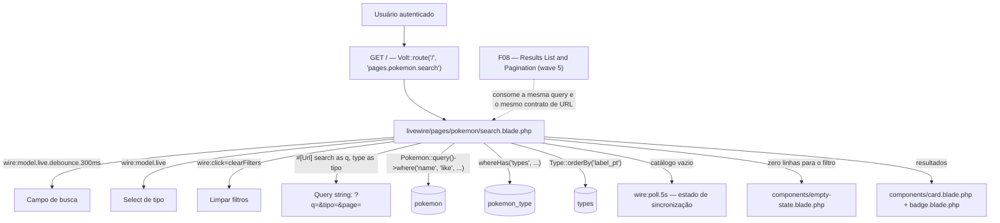
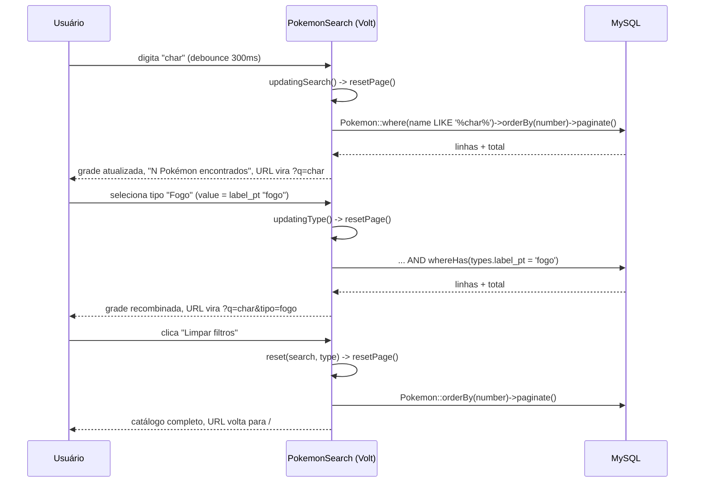

# Technical Specification: Pokémon Search

## 1. Technical Overview

**What:** A single Volt page component, mounted at `/` (route name `dashboard`, replacing F04's placeholder Blade view), that turns the local catalog written by F06 into a live-search screen: a debounced name field, a single-select type filter, both mirrored into the URL query string, a one-click "Limpar filtros" control, a result-count summary, and the two states the PRD calls out explicitly — no matches for the active filters, and an empty catalog table because the sync job hasn't finished yet. The component queries `pokemon`/`types`/`pokemon_type` directly through Eloquent; it never imports `PokeApiClient` and never reaches the network.

**Why:** F07 is the screen the PRD's central resilience claim is judged on — "search, filtering, and pagination remain 100% functional with PokeAPI unreachable" — and the only way to make that true is for this feature to depend exclusively on F06's already-synced MySQL rows. It is also the first feature to give `/` real content: F04 shipped a one-line "a busca será exibida aqui em breve" placeholder specifically because F07 (wave 4) was the feature assigned to replace it. Downstream, F08 (wave 5) consumes the exact query/filter/pagination state this feature establishes to build the polished result-card grid, and F09/F10 (waves 6–7) build on the routing conventions (`?q=`, `?tipo=`, `?page=`) this feature is the first to wire up.

**Complexity:** medium — no new database schema (F07 is read-only against F06's tables) and no JSON API, but the single Livewire component carries real logic: two URL-bound filters with independent debounce/immediacy requirements, a pagination-reset side effect, a three-way empty/no-match/results render decision, and a query that must stay correct under combined AND filtering — plus the routing change that retires F04's placeholder page.

### Scope

**Included:**
- Live, debounced (300 ms) name search against `pokemon.name`, case- and accent-insensitive by virtue of the column's existing `utf8mb4_unicode_ci` collation (F06)
- Single-select type filter populated from the 18 rows in `types`, combining with the name filter under AND semantics
- Both filters mirrored into the URL query string (`?q=`, `?tipo=`) via Livewire's `#[Url]` attribute, so the result set is reloadable and shareable
- A "Limpar filtros" control, shown only while at least one filter is active, that resets both filters and the page in one round-trip
- A "N Pokémon encontrados" summary driven by the paginated query's total count
- Pagination via Livewire's `WithPagination` trait, reset to page 1 on every filter change
- The two PRD-mandated non-happy-path states: no rows match the active filters (named empty state with a "Limpar filtros" action), and the `pokemon` table has zero rows because F06's sync hasn't completed yet (auto-refreshing "sincronizando" state)
- A minimal, functional results display (sprite, raw catalog name, national number, type badges) sufficient to prove the query and filter behavior — not the polished card grid

**Excluded (owned by other features):**
- The responsive 4/3/2/1-column card grid, hover-reveal favorite star, keyboard-focusable click-through to `/pokemon/{slug}`, lazy-load silhouette fallback, and skeleton-card placeholders during round-trips — all F08 (wave 5), per F04's own spec, which already excludes "Pokémon-specific... card content" from its scope in favor of F08/F09
- The `/pokemon/{slug}` detail route and anything about how a card navigates to it — F09 (wave 6)
- The favorite star and its pivot writes — F10 (wave 7)
- Any PokeAPI call, cache, or queue concern — F05/F06, already shipped; this feature deliberately depends on neither

---

## 2. Architecture Impact

| Layer | Components |
|---|---|
| Routing | `routes/web.php` (modified — `/` becomes a `Volt::route`, still named `dashboard`) |
| Livewire | `resources/views/livewire/pages/pokemon/search.blade.php` (new — Volt page, class API) |
| Configuration | `config/pokemon.php` (modified — adds a `search.per_page` value shared with F08) |
| Removed | `resources/views/dashboard.blade.php` (superseded by the new Volt page) |
| Consumed | `App\Models\Pokemon`, `App\Models\Type` and the `pokemon`/`types`/`pokemon_type` tables (F06, already shipped) |
| Consumed | `resources/views/components/card.blade.php`, `badge.blade.php`, `empty-state.blade.php` (F04, already shipped) |
| Consumers (future) | F08 (`pokemon`/`types` query shape, `?q=`/`?tipo=`/`?page=` URL contract), F09 (page-return context built on this URL contract), F10 (reuses the same catalog rows for favorited-card rendering) |

**Filter round-trip**

---

## 3. Technical Decisions

| Decision | Chosen Approach | Alternative Considered | Trade-off |
|---|---|---|---|
| `/` becomes a Volt page directly | Replace `Route::view('/', 'dashboard')` with `Volt::route('/', 'pages.pokemon.search')`, keeping the route **name** `dashboard` | Keep a thin `dashboard.blade.php` wrapper that embeds `<livewire:pokemon.search />` as a child component | F04's shell already renders `<x-app-layout>` around any page; a wrapper view would add an indirection layer with no behavior of its own. Keeping the route name `dashboard` avoids touching every `route('dashboard')` reference in the navigation Volt component, the two auth tests that redirect there, and F02/F03's post-login redirect target |
| Type filter is keyed by the pt-BR label, not the PokeAPI slug | `$type` binds to `types.label_pt` (e.g. `"fogo"`), and the URL parameter carries that same value | Bind to `types.slug` (the English PokeAPI name, e.g. `"fire"`) | The PRD's own worked example is explicit: selecting "Fogo" produces the URL `/?q=char&tipo=fogo` — not `tipo=fire`. `label_pt` is a fixed, hand-maintained 18-row enumeration (F06 decision), so keying the filter on it costs nothing in stability while matching the PRD's literal contract |
| Results render as a minimal but real grid, not the full F08 card | Each result shows sprite, the raw catalog `name`/`number`, and plain type badges via the existing `card`/`badge` primitives — no click-through link (`/pokemon/{slug}` does not exist before F09), no hover star (F10), no responsive column tuning or skeleton placeholders | Build F08's complete card spec now, since the visual gap is otherwise noticeable for one wave | F04's own spec explicitly excludes "Pokémon-specific badge colors... and card content" from its scope and assigns it to F08/F09; building it here would duplicate work F08 is specced to do next wave against routes (`/pokemon/{slug}`) that don't exist yet in this wave |
| LIKE-pattern escaping | Escape `%`, `_`, and `\` in the trimmed search term before interpolating into `LIKE '%...%'` | Pass the raw term straight into the pattern | A term containing a literal `%` or `_` would otherwise behave as an unintended wildcard instead of matching literally; the escape is a few characters of defensive code with no behavior change for ordinary alphabetic terms |
| Per-page count centralized in `config/pokemon.php` | Add `search.per_page` (20) next to F06's existing `sync` key, read by this feature's `paginate()` call | Hardcode `paginate(20)` inline | F08 needs the identical constant for its own rendering next wave; centralizing it in the file this codebase already uses for Pokémon-domain tuning (`config/pokemon.php`) avoids a second hardcoded `20` drifting out of sync later |
| Catalog-empty vs. zero-match distinction | A dedicated `Pokemon::query()->exists()` computed property decides between the "sincronizando" state and the ordinary no-match empty state | Infer "still syncing" from the filtered query's total being zero | Inferring from the filtered total would show "catálogo sincronizando..." to a user whose filter simply matched nothing in a fully-populated catalog — the two states have different causes and different PRD-mandated copy, so they need an independent signal |

---

## 4. Component Overview

### Routing

| File Path | New/Modified | Purpose | Key Responsibilities |
|---|---|---|---|
| `routes/web.php` | Modified | `/` becomes the search screen | Swaps `Route::view('/', 'dashboard')` for `Volt::route('/', 'pages.pokemon.search')`; route name stays `dashboard`; `auth` middleware unchanged |

### Livewire

| File Path | New/Modified | Purpose | Key Responsibilities |
|---|---|---|---|
| `resources/views/livewire/pages/pokemon/search.blade.php` | New | Search/filter screen | Owns `search` and `type` state (both `#[Url]`-bound); resets pagination on either changing (`updatingSearch()`/`updatingType()`); exposes a `clearFilters()` action; computed `results` (paginated, filtered `Pokemon` query with eager-loaded `types`), `types` (18 rows, ordered by `label_pt`), `catalogEmpty` (cheap existence check), and `hasActiveFilters`; renders the search field, type select, "Limpar filtros" control, count summary, and the three-way empty/no-match/results view |

### Configuration

| File Path | New/Modified | Purpose | Key Responsibilities |
|---|---|---|---|
| `config/pokemon.php` | Modified | Shared search tuning | Adds a `search.per_page` key (20) alongside the existing `sync`/`type_labels` keys, consumed by this feature's paginator and, next wave, by F08 |

### Removed

| File Path | Reason |
|---|---|
| `resources/views/dashboard.blade.php` | F04's one-line placeholder ("A busca de Pokémon será exibida aqui em breve.") is superseded by the Volt page; nothing else references this view |

---

## 5. Exposed Interfaces

F07 exposes no JSON API — its surface is one route and the public contract of a single Livewire (Volt) component.

### Route

| Aspect | Value |
|---|---|
| Path | `/` |
| Route name | `dashboard` (unchanged from F04, so every existing `route('dashboard')` reference — navigation, F02/F03 post-login redirect, existing tests — keeps working) |
| Middleware | `auth` |
| Renders | `pages.pokemon.search` (Volt, class API) |

### Component contract: `pages.pokemon.search`

| Member | Kind | Behavior |
|---|---|---|
| `search` | Public property, `#[Url(as: 'q')]` | Bound to the text input via `wire:model.live.debounce.300ms`; empty string is the default and is omitted from the URL |
| `type` | Public property, `#[Url(as: 'tipo')]` | Bound to the type `<select>` via `wire:model.live` (no debounce — a discrete selection, not free text); value is a `types.label_pt` string; empty string means "todos os tipos" and is omitted from the URL |
| `updatingSearch()` / `updatingType()` | Lifecycle hooks | Each calls `resetPage()` before the new value takes effect, so any filter change lands on page 1 |
| `clearFilters()` | Action, `wire:click` | Resets `search` and `type` to `''` and calls `resetPage()` in the same round-trip |
| `results` | Computed property | `Pokemon::query()->with('types')`, conditionally filtered by an escaped `LIKE '%term%'` on `name` and by `whereHas('types', ...)` on `label_pt`, both applied with AND semantics, ordered by `number` ascending, paginated at `config('pokemon.search.per_page')` |
| `types` | Computed property | All 18 `Type` rows ordered by `label_pt`, used to populate the `<select>` |
| `catalogEmpty` | Computed property | `Pokemon::query()->doesntExist()` — true only when F06's sync has not written any rows yet |
| `hasActiveFilters` | Computed property | `true` when `search` or `type` is non-empty; gates the "Limpar filtros" control and shapes the no-match message |

### Rendered states

| Condition | What renders |
|---|---|
| `catalogEmpty` is true | "Catálogo sincronizando... isso leva menos de um minuto." with a spinner; the block carries `wire:poll.5s` so it re-checks every 5 seconds without the user reloading; the poll directive is only present in this branch, so it stops firing the moment the catalog has rows |
| `catalogEmpty` is false, `results` is empty | `x-empty-state` with "Nenhum Pokémon encontrado para '{termo}'." when `search` is non-empty, or "Nenhum Pokémon encontrado para o tipo selecionado." when only `type` is active, plus a "Limpar filtros" action |
| `catalogEmpty` is false, `results` is non-empty | "N Pokémon encontrados" summary, a grid of result rows (sprite, name, number, type badges), and the paginator |

---

## 6. Data Model

No new migrations — F07 reads exclusively from the tables F06 already created and owns.

| Table | Columns this feature reads | Notes |
|---|---|---|
| `pokemon` | `number`, `name`, `slug`, `sprite_url` | `name` is matched with `LIKE '%term%'`; case- and accent-insensitivity come from the column's existing `utf8mb4_unicode_ci` collation, not from any code in this feature |
| `types` | `id`, `label_pt` | Populates the type `<select>`; `label_pt` doubles as the filter's bound value and its URL representation |
| `pokemon_type` | `pokemon_number`, `type_id` | Joined implicitly through `Pokemon::types()` inside `whereHas()` |

No index changes. F07 does not add a migration.

---

## 7. Testing Strategy

### Test files

| Test File | Test Type | Target | Coverage Goal |
|---|---|---|---|
| `tests/Feature/PokemonSearchTest.php` | Feature | The `pages.pokemon.search` Volt component and the `/` route | 100% of PRD F07 acceptance criteria |

### `tests/Feature/PokemonSearchTest.php`

| Test Function | Description | Assertions |
|---|---|---|
| `a busca por nome é case e acento insensível e retorna correspondências parciais` | Seed `Pokemon` rows including a `charmander`-like name; set `search` to a differently-cased fragment | Matching rows returned, non-matching rows excluded |
| `selecionar um tipo restringe os resultados ao pivot` | Seed Pokémon across two types; set `type` to one `label_pt` value | Only Pokémon carrying that type are returned |
| `nome e tipo combinados usam semântica AND` | Seed rows matching name only, type only, both, and neither | Only the "both" row is returned |
| `qualquer mudança de filtro reseta a paginação para a página 1` | Seed more than one page of results, navigate to page 2, then change `search` (and separately `type`) | Component's current page is 1 after each change |
| `uma busca sem correspondência mostra o estado vazio nomeando o termo e o botão limpar filtros` | Set `search` to a term matching nothing | Response contains the term-specific message and a "Limpar filtros" control |
| `limpar filtros reseta busca, tipo e página em um único round-trip` | Set both filters and page 2, call `clearFilters` | `search`/`type` are empty, page is 1, URL query string is empty |
| `os filtros ativos são refletidos na url e recarregar restaura o mesmo resultado` | `GET /?q=char&tipo=fogo` directly (no prior Livewire interaction) | Response reflects the identical filtered set the equivalent Livewire interaction would produce |
| `com acesso de rede bloqueado, busca, filtro de tipo e paginação continuam funcionando` | `Http::preventStrayRequests()`, exercise search, type filter, and page navigation | All operations succeed; `Http::assertNothingSent()` |
| `com o catálogo vazio, a área de busca mostra o estado de sincronização` | No `Pokemon` rows in the database | Response contains "sincronizando" text and the polling directive; no result grid or empty-state block renders |
| `o select de tipo é populado com os 18 tipos e seus rótulos em pt-BR` | Sync 18 real types via the shared `fakePokeApiCatalog()`/`runPokemonSync()` Pest helpers (same fixtures F06's own suite uses) | Exactly 18 `<option>` values, each equal to a `config('pokemon.type_labels')` value |
| `um pokémon presente na tabela local é encontrável por um fragmento do nome` | Sync via `runPokemonSync()` with a small realistic fixture set (Cross-Feature Integration criterion, F06→F07) | A Pokémon written by the sync job is returned by a name-fragment search against the same rows |

### Cross-DB note

The application runs on MySQL (`utf8mb4_unicode_ci`) but the test suite runs on in-memory SQLite (F13's documented, pre-existing choice). SQLite's `LIKE` case-folds ASCII only and does not fold accents the way `utf8mb4_unicode_ci` does; test fixtures accordingly use ASCII-safe names/fragments for the case-insensitivity assertion so the test's pass/fail is not itself dependent on collation behavior the test database doesn't implement. Accent-insensitivity is a property of the production column collation (already established by F06), not of code this feature adds.

---

## Appendix: PRD Traceability

| PRD block | Spec destination |
|---|---|
| F07 Consumes (F06 catalog rows, type vocabulary) | Section 2 architecture diagram, Section 6 Data Model |
| F07 Provides (filtered/ordered query, used by F08) | Section 5 component contract (`results`), Section 3 per-page decision |
| F07 Core Scope | Section 1 Scope → Included, Section 4/5 |
| F07 Full Scope additions (URL mirroring, clear-all, count summary) | Section 1 Scope → Included, Section 5 rendered states |
| F07 Capabilities | Section 3 Technical Decisions, Section 5 component contract |
| F07 Experience | Section 5 rendered states, Section 2 sequence diagram |
| Section 9 F07 acceptance criteria | Section 7 test functions |
| Section 9 Cross-Feature Integration (F06→F07) | Section 7 "um pokémon presente na tabela local é encontrável..." test |
| Section 8 Foundation Features (F04 shell, consumed by F07) | Section 2 architecture diagram, Section 4 (routing/removed files) |

## Appendix: Assumptions Requiring Review

1. **The `name` index F06 created does not accelerate a leading-wildcard `LIKE '%term%'` query.** A standard B-tree index only helps a trailing-wildcard pattern (`term%`); with the wildcard on both sides, MySQL scans the table regardless. This is a non-issue at the catalog's actual size (~1302 rows scan in well under a millisecond) and PRD §7 explicitly excludes a dedicated search engine (Meilisearch/Scout) for this reason — noted here so it isn't mistaken for an oversight.
2. **The type filter's URL value is the pt-BR label, not the PokeAPI slug**, per the PRD's own `?tipo=fogo` example (Section 3). If a future feature needs the English slug in the URL instead, that is a breaking change to this contract, not an additive one.
3. **`#[Url]` uses Livewire's default (non-history) mode.** Every keystroke inside the 300 ms debounce window would otherwise risk pushing a browser history entry per settled query, which is not requested by the PRD and would make the back button behave unpredictably during a typing session.
4. **Results are rendered, not withheld.** F07 ships a working (if visually minimal) grid rather than an inert placeholder, so `/` is a genuinely usable search screen for the wave it ships in — not a stopgap. F08 is expected to replace the markup, not the underlying `results` computed property or the URL contract.
