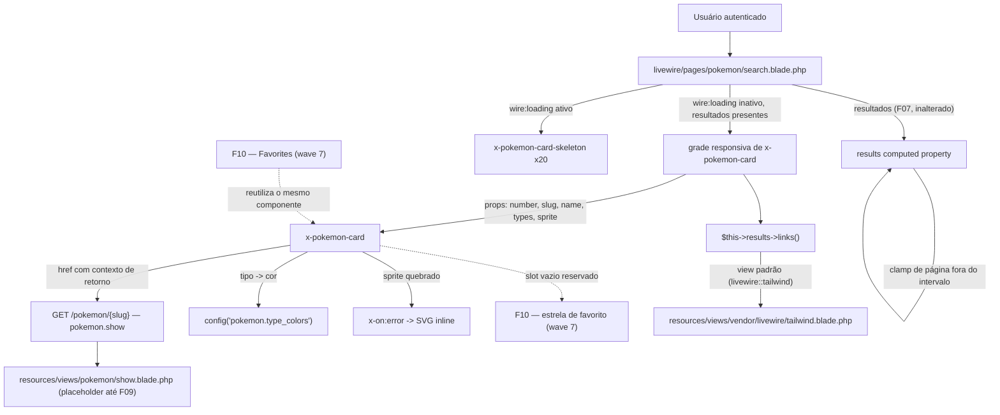
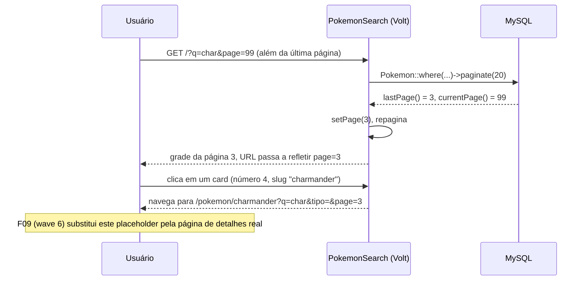

# Technical Specification: Results List and Pagination

## 1. Technical Overview

**What:** Replaces the minimal result markup F07 shipped inside `pages.pokemon.search` with the polished card grid the PRD describes: a reusable `<x-pokemon-card>` component (sprite with lazy loading and a silhouette fallback, capitalized name, zero-padded national number, one colored badge per type, hover-raise, keyboard-focusable click-through), a matching `<x-pokemon-card-skeleton>` shown during any filter/page round-trip, a translated (`pt-BR`) Tailwind paginator with numbered links and ellipsis, and a page-out-of-range guard that clamps to the last valid page instead of rendering empty. It also opens a placeholder route at `/pokemon/{slug}` so the card's click-through target is a real, working page before F09 (wave 6) builds the actual detail screen — the same pattern F04 already used for `/favoritos` and `/chat`.

**Why:** F07 deliberately shipped "a minimal but real grid, not the full F08 card" (its own spec, Section 3) precisely because this feature owns the visual and interaction polish: the responsive card, the favorite-toggle slot F10 will fill in next wave, and the paginator UX. F08 is also the feature that makes `/pokemon/{slug}` a real, clickable destination — without it, F07's cards would be dead ends for two waves, breaking the "every destination is one click away" principle F04 established for top-level navigation and that this feature extends to result cards.

**Complexity:** medium — no new database schema (F08 reads the exact same `pokemon`/`types`/`pokemon_type` rows F07 already queries) and no JSON API, but the work spans five layers (routing, a new Blade component pair, app-wide pagination configuration, a service provider change, and the modified Volt page) and carries real logic: an 18-type color mapping, an error-driven image fallback, and a pagination-clamp guard that must work identically on a fresh page load and on a Livewire round-trip.

### Scope

**Included:**
- A reusable `<x-pokemon-card>` component rendering sprite, capitalized name, zero-padded national number, and one colored badge per type (pt-BR label), the whole card wrapped in a focusable, keyboard-activatable link to `/pokemon/{slug}` carrying page-return context
- A reserved, currently-empty slot in the card's top-right corner for F10's future favorite star, so F10 does not have to modify this component's structure to add it
- A `<x-pokemon-card-skeleton>` component and the `wire:loading`-driven toggle that shows 20 of them in place of the real grid during any filter or pagination round-trip, so the grid never collapses in height
- A translated, numbered-links-with-ellipsis Tailwind pagination view ("Exibindo X–Y de Z", "Anterior"/"Próximo"), registered as the application default so any future paginator (F10's favorites page) gets it automatically
- A guard that clamps a requested page beyond the last valid one back to the last valid page, on both a direct URL load and a Livewire filter/page interaction
- A lazy-loaded sprite (`loading="lazy"`) inside a fixed aspect-ratio box, falling back to an inline silhouette placeholder when the sprite URL 404s, without shifting the card's layout
- A placeholder route and view for `/pokemon/{slug}` (route name `pokemon.show`) so the card's click-through target works today; replaced by F09's real detail page in a later wave

**Excluded (owned by other features):**
- The actual Pokémon detail page content (sprite at 475px, abilities, base stats, height/weight, species text) and the "Voltar aos resultados" reconstruction logic — F09 (wave 6)
- The favorite star's behavior, pivot writes, and toast feedback — F10 (wave 7); F08 only reserves the slot
- The favorites page (`/favoritos`) that will reuse `<x-pokemon-card>` — F10 (wave 7)
- The filtering/search logic, the `results`/`types`/`catalogEmpty`/`hasActiveFilters` computed properties, the `#[Url]`-bound `search`/`type` state, and the "N Pokémon encontrados" summary — F07, already shipped and untouched by this feature

---

## 2. Architecture Impact

| Layer | Components |
|---|---|
| Routing | `routes/web.php` (modified — adds the `/pokemon/{slug}` placeholder route, name `pokemon.show`) |
| Views (new) | `resources/views/components/pokemon-card.blade.php`, `resources/views/components/pokemon-card-skeleton.blade.php`, `resources/views/pokemon/show.blade.php` (placeholder) |
| Views (modified) | `resources/views/livewire/pages/pokemon/search.blade.php` (results section replaced with the card grid + skeleton toggle + paginator) |
| Pagination | `resources/views/vendor/livewire/tailwind.blade.php` (new, published/translated view — Livewire's own vendor override path, not Laravel's) |
| Configuration | `config/pokemon.php` (modified — adds a `type_colors` map alongside the existing `type_labels`/`search` keys) |
| Consumed | `App\Models\Pokemon`, `App\Models\Type` and F07's `results` computed property (unchanged query/filter/pagination contract) |
| Consumed | `resources/views/components/badge.blade.php`, `empty-state.blade.php` (F04, already shipped) |
| Consumers (future) | F09 (`pokemon.show` route it will replace; the `?q=&tipo=&page=` page-return context carried on the card link), F10 (`<x-pokemon-card>` reused on `/favoritos`; the reserved favorite slot) |

**Card click-through and page-clamp flow**

---

## 3. Technical Decisions

| Decision | Chosen Approach | Alternative Considered | Trade-off |
|---|---|---|---|
| `/pokemon/{slug}` before F09 exists | Register the route now (`pokemon.show`) rendering a minimal "Em construção" placeholder, following F04's exact precedent for `/favoritos` and `/chat` | Leave the route undefined and render cards without a working link until F09 ships | An undefined route would make card click-through — the PRD's own worked interaction ("Clicking any card to open its details") — a dead end for two waves; `navigation.blade.php`'s `inicioIsActive()` already anticipates a `pokemon.*` route name, so this isn't a new convention |
| Extract `<x-pokemon-card>` as a shared component | New Blade component taking `number`/`slug`/`name`/`types`/`sprite` props plus a reserved, currently-empty slot for the favorite star | Keep the card markup inline in `search.blade.php`, as F07 did for its minimal version | F10's favorites page (wave 7) needs the identical markup; extracting it once now avoids F10 duplicating or copy-pasting the grid/card structure |
| Type-to-color mapping | New `type_colors` array in `config/pokemon.php` (18 slugs → one of `<x-badge>`'s 8 existing colors, reused across thematically distant types) | Extend `<x-badge>` with 10+ new Tailwind color variants for 1:1 visual distinction | `<x-badge>` is a shared F04 primitive other features (chat unread counts, future badges) also use; adding a domain-specific 18-color palette to it would couple a generic component to Pokémon's type list. A config map keeps the domain knowledge in the Pokémon config file next to `type_labels`, where F06 already put the analogous mapping |
| Broken-sprite fallback | Alpine `x-on:error` on the `` swaps `src` to an inline SVG data URI (a neutral silhouette), defined once inside `<x-pokemon-card>` | Add a static placeholder asset file under `public/images/` and reference it as the fallback `src` | No new binary asset to ship or cache-bust; the fallback is self-contained in the component and works identically offline, consistent with the PRD's resilience theme |
| pt-BR pagination view | Publish and translate Livewire's own bundled pagination view to `resources/views/vendor/livewire/tailwind.blade.php` (kept structurally identical — wire:click-driven prev/next, numbered links, ellipsis — only strings translated) | Register a translated view via `Paginator::defaultView()` in `AppServiceProvider::boot()`, following Laravel's own publish convention (`resources/views/vendor/pagination/`) | Livewire's `SupportPagination` hook unconditionally resets `Paginator::defaultView()` to `livewire::tailwind` on every component boot for any component using `WithPagination`, overriding whatever a service provider registers — confirmed by testing both approaches. Livewire's own vendor-override path (`resources/views/vendor/livewire/`) is the only one that actually takes effect, and needs no service-provider change: every Livewire paginator in the app (F08 now, F10's favorites paginator next wave) inherits it automatically because Livewire's own `loadViewsFrom` checks that path first |
| Page-return context on the card link | Append the exact same URL parameter names F07 already established (`q`, `tipo`, `page`) as a query string on the `/pokemon/{slug}` link | Invent a new parameter scheme (e.g., a single opaque `from` token) for the return context | F09's "Voltar aos resultados" (wave 6) needs to reconstruct the origin URL; reusing F07's own param names means F09 can build that link with zero translation layer, and a user landing on `/pokemon/{slug}?q=char&tipo=fogo&page=2` can already see the origin context in the URL itself |
| Out-of-range page clamp | Inside F07's existing `results` computed property: after the first `paginate()` call, if `currentPage() > lastPage()` and `lastPage() >= 1`, call `setPage(lastPage())` and repaginate before returning | Redirect via an HTTP 302 from a `mount()` hook | Livewire's `WithPagination` trait already owns page state through the `#[Url]`-mirrored `page` parameter; clamping inside the same computed property that already renders the grid keeps the fix colocated with the query it corrects, and works identically for a full-page GET and a Livewire round-trip without introducing a redirect response type this component doesn't otherwise use |

---

## 4. Component Overview

### Routing

| File Path | New/Modified | Purpose | Key Responsibilities |
|---|---|---|---|
| `routes/web.php` | Modified | Placeholder detail route | Adds `GET /pokemon/{slug}` behind `auth`/`auth.session`, named `pokemon.show`, rendering the new placeholder view; superseded by F09 |

### Views and Components

| File Path | New/Modified | Purpose | Key Responsibilities |
|---|---|---|---|
| `resources/views/components/pokemon-card.blade.php` | New | Reusable result card | Renders sprite (lazy, aspect-ratio boxed, error-fallback), capitalized name, zero-padded number, one colored badge per type; wraps everything in a focusable `<a>` to `pokemon.show` carrying `q`/`tipo`/`page`; exposes an empty top-right slot for F10's favorite star; hover-raise transition |
| `resources/views/components/pokemon-card-skeleton.blade.php` | New | Loading placeholder | Mirrors the real card's box dimensions (image box, name line, badge row) with a pulse animation; no props |
| `resources/views/pokemon/show.blade.php` | New | Detail page placeholder | `<x-app-layout>` wrapping an `<x-empty-state>` with "Em construção" copy and a link back to the search results; replaced by F09 |
| `resources/views/livewire/pages/pokemon/search.blade.php` | Modified | Search/results screen | Results section replaced: a `wire:loading`-gated skeleton grid (20 `<x-pokemon-card-skeleton>`) shown during any filter/page round-trip, otherwise a responsive grid of `<x-pokemon-card>` bound to `$this->results`, followed by `{{ $this->results->links() }}`. `search`/`type`/`updatingSearch()`/`updatingType()`/`clearFilters()`/`types`/`catalogEmpty`/`hasActiveFilters`/`noMatchMessage` are unchanged from F07; `results` gains the page-clamp guard described in Section 3 |

### Pagination

| File Path | New/Modified | Purpose | Key Responsibilities |
|---|---|---|---|
| `resources/views/vendor/livewire/tailwind.blade.php` | New | pt-BR paginator markup | Structurally Livewire's own bundled `wire:click`-driven Tailwind pagination view (prev/next controls, numbered links, ellipsis) with "Exibindo X–Y de Z", "Anterior", and "Próximo" replacing the English strings. Livewire's `SupportPagination` hook loads this override automatically for any component using `WithPagination` — no service-provider registration needed or effective |

### Configuration

| File Path | New/Modified | Purpose | Key Responsibilities |
|---|---|---|---|
| `config/pokemon.php` | Modified | Type badge colors | Adds a `type_colors` key mapping each of the 18 PokeAPI type slugs (the same keys as the existing `type_labels`) to one of `<x-badge>`'s supported color names |

---

## 5. Exposed Interfaces

F08 exposes no JSON API — its surface is one new route, two new Blade components, and the modified rendering contract of the existing `pages.pokemon.search` component.

### Route

| Aspect | Value |
|---|---|
| Path | `/pokemon/{slug}` |
| Route name | `pokemon.show` |
| Middleware | `auth`, `auth.session` (same pair as every other authenticated route in the app) |
| Renders | `pokemon.show` (Blade, placeholder — no controller logic, no slug validation; replaced wholesale by F09's Volt detail page) |

### `<x-pokemon-card>` props

| Prop | Type | Required | Behavior |
|---|---|---|---|
| `number` | `int` | Yes | Rendered zero-padded (`#0006`), also used to build the `wire:key` in the parent grid |
| `slug` | `string` | Yes | Used to build the `pokemon.show` link |
| `name` | `string` | Yes | Rendered capitalized |
| `types` | `Collection<Type>` | Yes | Iterated to render one `<x-badge>` per type, colored via `config('pokemon.type_colors')[$type->slug]`, falling back to `gray` for any slug missing from the map |
| `sprite` | `string` | Yes | ``; on a load error, an Alpine handler swaps it to the inline silhouette SVG |
| `favorite` (slot) | slot | No | Empty in this feature; F10 renders its favorite-star control into this slot without touching the rest of the card's markup |

### `<x-pokemon-card-skeleton>`

No props. Renders a card-shaped placeholder (image box, name bar, badge-row bars) with `animate-pulse`, matching `<x-pokemon-card>`'s outer dimensions so the grid's height doesn't shift when the real cards replace it.

### `pages.pokemon.search` — contract changes

| Member | Change |
|---|---|
| `results` | Same query/filter logic as F07; gains the page-clamp guard (Section 3) — if the requested page exceeds the last available page, the component silently repaginates at the last valid page before rendering |
| `search`, `type`, `updatingSearch()`, `updatingType()`, `clearFilters()`, `types`, `catalogEmpty`, `hasActiveFilters`, `noMatchMessage` | Unchanged from F07 |
| Rendered markup | The "minimal results display" F07 shipped (Section 1 of F07's spec) is replaced by the skeleton/grid/paginator described in Section 4 above; the three-way empty/no-match/results decision F07 established is preserved as-is — only the "results" branch's markup changes |

### Rendered states (additions to F07's three-way decision)

| Condition | What renders |
|---|---|
| A filter or pagination action is in flight (`wire:loading` active, targeting the search/type/pagination actions) | 20 `<x-pokemon-card-skeleton>` in the same responsive grid, replacing the real grid for the round-trip's duration |
| `results` is non-empty and no action is in flight | The responsive grid of `<x-pokemon-card>` followed by the translated paginator |
| A card's sprite URL 404s | The card keeps its full layout (image box, name, number, badges); only the `` content swaps to the inline silhouette |

---

## 6. Data Model

No new migrations — F08 reads exclusively from the tables F06 already created and F07 already queries (`pokemon`, `types`, `pokemon_type`); this feature adds no columns, indexes, or constraints.

| Source | What F08 reads | Notes |
|---|---|---|
| `pokemon` (via F07's `results`) | `number`, `name`, `slug`, `sprite_url` | Same rows F07 already selects; F08 changes only how they're rendered |
| `types` (via `Pokemon::types()`, eager-loaded by F07) | `label_pt`, and (new) each type's slug is looked up against the new `config('pokemon.type_colors')` map for its badge color | The color map lives in configuration, not the database — it is static application data, matching how F06 already stores `type_labels` |

---

## 7. Testing Strategy

### Test files

| Test File | Test Type | Target | Coverage Goal |
|---|---|---|---|
| `tests/Feature/PokemonResultsListTest.php` | Feature | The card grid, skeleton, pagination, and page-clamp behavior inside `pages.pokemon.search` | 100% of PRD F08 acceptance criteria and the F07→F08 Cross-Feature Integration criterion |
| `tests/Feature/PokemonShowPlaceholderTest.php` | Feature | The `/pokemon/{slug}` placeholder route | Guest redirect, authenticated render, active-nav-state, replaced by F09 |

### `tests/Feature/PokemonResultsListTest.php`

| Test Function | Description | Assertions |
|---|---|---|
| `cada card mostra o sprite, o nome capitalizado, o número nacional com zero à esquerda e um badge por tipo` | Seed a Pokémon with two attached types | Response contains the capitalized name, the zero-padded number, and both types' pt-BR labels |
| `exatamente 20 cards renderizam por página e o resumo bate com o total do filtro` | Seed 45 Pokémon | Response contains exactly 20 `<x-pokemon-card>` render markers and "Exibindo 1–20 de 45" |
| `solicitar uma página além da última redireciona para a última página válida` | Seed 25 Pokémon (2 pages at 20/page) | `GET /?page=99` responds 200 with page-3-worthy content clamped to the last valid page (page 2 here), not an empty grid; a Livewire `gotoPage(99)` call converges on the same clamped page |
| `clicar em um card leva a /pokemon/{slug} com o contexto de página e filtros` | Seed a Pokémon, set `search`/`type`/page state | The rendered card's link `href` targets `pokemon.show` for the correct slug and carries the current `q`/`tipo`/`page` values |
| `uma url quebrada de sprite renderiza o placeholder sem quebrar o layout do card` | Render a card with a sprite URL | Response contains the `x-on:error` fallback handler wired to the ``, and the card's outer structure (image box, name, badges) is present regardless |
| `cards de esqueleto ocupam a grade durante mudanças de filtro e paginação` | Inspect the rendered markup for the `wire:loading`-gated skeleton block | Exactly 20 `<x-pokemon-card-skeleton>` markers are present in the loading block, targeting the same actions (`search`, `type`, pagination) that trigger the real grid's round-trip |
| `a grade usa as colunas responsivas 4 3 2 1` | Render the results grid | Response contains the `grid-cols-1 sm:grid-cols-2 lg:grid-cols-3 xl:grid-cols-4` class combination on the grid container |
| `a consulta filtrada do f07 dirige a contagem de cards e o total de páginas do paginador` | Seed Pokémon across two types, apply a type filter that matches a known subset | The rendered card count, the "Exibindo X–Y de Z" total, and the paginator's last page all match the filtered subset's count — not the full catalog |

### `tests/Feature/PokemonShowPlaceholderTest.php`

| Test Function | Description | Assertions |
|---|---|---|
| `a página de detalhes exige autenticação` | `GET /pokemon/qualquer-slug` as a guest | Redirects to `route('login')` |
| `um usuário autenticado vê o placeholder de detalhes` | `GET /pokemon/charmander` authenticated | `assertOk()`; contains "Em construção"; Início nav item still highlighted (mirrors `navigation.blade.php`'s existing `pokemon.*` pattern match) |

---

## Appendix: PRD Traceability

| PRD block | Spec destination |
|---|---|
| F08 Consumes (F07's filtered/ordered query, total count, active filter state) | Section 2 architecture diagram, Section 5 contract-changes table |
| F08 Provides (selected slug + page-return context for F09; card slots for F10's favorite toggle) | Section 3 (page-return context decision), Section 5 (`<x-pokemon-card>` props, `favorite` slot) |
| F08 Capabilities | Sections 3–5 throughout |
| F08 Experience | Section 5 rendered states, Section 2 sequence diagram |
| Section 9 F08 acceptance criteria | Section 7 `PokemonResultsListTest.php` test functions |
| Section 9 Cross-Feature Integration — F07 query drives F08's grid/paginator totals | Section 7, "a consulta filtrada do f07 dirige a contagem de cards e o total de páginas do paginador" |
| Section 9 Cross-Feature Integration — F08's slug/page-return context opens F09's detail page | Section 7, "clicar em um card leva a /pokemon/{slug} com o contexto de página e filtros" (F08's half of the contract; F09 will test the reconstruction once it exists) |
| Section 8 Foundation Features (F04 shell/placeholder-route precedent, consumed by F08) | Section 2 architecture diagram, Section 3 (placeholder-route decision) |

## Appendix: Assumptions Requiring Review

1. **The Cross-Feature Integration criterion "the catalog rows from the sync (F06) render the favorites page (F10) cards with the same name, number, types, and sprite shown in search results" is only partially testable today.** F08 guarantees it structurally by extracting `<x-pokemon-card>` as the single shared component — F10 (wave 7) is expected to render the same component rather than rebuild the markup — but the actual cross-feature test (comparing F08's and F10's rendered output) can only be written once F10 exists.
2. **The pt-BR pagination override (`resources/views/vendor/livewire/tailwind.blade.php`) applies globally, not scoped to this feature's paginator.** This is intentional (see Section 3) so F10 inherits it automatically, but it means any other Livewire paginator added to the app before F10 also renders in pt-BR — currently there are none, so this has no observable side effect yet. Discovered during implementation: Livewire's `WithPagination` trait forces `Paginator::defaultView()` back to `livewire::tailwind` on every component boot regardless of any `AppServiceProvider` registration, so the override must live at Livewire's own vendor path, not Laravel's.
3. **The 18-type color map reuses `<x-badge>`'s 8 existing colors, so some visually distant types share a color** (e.g., `pedra`, `sombrio`, `aço`, and `normal` all map to `gray`). This trades perfect visual distinction for not touching a shared F04 primitive; if a future reviewer wants full 1:1 color distinction, that is a deliberate follow-up to `<x-badge>`, not a gap in this feature.
4. **The `/pokemon/{slug}` placeholder performs no slug validation** (it renders unconditionally for any path segment, authenticated or not past the 404 route pattern). F09 owns resolving the slug against the local catalog and the "Pokémon não encontrado" 404 state (PRD F09 Error Handling); F08's placeholder exists only to make the click-through link non-dead, not to validate its target.
