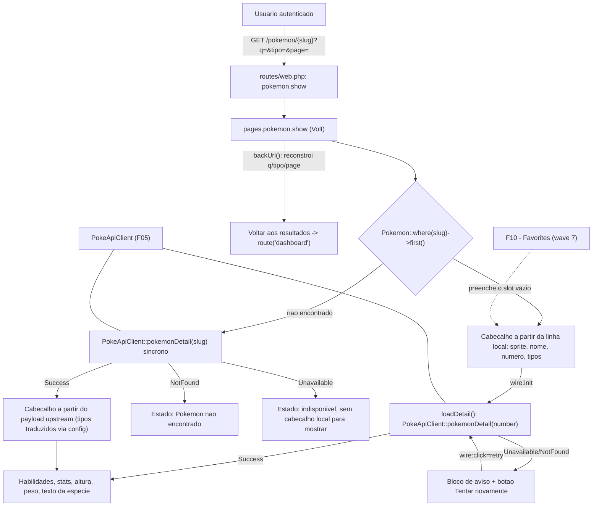
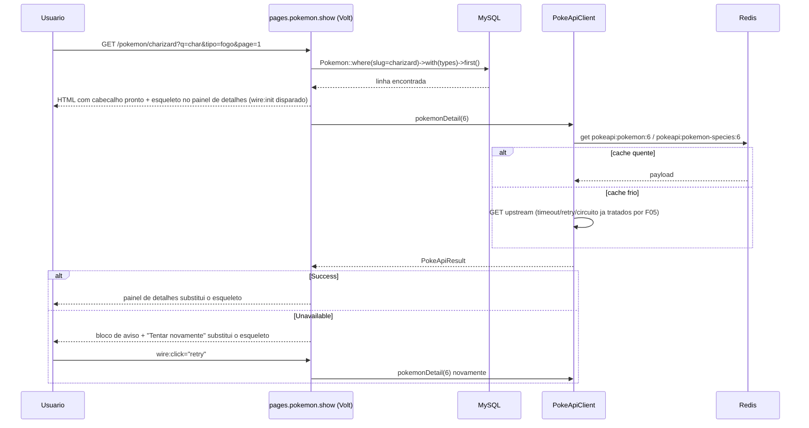

# Technical Specification: Pokémon Details

## 1. Technical Overview

**What:** Replaces F08's "Em construção" placeholder at `/pokemon/{slug}` with the real detail page: a Volt component that resolves the slug against the local catalog first, renders the header (artwork, name, national number, type badges) immediately from whichever source answered, then lazily fetches the PokeAPI-only fields (abilities, base stats, height, weight, species flavor text) through F05's `PokeApiClient` and fills them in behind a skeleton. A slug that exists neither locally nor upstream renders a dedicated "Pokémon não encontrado" state instead of a stack trace; an upstream outage renders a warning block with a working retry button instead of an indefinite spinner.

**Why:** F09 is the last consumer standing between F05 (the resilient client, already shipped with zero UI callers) and F08 (whose result cards have pointed at a placeholder since wave 5). It is also the feature that proves F05's resilience claims end-to-end in the UI: a cached repeat view must be effectively instant, an unavailable upstream must degrade gracefully rather than crash, and a bad slug must produce a clear message rather than a 500. F10 (wave 7, favorites) depends on this page existing to place its detail-page favorite toggle, per its own PRD Consumes block — this feature reserves that slot without implementing it.

**Complexity:** medium — one route change, one new Volt page component with three mutually exclusive header states (found locally, resolved only upstream, not found) and a lazily-loaded detail sub-state (loading, loaded, unavailable), plus the stat-bar/ability-list rendering logic. No new database migration, no new JSON API surface — the component's only "endpoint" is its own Livewire action for the lazy fetch and the retry button.

### Scope

**Included:**
- Route `/pokemon/{slug}` re-registered as a Volt page (`pages.pokemon.show`), replacing F08's placeholder `Route::view` wholesale
- Local-catalog-first resolution: a slug present in `pokemon` renders its header (sprite, name, zero-padded number, type badges) immediately from the local row; a slug absent locally falls back to a synchronous upstream lookup by name before concluding the Pokémon doesn't exist
- Lazy loading of PokeAPI-only fields (abilities with hidden-ability marking, the 6 base stats as color-banded bars scaled against 255, height in metres, weight in kilograms, pt-BR flavor text when present) via a `wire:init` round-trip, with a skeleton shown until it resolves
- Graceful degradation: local header data stays on screen with a "Tentar novamente" retry button when the upstream detail fetch fails; a slug unresolved both locally and upstream (confirmed 404) renders "Pokémon não encontrado."; a slug unresolved locally whose upstream lookup is itself unavailable (existence unknown, not confirmed absent) renders the same retry-capable warning block instead of falsely claiming non-existence
- "Voltar aos resultados" reconstructing the exact `q`/`tipo`/`page` context F08's cards already append to this route's URL, falling back to the plain search page when arriving without that context
- A reserved, currently-empty header slot beside the name for F10's future favorite toggle
- Per-section fallback text ("Informação indisponível.") when the upstream payload lacks `stats` or `abilities`
- Broken-sprite fallback to the same inline silhouette pattern F08's `<x-pokemon-card>` already established

**Excluded (owned by other features):**
- The favorite toggle's behavior, pivot writes, and toast feedback in the reserved header slot — F10 (wave 7)
- The result card and its click-through link, the responsive grid, and the page-clamp guard that gets the user here — F08, already shipped and untouched by this feature
- `PokeApiClient` itself, its retry/timeout/cache/circuit-breaker behavior, and the shape of `pokemonDetail()`'s payload — F05, already shipped and consumed as-is
- The catalog rows this feature reads for the local-first branch — F06, already shipped

---

## 2. Architecture Impact

| Layer | Components |
|---|---|
| Routing | `routes/web.php` (modified — `pokemon.show` switches from `Route::view` to `Volt::route`) |
| Views (new) | `resources/views/livewire/pages/pokemon/show.blade.php` (Volt page component) |
| Views (removed) | `resources/views/pokemon/show.blade.php` (F08's placeholder, wholesale replaced) |
| Configuration | None — reuses `config('pokemon.type_labels')` and `config('pokemon.type_colors')` (F06/F08) unmodified |
| Consumed | `App\Services\PokeApi\PokeApiClient::pokemonDetail()` (F05), `App\Models\Pokemon`/`App\Models\Type` (F06), `<x-app-layout>`, `<x-card>`, `<x-badge>`, `<x-empty-state>` (F04) |
| Consumers (future) | F10 (the reserved favorite-toggle header slot) |
| Tests (new) | `tests/Feature/PokemonShowTest.php` |
| Tests (removed) | `tests/Feature/PokemonShowPlaceholderTest.php` (F08's placeholder coverage, superseded) |

**Lazy detail load and retry (found-locally branch)**

---

## 3. Technical Decisions

| Decision | Chosen Approach | Alternative Considered | Trade-off |
|---|---|---|---|
| When to fetch the PokeAPI-only fields | Confirmed in interview. `wire:init="loadDetail"` fires after the first response, rendering a skeleton in the detail panel until it resolves — mirrors F08's `wire:loading`-skeleton convention | Fetch everything synchronously inside `mount()` before the first response | A blocking `mount()` would hold the whole page response for up to PokeAPI's 10-second budget on a cold cache or an unavailable upstream; the lazy round-trip keeps the header (and the local-catalog data the PRD explicitly says must "remain on screen") visible immediately regardless of upstream health |
| Existence-check for a slug missing from the local catalog | Confirmed in interview as a corollary: for this one edge case only, `mount()` calls `PokeApiClient::pokemonDetail($slug)` synchronously, because there is no local header to show while a lazy round-trip would be in flight — the three-way outcome (found/not-found/unavailable) has to be known before anything can render | Apply the same `wire:init` lazy pattern here too, showing a full-page skeleton first | With no local row, there is nothing meaningful to render ahead of the lookup (not even a sprite or a name), so deferring buys no perceived-performance benefit and only adds a second round-trip; this branch is also the rare case (a Pokémon added upstream after the last sync, or a stale/bad URL), not the common path the lazy-loading decision optimizes for |
| Local-miss + upstream-unavailable rendering | Confirmed in interview. Renders the same retry-capable warning block as the found-locally-but-detail-fails case, with no header data (none exists) — never the "não encontrado" state | Collapse into "não encontrado" whenever there's no local row and the upstream call didn't succeed | Existence is genuinely unconfirmed when the upstream call itself is what failed (timeout, circuit open); reporting "não encontrado" would assert something the system doesn't actually know, and would incorrectly cache that impression in the user's mind until they retry |
| "Pokémon não encontrado" response shape | Confirmed in interview. Renders inside the normal `<x-app-layout>` + nav bar, HTTP 200, via the same Volt component (a boolean state flag) — no `abort(404)` | `abort(404)` to a dedicated Blade view outside the Livewire component tree | F04's shell rule ("every authenticated page renders the same shell") and F07's own precedent (the empty-state for zero search matches is a 200, not an error response) both point at keeping the nav bar; `abort(404)` would strand the user without navigation on the one page where "Buscar outro Pokémon" is the obvious next action |
| Base stat bar color bands | Confirmed in interview. `< 60` red, `60–99` yellow, `>= 100` green (traffic-light convention), computed as a `match()` over the numeric value | Reuse `<x-badge>`'s neutral gray/indigo/blue scale to avoid a pass/fail connotation | Traffic-light bands are immediately legible for "is this stat good or bad" at a glance, which is the PRD's own framing ("color-coded in 3 bands"); the neutral scale would require a legend to be meaningful |
| Identifier passed to `pokemonDetail()` | The local row's `number` (int) when the slug resolves locally; the raw `$slug` (string) otherwise | Always pass the slug, even when a local row exists | F06's sync writes `slug` as PokeAPI's own raw resource name for every row, so both identifiers resolve the same upstream Pokémon — but `number` is the unambiguous, already-known value once a local row exists, and reusing it avoids a redundant string round-trip through the same normalization F06 already did |
| Header type-badge normalization | `mount()` normalizes both possible sources (local `Type` models with `label_pt`, or raw PokeAPI type slugs from an upstream-only lookup) into one plain `array{label: string, color: string}[]` before the view ever renders, using the same `config('pokemon.type_labels')`/`type_colors` maps `<x-pokemon-card>` already reads | Branch in the Blade view on whether the Pokémon came from the local catalog or upstream | Keeps the header markup identical regardless of data origin — the view never needs to know which branch produced it, matching how F08 kept its own type-color lookup a single config read rather than a conditional |
| Favorite-toggle reserved slot | An empty, clearly-marked container (`
`) placed beside the name in the header markup, to be filled by editing this file directly in F10 | Extract the header into its own invokable Blade component (like `<x-pokemon-card>`) with a real `favorite` slot | `pages.pokemon.show` is a routed Volt page, not a component invoked with a tag from a parent view — there is no caller to pass slot content from, so a real Blade `$slot` has no producer. A marked, empty container is the routed-page equivalent of F08's reserved slot convention |

---

## 4. Component Overview

### Routing

| File Path | New/Modified | Purpose | Key Responsibilities |
|---|---|---|---|
| `routes/web.php` | Modified | Real detail route | `pokemon.show` becomes `Volt::route('/pokemon/{slug}', 'pages.pokemon.show')` behind `auth`/`auth.session`, replacing F08's placeholder `Route::view` line |

### Views

| File Path | New/Modified | Purpose | Key Responsibilities |
|---|---|---|---|
| `resources/views/livewire/pages/pokemon/show.blade.php` | New | Detail page | Volt class component with `mount(string $slug)` (local-first resolution, synchronous upstream fallback only when there's no local row), `loadDetail()` (the `wire:init`-triggered lazy fetch for the found-locally branch), `retry()` (re-invokes `loadDetail()`), and a `#[Computed] backUrl()`; template renders the header, the lazily-loaded detail panel (skeleton / content / warning), the not-found state, and the reserved favorite slot |
| `resources/views/pokemon/show.blade.php` | Removed | — | F08's "Em construção" placeholder, superseded entirely by the Volt component above |

### Tests

| File Path | New/Modified | Purpose | Key Responsibilities |
|---|---|---|---|
| `tests/Feature/PokemonShowTest.php` | New | Full behavioral coverage | See Section 7 |
| `tests/Feature/PokemonShowPlaceholderTest.php` | Removed | — | Covered F08's placeholder only (auth redirect + "Em construção"); both assertions are subsumed by the new test file's auth and header tests |

No migration, model, controller, or new Blade component is introduced — the header reuses `<x-badge>`, `<x-card>`, `<x-empty-state>`, and the same silhouette-fallback markup pattern `<x-pokemon-card>` already established, inlined into the new template rather than factored out (used in exactly one place).

---

## 5. Exposed Interfaces

F09 exposes no JSON API or HTTP endpoint beyond the page route itself; its surface is the Volt component's public methods and computed properties, invoked by Livewire's own protocol (`wire:init`, `wire:click`).

### Route

| Aspect | Value |
|---|---|
| Path | `/pokemon/{slug}` |
| Route name | `pokemon.show` (unchanged from F08) |
| Middleware | `auth`, `auth.session` |
| Renders | `pages.pokemon.show` (Volt) |

### Component: `pages.pokemon.show`

| Member | Kind | Behavior |
|---|---|---|
| `mount(string $slug)` | lifecycle | Looks up `Pokemon::where('slug', $slug)->with('types')->first()`. If found: sets header state from the row, leaves detail state empty pending `loadDetail()`. If not found: calls `PokeApiClient::pokemonDetail($slug)` synchronously and sets header **and** detail state together from the single outcome (Success → both populated; NotFound → `notFound = true`; Unavailable → `headerUnavailable = true`) |
| `loadDetail()` | action, `wire:init` | Only wired when a local row was found and detail isn't loaded yet. Calls `PokeApiClient::pokemonDetail($number)`; Success merges `abilities`/`stats`/`height_m`/`weight_kg`/`flavor_text` into detail state; NotFound/Unavailable sets `detailUnavailable = true`. Always ends by setting `detailLoaded = true` |
| `retry()` | action, `wire:click` | Resets `detailUnavailable` and `detailLoaded` to their pre-fetch values, then calls `loadDetail()` again — same round-trip, no full page reload |
| `backUrl()` | `#[Computed]` | Reads `q`/`tipo`/`page` from the current request's query string, filters out blanks, and appends whatever remains to `route('dashboard')` — an empty result naturally resolves to the plain `/`, matching direct-URL arrival |

### Rendered states

| Condition | What renders |
|---|---|
| Local row found | Header (sprite, name, `#0006`-style number, type badges, reserved favorite slot) renders immediately |
| Local row found, `loadDetail()` in flight | Detail panel shows a skeleton (stat-bar placeholders, ability-line placeholders) in place of content |
| Local row found, detail loaded successfully | Abilities (hidden ones suffixed "(oculta)"), 6 color-banded stat bars, height in metres, weight in kilograms, flavor text when present |
| Local row found, detail fetch failed (`detailUnavailable`) | Header stays on screen; detail panel replaced by "Não foi possível carregar os detalhes agora. O serviço de dados está temporariamente indisponível." with a "Tentar novamente" button |
| No local row, upstream resolves successfully | Header and full detail panel both render from the single upstream payload — no skeleton, since `mount()` already has everything |
| No local row, upstream reports not found | "Pokémon não encontrado." page (200, inside the app shell) with a link back to the search |
| No local row, upstream unavailable | Same warning block as the detail-fetch-failure case, minus any header content (there is none), with a retry button that re-runs the same synchronous lookup |
| Payload has no `stats` (either branch) | Stats section replaced by "Informação indisponível." | 
| Payload has no `abilities` (either branch) | Abilities section replaced by "Informação indisponível." |
| A sprite URL fails to load | Inline silhouette placeholder, matching `<x-pokemon-card>`'s fallback |

---

## 6. Data Model

No new migration — this feature only reads tables F06 already created (`pokemon`, `types`, `pokemon_type`) and never persists the PokeAPI detail payload anywhere; F05's Redis cache (`pokeapi:pokemon:{id}` / `pokeapi:pokemon-species:{id}`, both already implemented) is the only place that payload is stored, and F09 never writes to it directly — `PokeApiClient::pokemonDetail()` owns every cache write.

| Source | What F09 reads | Notes |
|---|---|---|
| `pokemon` (local-first branch) | `number`, `name`, `slug`, `sprite_url` | Same columns F07/F08 already select; F09 adds no query beyond a single `where('slug', ...)` lookup |
| `types` (via `Pokemon::types()`, eager-loaded) | `slug`, `label_pt` | Normalized into the same `{label, color}` shape as the upstream-only branch, per Section 3 |
| `PokeApiResult::data()` (via F05, no direct DB access) | `abilities`, `stats`, `height_m`, `weight_kg`, `flavor_text`, and (upstream-only branch) `number`/`name`/`sprite_url`/`types` | Shape fixed by F05's spec (Section 5 there); F09 treats every field as possibly absent and falls back to "Informação indisponível." per-section rather than assuming presence |

---

## 7. Testing Strategy

### Test files

| Test File | Test Type | Target | Coverage Goal |
|---|---|---|---|
| `tests/Feature/PokemonShowTest.php` | Feature | `pages.pokemon.show` across all header/detail/error states | 100% of PRD F09 acceptance criteria and the F05→F09 / F08→F09 Cross-Feature Integration criteria |

### `tests/Feature/PokemonShowTest.php`

| Test Function | Description | Assertions |
|---|---|---|
| `a pagina de detalhes exige autenticacao` | `GET /pokemon/charizard` as a guest | Redirects to `route('login')` |
| `um pokemon local mostra o cabecalho imediatamente sem esperar o fetch de detalhes` | Seed a local Pokémon with types, fake a slow/never-resolving detail response | Initial response contains sprite, capitalized name, zero-padded number, and type badges without waiting on the upstream call |
| `os detalhes carregam via wire init e preenchem habilidades stats altura e peso` | Seed a local Pokémon, fake a successful `pokemonDetail()` response | `Volt::test()->call('loadDetail')` results in abilities, all 6 stat bars, height in metres, and weight in kilograms present in the rendered output |
| `uma habilidade oculta e marcada com oculta` | Fake a detail payload with one hidden ability | Rendered output contains that ability's name followed by "(oculta)" |
| `as barras de status usam as 3 faixas de cor` | Fake a payload with one stat below 60, one between 60 and 99, one at 100+ | Rendered output contains the red/yellow/green classes on the corresponding bars |
| `a segunda visita ao mesmo pokemon nao gera nova chamada upstream` | Call `loadDetail()` twice (simulating cache warm) with `Http::fake()` faked once | `Http::assertSentCount(1)` across both calls |
| `com o pokeapi indisponivel os dados locais permanecem e o botao tentar novamente funciona` | Seed a local Pokémon, fake a connection failure on the detail endpoint | Header (name/number/types/sprite) still present; warning block with "Tentar novamente" shown; `Volt::test()->call('retry')` followed by a faked success shows the detail panel replacing the warning |
| `um slug ausente localmente ainda tenta a busca upstream antes de concluir que nao existe` | No local row; fake a successful `pokemonDetail()` response for the slug | Header and detail panel both render from the upstream payload alone |
| `um slug inexistente local e upstream mostra a pagina pokemon nao encontrado` | No local row; fake a 404 on the detail endpoint | Response is 200, contains "Pokémon não encontrado.", contains a link back to the search, and the nav shell (Início highlighted) is still present |
| `um slug ausente localmente com upstream indisponivel mostra o aviso e nao a pagina de nao encontrado` | No local row; fake a connection failure on the detail endpoint | Response does not contain "Pokémon não encontrado."; contains the same "Não foi possível carregar os detalhes agora." warning block instead |
| `um payload sem stats ou habilidades mostra informacao indisponivel para aquela secao` | Fake a detail payload with an empty `stats` array | Stats section renders "Informação indisponível." instead of throwing or rendering empty bars |
| `voltar aos resultados reconstroi a pagina e os filtros de origem` | `GET /pokemon/charizard?q=char&tipo=fogo&page=2` | The "Voltar aos resultados" link's `href` equals `route('dashboard')` with `q=char&tipo=fogo&page=2` |
| `chegar direto pela url sem contexto de origem leva de volta para o inicio` | `GET /pokemon/charizard` with no query string | The "Voltar aos resultados" link's `href` equals plain `route('dashboard')` |
| `uma url de sprite quebrada renderiza o placeholder sem quebrar o layout` | Seed a local Pokémon | Response contains the same `x-on:error` fallback handler pattern used by `<x-pokemon-card>` |
| `a pagina de detalhes mantem o inicio destacado na navegacao` | `GET /pokemon/charizard` for an existing local Pokémon | `navLinkIsActive($html, 'Início')` is true |

### Cross-Feature Integration criteria (PRD Section 9)

- *"The full detail payload returned by the PokeAPI client (F05) renders on the detail page (F09) with sprites, types, abilities, base stats, height, and weight populated from that payload"* — covered by `os detalhes carregam via wire init e preenchem habilidades stats altura e peso` and `um slug ausente localmente ainda tenta a busca upstream antes de concluir que nao existe`
- *"The selected slug and page-return context carried from the results grid (F08) open the correct detail page (F09), and 'Voltar aos resultados' restores the same page number and filters"* — covered by `voltar aos resultados reconstroi a pagina e os filtros de origem`, closing the half of this contract F08's own spec left for F09 to verify

---

## Appendix: PRD Traceability

| PRD block | Spec destination |
|---|---|
| F09 Consumes (F05 detail payload; F08 selected slug + page-return context) | Section 2 architecture diagram, Section 5 `backUrl()`/`loadDetail()` |
| F09 Provides (header slot for F10's favorite toggle) | Section 3 (reserved-slot decision), Section 5 rendered-states table |
| F09 Capabilities | Sections 3–5 throughout |
| F09 Experience | Section 5 rendered states, Section 2 sequence diagram |
| F09 Error Handling | Section 5 rendered states table (unavailable / not-found / missing-section rows) |
| Section 9 F09 acceptance criteria | Section 7 test list (each of the 7 criteria maps to one or more named tests) |
| Section 9 Cross-Feature Integration (F05→F09, F08→F09) | Section 7 "Cross-Feature Integration criteria" subsection |
| Section 8 Foundation Features (F05 client, F04 shell — both consumed as-is) | Section 2 architecture diagram |

## Appendix: Assumptions Requiring Review

The first four were confirmed directly in the spec interview; the rest follow from cross-referencing F05/F06/F08's already-shipped code, not from any remaining ambiguity in the PRD.

1. **Detail fields load via a `wire:init` round-trip with a skeleton, not a blocking `mount()`.** Confirmed in interview.
2. **A slug missing from the local catalog whose upstream lookup comes back unavailable renders the retry-capable warning block, never the "não encontrado" page.** Confirmed in interview — existence is genuinely unconfirmed in that case.
3. **"Pokémon não encontrado" renders at HTTP 200 inside the normal app shell, not via `abort(404)`.** Confirmed in interview.
4. **Base stat bars use red (<60) / yellow (60–99) / green (≥100).** Confirmed in interview.
5. **For a slug missing locally, `mount()` fetches synchronously instead of lazily.** Not asked directly, but follows necessarily from decision #1: there is no local header to show while a round-trip would be in flight, so lazy-loading has nothing to defer in this branch.
6. **`pokemonDetail()` is called with the local row's `number` when one exists, and with the raw `$slug` otherwise.** F06's sync writes `slug` as PokeAPI's own resource name (`app/Jobs/SyncPokemonCatalog.php`, `'slug' => $entry['name']`), so both identifiers resolve to the same upstream Pokémon; `number` is simply the more direct value once known.
7. **The favorite-toggle slot for F10 is a marked empty container, not a Blade `$slot`.** `pages.pokemon.show` is a routed Volt page with no invoking parent to supply slot content, unlike `<x-pokemon-card>`; F10 will fill the container by editing this file directly.
8. **No new Blade component is extracted for the stat bars or ability list.** Both render in exactly one place (this page); F04's own guidance for `<x-pokemon-card>` extracted a component because F10's favorites page would otherwise duplicate it — no such second consumer exists here.
