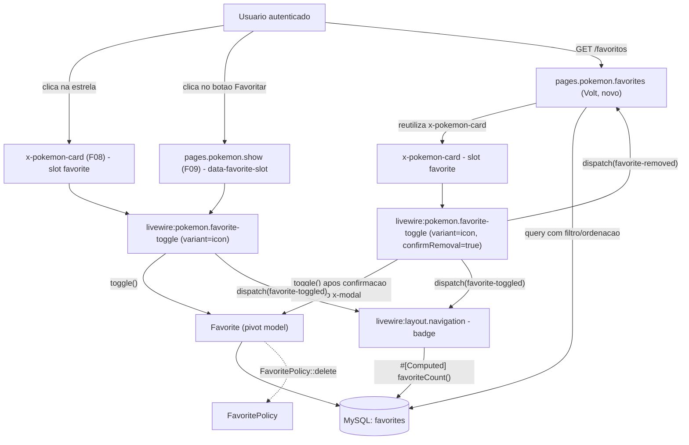
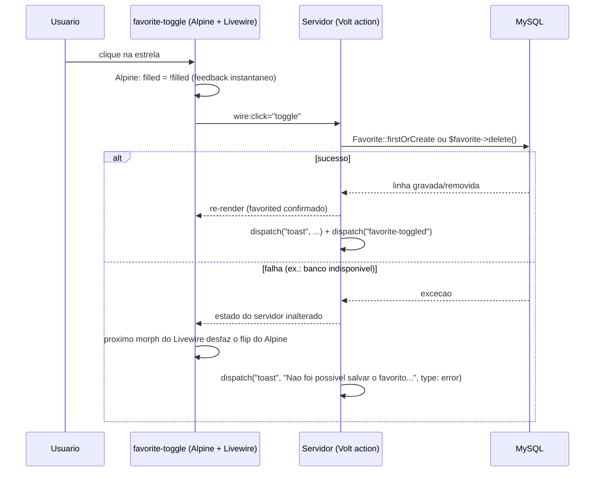
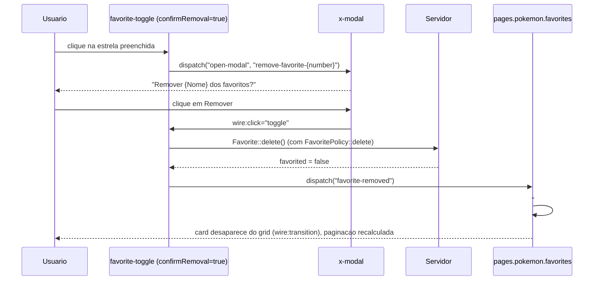

# Technical Specification: Favorites

## 1. Technical Overview

**What:** Fills the two slots F08 and F09 deliberately left empty — `<x-pokemon-card>`'s reserved `favorite` slot and `pages.pokemon.show`'s `
` — with a single reusable favorite-toggle control, backed by a new `users` N:N `pokemon` pivot (`favorites`). Replaces F04's `/favoritos` "Em construção" placeholder with a real Volt page that lists, filters, sorts, and removes the authenticated user's collection using the exact same `<x-pokemon-card>` component the search grid already renders. Adds a live favorite-count badge to the navigation bar.

**Why:** F10 is the last consumer of two slots that have sat empty since wave 5 (F08) and wave 6 (F09) — both features' own specs name F10 explicitly as the feature that fills them, and one of the PRD's own Cross-Feature Integration criteria ("favoriting from a card shows the Pokémon as favorited when its detail page is opened, and vice versa") only becomes verifiable once this feature exists. It is also the feature that proves the PRD's IDOR-closing claim end-to-end for a second user-owned resource (after F11's profile): every read and write is scoped through `auth()->user()->favorites()`, with a policy as the second line of defense — the same defense-in-depth shape `UpdateProfilePolicy` and `ConversationPolicy` already established.

**Complexity:** medium — one new migration/model/policy/config file, one new reusable Volt sub-component rendered in three distinct places (two of them pre-wired slots), one new routed Volt page reusing an existing card component, and small modifications to three already-shipped files (`search.blade.php`, `show.blade.php`, `navigation.blade.php`). No new JSON API surface — every write is a Livewire component action.

### Scope

**Included (Core + Full Scope):**
- An idempotent favorite toggle (star) available on result cards (F08's slot) and the detail page (F09's slot)
- A dedicated `/favoritos` page listing the user's collection as the same `<x-pokemon-card>` grid, paginated at 20 per page
- Removal from `/favoritos`, gated by a confirmation modal, fading the card out without a full page reload
- Text filtering within favorites (name only, 300 ms debounce, matching F07's search field convention)
- A sort control on `/favoritos`: most recently favorited (default), name (A–Z), national number
- A live favorite-count badge in the navigation bar, capped at "99+"

**Excluded (owned by other features, consumed as-is):**
- `<x-pokemon-card>`'s markup, grid, and pagination shell — F08, only its reserved `favorite` slot is filled here
- The detail page's header/stat/ability rendering — F09, only its reserved `data-favorite-slot` container is filled here
- The local catalog (`pokemon`, `types`, `pokemon_type`) this feature reads `number`/`name`/`slug`/`sprite_url`/types from — F06
- Authentication, session scoping, and the `auth`/`auth.session` middleware every route in this feature sits behind — F02

---

## 2. Architecture Impact

| Layer | Components |
|---|---|
| Routing | `routes/web.php` (modified — `favoritos` switches from `Route::view` to `Volt::route`) |
| Views (new) | `resources/views/livewire/pages/pokemon/favorites.blade.php` (Volt page), `resources/views/livewire/pokemon/favorite-toggle.blade.php` (Volt sub-component) |
| Views (modified) | `resources/views/livewire/pages/pokemon/search.blade.php` (fills the `favorite` slot per card), `resources/views/livewire/pages/pokemon/show.blade.php` (replaces `data-favorite-slot`), `resources/views/livewire/layout/navigation.blade.php` (favorite-count badge) |
| Views (removed) | `resources/views/favoritos.blade.php` (F04's placeholder) |
| Models | `app/Models/Favorite.php` (new pivot model), `app/Models/User.php` (modified — `favorites()` relationship) |
| Policies | `app/Policies/FavoritePolicy.php` (new) |
| Configuration | `config/favorites.php` (new) |
| Database | `database/migrations/..._create_favorites_table.php`, `database/factories/FavoriteFactory.php` |
| Consumed | `App\Models\Pokemon`/`App\Models\Type` (F06), `<x-pokemon-card>`/`<x-card>`/`<x-badge>`/`<x-empty-state>`/`<x-modal>`/`<x-secondary-button>` (F04), the `favorite`/`toast`/`open-modal`/`close-modal` browser-event conventions (F04/F11) |
| Consumers | None — F10 is the final wave (7) consumer of F08's and F09's reserved slots; F13 (wave 8) will exercise this feature's own behavior in the automated suite |
| Tests (new) | `tests/Feature/Favorites/FavoriteToggleTest.php`, `FavoritesPageTest.php`, `FavoriteRemovalTest.php`, `FavoriteAuthorizationTest.php`, `FavoriteNavigationBadgeTest.php` |
| Tests (removed) | `tests/Feature/PlaceholderPagesTest.php` (covered only the `/favoritos` placeholder; superseded entirely) |

**Toggle from a result card (optimistic, no confirmation)**

**Removal with confirmation on `/favoritos`**

---

## 3. Technical Decisions

| Decision | Chosen Approach | Alternative Considered | Trade-off |
|---|---|---|---|
| Scope | Confirmed in interview: Core + Full Scope in one spec (toggle, `/favoritos`, removal, text filter, sort, confirmation modal, badge) | Core only, deferring filter/sort/confirmation to a follow-up spec | F10 is the last wave with no later feature depending on the deferred pieces; splitting would only add a second interview/spec cycle for no coordination benefit |
| Toggle component architecture | Confirmed in interview. One reusable Volt component (`livewire:pokemon.favorite-toggle`) with a `variant` prop (`icon` for the card slot and the `/favoritos` grid, `button` for the detail-page slot) | Two separate components (`favorite-star`, `favorite-button`) sharing logic via a trait | Mirrors the established `livewire:chat.user-list` / `livewire:chat.conversation` sub-component pattern; one component means the idempotent toggle logic exists in exactly one place, with the template branching only on presentation |
| Optimistic update + revert | Confirmed in interview. Alpine tracks a local `filled` boolean flipped instantly on click for the visual snap; `wire:click="toggle"` fires the real write in the background; Livewire's own re-render reconciles the star to the server-confirmed state, which naturally reverts it if the write failed | Pure Livewire with no local Alpine state (star only updates after the round-trip resolves) | A local DB write is typically well under 100 ms, so the difference is small in practice, but the Alpine flip is what makes the PRD's "updates optimistically... reverts on failure" literally true rather than merely fast |
| Sort control options | Confirmed in interview: "Mais recentes" (default), "Nome (A-Z)", "Número" | "Mais recentes" and "Nome (A-Z)" only | Reusing the catalog's own national-number ordering (already indexed and used by the main grid) costs nothing extra and gives large collections a third, familiar way to browse |
| Removal confirmation modal | Confirmed in interview: the existing `<x-modal name="remove-favorite-{number}">` primitive, opened via `$dispatch('open-modal', ...)`, with "Cancelar" and a destructive "Remover" button; body reads "Remover {Nome} dos favoritos?" | A plain JS `confirm()` guard before the toggle fires | `<x-modal>` already exists, unused, built for exactly this; a native `confirm()` would be visually inconsistent with every other confirmation-shaped interaction in the app |
| Removal confirmation scope | The `confirmRemoval` prop is `true` only for the toggle instance rendered on `/favoritos`; the card and detail-page instances unfavorite instantly with a toast, no modal | Requiring confirmation everywhere a filled star is clicked | The PRD's Experience section only describes a confirmation step for removal "from that page" (`/favoritos`); unfavoriting from a card mid-browse is explicitly instant ("Clicking a filled star empties it and shows 'Removido dos favoritos.'") |
| Pivot table and FK naming | `favorites` table with a `pokemon_number` foreign key (not `pokemon_id`) | Literal `pokemon_id`, following the PRD's descriptive wording | `Pokemon`'s actual primary key is `number` (`protected $primaryKey = 'number'`), and the existing `pokemon_type` pivot already established `pokemon_number` as this codebase's naming for that exact foreign key — matching it keeps every Pokémon-referencing pivot consistent |
| Per-row favorited state on the search/favorites grids | A single correlated `EXISTS`-style subquery column (`addSelect`) computes `favorited` for all rows in one query, avoiding N+1 across up to 20 cards; each `favorite-toggle` instance receives its seeded value via a `favorited` prop on `mount()`, but every mutation (`toggle()`) re-derives truth from its own write's outcome rather than trusting the seed again | Each `favorite-toggle` instance queries its own favorited status independently on `mount()` | Mirrors `chat/user-list.blade.php`'s own `selectRaw` correlated-subquery pattern for `unread_count`; per-instance querying would add up to 20 extra queries per page load for no correctness benefit, since the seed is only ever read once at mount |
| Cross-component reactivity | Two dispatched browser events, consumed via Livewire's `#[On(...)]` attribute: `favorite-toggled` (any add/remove — the navigation badge listens globally) and `favorite-removed` (removal specifically — only `pages.pokemon.favorites` listens, to re-render its own paginated list) | A shared Livewire "store"/singleton component, or JS-only Alpine state with no server round-trip | Matches the exact mechanism `chat/index.blade.php` (`#[On('conversation-selected')]`) and `chat/user-list.blade.php` (`#[On('echo-private:...')]`) already use in this codebase — a no-op listener method whose only job is forcing a re-render, so `#[Computed]` properties re-evaluate against the database |
| `FavoritePolicy` registration | No explicit `Gate::policy()` call — Laravel's naming-convention auto-discovery resolves `FavoritePolicy` against the `Favorite` model automatically | Explicit registration in `AppServiceProvider::boot()`, following `UpdateProfilePolicy`'s precedent | `UpdateProfilePolicy` needed explicit registration only because its name doesn't match `User`'s auto-discovery convention; `FavoritePolicy`/`Favorite` does match, exactly like `ConversationPolicy`/`Conversation` already does unregistered |

---

## 4. Component Overview

### Database

| Migration File | Tables Affected | Operation | Notes |
|---|---|---|---|
| `database/migrations/2026_08_17_000003_create_favorites_table.php` | `favorites` | CREATE | Composite unique index on (`user_id`, `pokemon_number`) is the database-level idempotency backstop behind `firstOrCreate` |

### Models

| File Path | New/Modified | Purpose | Key Responsibilities |
|---|---|---|---|
| `app/Models/Favorite.php` | New | Pivot model for a single favorite | `belongsTo` `user`, `belongsTo` `pokemon` (via `pokemon_number` → `number`); no custom scopes — every query is written explicitly scoped to `auth()->id()` at the call site, matching `Message`'s `unreadFor()` precedent of keeping ownership scoping visible where it's used |
| `app/Models/User.php` | Modified | Add the favorites relationship | `favorites(): BelongsToMany` to `Pokemon` through the `favorites` pivot table (`user_id`/`pokemon_number`), using `Favorite::class` as the pivot model and `withTimestamps()` |

### Policies

| File Path | New/Modified | Purpose | Key Responsibilities |
|---|---|---|---|
| `app/Policies/FavoritePolicy.php` | New | Second line of defense behind the already-scoped detach query | `delete(User $authUser, Favorite $favorite): bool` returns `$authUser->id === $favorite->user_id`, mirroring `UpdateProfilePolicy::update()`'s and `ConversationPolicy::view()`'s shape exactly |

### Configuration

| File Path | New/Modified | Purpose | Key Responsibilities |
|---|---|---|---|
| `config/favorites.php` | New | Feature-local tuning, following the `config/chat.php` precedent | `per_page` (20), `badge_cap` (99), `sort_options` (the three sort keys and their pt-BR labels, iterated by the sort `<select>`) |

### Views — Volt pages

| File Path | New/Modified | Purpose | Key Responsibilities |
|---|---|---|---|
| `resources/views/livewire/pages/pokemon/favorites.blade.php` | New | `/favoritos` page | `WithPagination`; `#[Url]`-bound `search` and `sort` properties (mirrors F07's `#[Url(as: 'q')]` convention); `#[Computed] results()` joins `favorites` → `pokemon` → `types` scoped to `auth()->id()`, applies the name filter and the selected sort, paginates at `config('favorites.per_page')`; `#[On('favorite-removed')]` no-op listener forcing a fresh `results()` evaluation, with the same page-clamp guard F08's `search.blade.php` already uses so removing the last item on a page doesn't strand an empty page; renders the empty-collection state with a "Buscar Pokémon" link when the collection (unfiltered) is empty, and the "no match" state when a filter yields nothing |
| `resources/views/livewire/pages/pokemon/search.blade.php` | Modified | Fill the card's favorite slot | `#[Computed] results()` gains one `addSelect` correlated-subquery column (`favorited`); the `<x-pokemon-card>` loop passes an `<x-slot name="favorite">` rendering `<livewire:pokemon.favorite-toggle variant="icon" :confirm-removal="false" .../>` |
| `resources/views/livewire/pages/pokemon/show.blade.php` | Modified | Fill the detail-page slot | The `
` container (line ~269) is replaced by `<livewire:pokemon.favorite-toggle variant="button" :confirm-removal="false" .../>`; `mount()` gains one extra query (or reuses the existing local-row lookup) to seed the initial `favorited` boolean |

### Views — Volt sub-component

| File Path | New/Modified | Purpose | Key Responsibilities |
|---|---|---|---|
| `resources/views/livewire/pokemon/favorite-toggle.blade.php` | New | The reusable star/button toggle | Props: `number` (int), `name` (string), `favorited` (bool, seeded by the caller), `variant` (`'icon'`\|`'button'`, default `'icon'`), `confirmRemoval` (bool, default `false`). `toggle()` action: re-derives current state from a fresh scoped query, `Favorite::firstOrCreate(...)` to add or the scoped row's `delete()` (behind `$this->authorize('delete', $favorite)`) to remove; dispatches `toast` (add/remove copy) and `favorite-toggled` on every successful mutation, plus `favorite-removed` specifically on a successful removal. Template: `variant='icon'` renders the outlined/filled star (Alpine `filled` local state, `x-cloak`d on hover-reveal per F08's card styling); `variant='button'` renders a labeled button ("Favoritar" / "Remover dos favoritos"). When `confirmRemoval` is true and the current state is favorited, the click dispatches `open-modal` instead of flipping state directly; the modal's own "Remover" button carries the `wire:click="toggle"` call |

### Views — layout

| File Path | New/Modified | Purpose | Key Responsibilities |
|---|---|---|---|
| `resources/views/livewire/layout/navigation.blade.php` | Modified | Live favorite-count badge | `#[Computed] favoriteCount()` returns `auth()->user()->favorites()->count()`; `#[On('favorite-toggled')]` no-op listener forces re-evaluation; the "Favoritos" `<x-nav-link>`/`<x-responsive-nav-link>` gains an adjacent `<x-badge>` rendering the count (or nothing when zero), capped at `config('favorites.badge_cap')."+"` |
| `resources/views/favoritos.blade.php` | Removed | — | F04's "Em construção" placeholder, superseded entirely by the Volt page above |

### Tests

| File Path | New/Modified | Purpose |
|---|---|---|
| `tests/Feature/Favorites/FavoriteToggleTest.php` | New | Toggle add/remove/idempotency/revert/toast, both variants, cross-slot consistency |
| `tests/Feature/Favorites/FavoritesPageTest.php` | New | Listing, ordering, text filter, sort control, pagination, empty states, cross-user isolation |
| `tests/Feature/Favorites/FavoriteRemovalTest.php` | New | Confirmation modal flow, fade-out, page-clamp after removing the last row on a page |
| `tests/Feature/Favorites/FavoriteAuthorizationTest.php` | New | IDOR coverage, `FavoritePolicy` unit-style test, guest/session-expiry redirect |
| `tests/Feature/Favorites/FavoriteNavigationBadgeTest.php` | New | Badge count, "99+" cap, cross-component live update |
| `tests/Feature/PlaceholderPagesTest.php` | Removed | Covered only the `/favoritos` placeholder; both assertions are subsumed by the new suite |
| `database/factories/FavoriteFactory.php` | New | `belongsTo` a `User` and a `Pokemon`; no special states needed |

---

## 5. Exposed Interfaces

F10 exposes no JSON API or HTTP endpoint beyond its two page routes; every write is a Livewire component action invoked by `wire:click`.

### Routes

| Aspect | Value |
|---|---|
| Path | `/favoritos` |
| Route name | `favoritos` (unchanged from F04) |
| Middleware | `auth`, `auth.session` |
| Renders | `pages.pokemon.favorites` (Volt, replacing the `Route::view` placeholder) |

### Component: `pokemon.favorite-toggle`

| Member | Kind | Behavior |
|---|---|---|
| `mount(int $number, string $name, bool $favorited, string $variant = 'icon', bool $confirmRemoval = false)` | lifecycle | Sets public state directly from props; performs no query of its own — the caller's already-efficient subquery is the source of truth at render time |
| `toggle()` | action, `wire:click` | Re-queries `Favorite::where('user_id', auth()->id())->where('pokemon_number', $this->number)->first()`. If found: `$this->authorize('delete', $favorite)`, then `$favorite->delete()`, `$this->favorited = false`, dispatches `toast` ("Removido dos favoritos.") and `favorite-removed`. If not found: `Favorite::firstOrCreate([...])`, `$this->favorited = true`, dispatches `toast` ("Adicionado aos favoritos."). Both branches end by dispatching `favorite-toggled`. A thrown exception (e.g. a DB failure) leaves `$this->favorited` unchanged and dispatches an error-styled `toast` ("Não foi possível salvar o favorito. Tente novamente.") instead |
| `requestRemoval()` | action, `wire:click` (icon variant, `confirmRemoval = true`, currently favorited only) | Dispatches `open-modal` with this instance's unique modal name instead of calling `toggle()` directly |

### Component: `pages.pokemon.favorites`

| Member | Kind | Behavior |
|---|---|---|
| `#[Url(as: 'q')] search` | property | Name filter, `wire:model.live.debounce.300ms`, matching F07's field exactly |
| `#[Url(as: 'ordenar')] sort` | property | One of `recent` (default) \| `name` \| `number` |
| `#[Computed] results()` | computed | `auth()->user()->favorites()` joined to `types`, filtered by `search`, ordered per `sort`, paginated at `config('favorites.per_page')`; includes the same beyond-last-page clamp guard as F08's `results()` |
| `clearFilters()` | action | Resets `search` to `''`, `sort` to `recent`, and the page to 1 |
| `#[On('favorite-removed')]` `refreshResults()` | listener | No-op body; its presence forces Livewire to re-render this component (and therefore recompute `results()`) whenever any `favorite-toggle` instance on the page reports a removal |

---

## 6. Data Model

**Table: `favorites`**

| Column | Type | Nullable | Default | Description |
|---|---|---|---|---|
| `id` | `bigint unsigned` (auto-increment) | No | - | Primary key |
| `user_id` | `bigint unsigned` (FK → `users.id`, cascade delete) | No | - | Owner |
| `pokemon_number` | `smallint unsigned` (FK → `pokemon.number`, cascade delete) | No | - | Favorited Pokémon, matching `pokemon_type`'s own FK naming |
| `created_at` | `timestamp` | Yes | - | Favorited-at; drives the default "Mais recentes" ordering |
| `updated_at` | `timestamp` | Yes | - | Kept for Eloquent-model parity with `pokemon_type`'s own `$table->timestamps()`; never meaningfully changes after creation |

**Indexes:**

| Index Name | Columns | Type | Purpose |
|---|---|---|---|
| `favorites_user_id_pokemon_number_unique` | (`user_id`, `pokemon_number`) | unique | Database-level idempotency backstop behind `firstOrCreate` — a double-click or duplicated request can never insert a second row |
| `favorites_user_id_created_at_index` | (`user_id`, `created_at`) | btree | Every read on this table is scoped by `user_id`; `created_at` covers the default sort and the navigation badge's `count()` |

**Constraints:**

| Constraint | Type | Definition | Purpose |
|---|---|---|---|
| `favorites_user_id_foreign` | FOREIGN KEY | `user_id REFERENCES users(id) ON DELETE CASCADE` | Deleting a user (out of scope for this feature, but consistent with the rest of the schema) removes their favorites |
| `favorites_pokemon_number_foreign` | FOREIGN KEY | `pokemon_number REFERENCES pokemon(number) ON DELETE CASCADE` | A catalog row removed between render and click (F10's own documented error case) leaves no orphaned favorite |

No cross-database notes beyond what `pokemon_type`'s migration already established for this codebase — both tables run against MySQL in the app and SQLite in the test suite, and neither introduces a type SQLite can't represent.

---

## 7. Testing Strategy

### Test files

| Test File | Test Type | Target | Coverage Goal |
|---|---|---|---|
| `tests/Feature/Favorites/FavoriteToggleTest.php` | Feature | `pokemon.favorite-toggle` | Add/remove/idempotency/revert, both variants, PRD F10 idempotency and cross-slot acceptance criteria |
| `tests/Feature/Favorites/FavoritesPageTest.php` | Feature | `pages.pokemon.favorites` | Listing, filter, sort, pagination, empty states, cross-user isolation |
| `tests/Feature/Favorites/FavoriteRemovalTest.php` | Feature | Removal flow | Confirmation modal, fade-out, page-clamp |
| `tests/Feature/Favorites/FavoriteAuthorizationTest.php` | Feature | IDOR / policy | Section 9's tampered-removal criterion, `FavoritePolicy` directly |
| `tests/Feature/Favorites/FavoriteNavigationBadgeTest.php` | Feature | Nav badge | Count, cap, live update |

### `FavoriteToggleTest.php`

| Test Function | Description | Assertions |
|---|---|---|
| `clicar na estrela de um card cria exatamente uma linha e preenche a estrela` | `Volt::test('pokemon.favorite-toggle', [...])->call('toggle')` for a Pokémon not yet favorited | `favorites` has exactly 1 row for that user/Pokémon; component's `favorited` is `true`; `toast` dispatched with "Adicionado aos favoritos." |
| `clicar duas vezes na mesma estrela deixa exatamente uma linha no banco` | Two sequential `toggle()` calls with the component re-mounted between them at the true DB state (simulating two independent page loads) | Exactly 1 row after the first call, 0 after the second — no duplicate ever created |
| `favoritar o mesmo pokemon duas vezes seguidas sem recarregar continua idempotente` | Two `toggle()` calls on the same test instance without remount | Second call removes what the first created; database never holds 2 rows |
| `o estado de favorito e consistente entre o card e a pagina de detalhes` | Favorite a Pokémon via the icon-variant toggle, then mount the button-variant toggle for the same Pokémon/user | Button-variant instance's `favorited` seed (computed the same way both callers compute it) is `true` |
| `uma falha de escrita reverte o estado e mostra a mensagem de erro` | Temporarily drop the `favorites` table before calling `toggle()`, forcing a genuine `QueryException`; restore it after | Component's `favorited` is unchanged from before the call; `toast` dispatched with `type: 'error'` and the retry copy |
| `remover um favorito dispara o evento favorite-removed e adicionar dispara apenas favorite-toggled` | One `toggle()` call to add, one to remove | Add: `favorite-toggled` dispatched, `favorite-removed` not dispatched. Remove: both dispatched |

### `FavoritesPageTest.php`

| Test Function | Description | Assertions |
|---|---|---|
| `a pagina de favoritos exige autenticacao` | `GET /favoritos` as guest | Redirects to `route('login')` |
| `a pagina lista apenas os favoritos do usuario autenticado` | Two users each favorite different Pokémon | User A's `/favoritos` shows only their own Pokémon, not user B's |
| `os favoritos aparecem em ordem do mais recente para o mais antigo por padrao` | Favorite three Pokémon in sequence | Rendered order matches reverse creation order |
| `o filtro de texto busca apenas dentro da colecao do usuario` | User favorites "charizard" and "squirtle"; filters for "char" | Only charizard renders |
| `o controle de ordenacao por nome reordena a lista alfabeticamente` | Favorite Bulbasaur then Charizard | Setting `sort` to `name` renders Bulbasaur before Charizard regardless of favorited-at order |
| `o controle de ordenacao por numero usa o numero nacional` | Favorite #150 then #1 | Setting `sort` to `number` renders #1 before #150 |
| `a colecao vazia mostra a mensagem dedicada com o link para buscar` | No favorites for the user | Renders "Você ainda não favoritou nenhum Pokémon." and a link to `route('dashboard')` |
| `um filtro sem correspondencia mostra o estado de nenhum resultado sem esvaziar a colecao` | User has favorites, filter matches none | Distinct "no match" message rendered, not the empty-collection message |
| `a pagina de favoritos reutiliza o mesmo componente de card dos resultados de busca` | Favorite one Pokémon | `/favoritos` response contains the same sprite/name/number/badge markup structure `PokemonResultsListTest` asserts for `/` |
| `a pagina pagina em 20 itens` | 45 favorites for one user | "Exibindo 1–20 de 45" and exactly 20 cards render |

### `FavoriteRemovalTest.php`

| Test Function | Description | Assertions |
|---|---|---|
| `remover pede confirmacao antes de gravar qualquer alteracao` | Favorite a Pokémon, then click its (confirm-gated) star on `/favoritos` without confirming | `favorites` row still exists; no `toast` dispatched yet |
| `confirmar a remocao apaga a linha e dispara o evento de remocao` | As above, then simulate the modal's confirm click (`->call('toggle')`) | Row deleted; `favorite-removed` dispatched |
| `remover o unico item de uma pagina redireciona para a ultima pagina valida` | 21 favorites (2 pages), remove the sole item on page 2 | After removal, page clamps to 1 instead of rendering an empty page |
| `cancelar a confirmacao nao altera o estado` | Open the modal, then don't call `toggle()` | Row still exists on refetch |

### `FavoriteAuthorizationTest.php`

| Test Function | Description | Assertions |
|---|---|---|
| `um usuario nao consegue remover o favorito de outro usuario` | User B has a favorite; user A calls `toggle()` against a `favorite-toggle` instance manually mounted with user B's Pokémon while `auth()` is user A | User A's `toggle()` call creates their **own** favorite row instead of touching user B's (the scoped lookup finds nothing to delete) — user B's row is untouched, proving the query-scoping half of the guarantee |
| `a politica nega a exclusao de um favorito que nao pertence ao usuario autenticado` | Direct `FavoritePolicy` instantiation, mirroring `UpdateProfilePolicy`'s own test | `$policy->delete($userA, $favoriteOwnedByUserB)` is `false`; `$policy->delete($userB, $favoriteOwnedByUserB)` is `true` |
| `um convidado que tenta favoritar e redirecionado para o login preservando a url pretendida` | `GET /favoritos` and a raw `toggle` attempt as guest | Both redirect toward `route('login')`; no row created |
| `usuario a nunca ve os favoritos do usuario b na propria listagem` | Both users favorite the same Pokémon independently | Each sees exactly 1 row in their own `/favoritos`, and `favorites` has 2 independent pivot rows total |

### `FavoriteNavigationBadgeTest.php`

| Test Function | Description | Assertions |
|---|---|---|
| `a barra de navegacao mostra a contagem atual de favoritos` | User has 3 favorites | Nav renders a badge showing "3" next to "Favoritos" |
| `a contagem satura em 99+` | User has 150 favorites | Badge shows "99+" |
| `favoritar a partir de um card atualiza a contagem no mesmo carregamento` | `Volt::test('pages.pokemon.search')` favorites a card, then mount `layout.navigation` | Badge reflects the incremented count without a full page reload |
| `sem favoritos nenhum badge e exibido` | New user, no favorites | Badge markup absent (not "0") |

### Cross-Feature Integration criteria (PRD Section 9)

- *"The catalog rows from the sync (F06) render the favorites page (F10) cards with the same name, number, types, and sprite shown in search results"* — covered by `a pagina de favoritos reutiliza o mesmo componente de card dos resultados de busca`
- *"The favorite toggle rendered into result cards (F08) writes and reads the same pivot row as the toggle on the detail page (F09): favoriting from a card shows the Pokémon as favorited when its detail page is opened, and vice versa"* — covered by `o estado de favorito e consistente entre o card e a pagina de detalhes`

---

## Appendix: PRD Traceability

| PRD block | Spec destination |
|---|---|
| F10 Consumes (F06 catalog rows; F08 card slot; F09 detail slot) | Section 2 architecture diagram, Section 4 (`search.blade.php`/`show.blade.php` modifications) |
| F10 Core Scope | Section 1 Scope → Included; Section 4 (`favorites.blade.php`, `favorite-toggle.blade.php`, migration) |
| F10 Full Scope additions | Section 1 Scope → Included (confirmed Core+Full in interview); Section 3 (sort options, confirmation modal decisions) |
| F10 Capabilities | Sections 3–6 throughout |
| F10 Experience | Section 2 sequence diagrams, Section 5 rendered behavior |
| F10 Error Handling | Section 5 (`toggle()` failure branch), Section 7 (`uma falha de escrita reverte...`, IDOR tests) |
| Section 9 F10 acceptance criteria | Section 7 test lists (each criterion maps to one or more named tests) |
| Section 9 Cross-Feature Integration (F06→F10, F08↔F09 via F10) | Section 7 "Cross-Feature Integration criteria" subsection |

## Appendix: Assumptions Requiring Review

The first five were confirmed directly in the spec interview; the rest follow from cross-referencing F04/F06/F08/F09/F11/F12's already-shipped code.

1. **Scope is Core + Full in a single spec.** Confirmed in interview.
2. **One reusable Volt component with an `icon`/`button` variant, not two components.** Confirmed in interview.
3. **Optimistic update via a local Alpine flip reconciled by Livewire's own re-render, not a pure-Livewire round-trip.** Confirmed in interview.
4. **Sort control offers recent/name/number.** Confirmed in interview.
5. **Removal confirmation uses the existing `<x-modal>` primitive with "Remover {Nome} dos favoritos?" and Cancelar/Remover buttons.** Confirmed in interview.
6. **The pivot table is `favorites` with a `pokemon_number` FK, not `pokemon_id`.** Not asked directly — `Pokemon`'s actual primary key is `number`, and `pokemon_type` already established `pokemon_number` as this codebase's naming for that exact relationship; using `pokemon_id` would create an inconsistent, misleading column name.
7. **Confirmation applies only to the `/favoritos` instance of the toggle (`confirmRemoval = true`), never the card or detail-page instances.** Directly stated in the PRD's own Experience section — instant unfavorite from a card, confirmation "on that page" only.
8. **The favorites-page grid's per-row `favorited` seed and the search grid's per-row `favorited` seed both use a correlated `EXISTS` subquery rather than eager-loading the relationship.** Mirrors `chat/user-list.blade.php`'s `unread_count` pattern already in this codebase, and avoids N+1 across up to 20 cards.
9. **`FavoritePolicy` needs no explicit `Gate::policy()` registration.** Laravel's naming-convention auto-discovery already handles `ConversationPolicy`/`Conversation` unregistered in this codebase; `FavoritePolicy`/`Favorite` follows the identical convention.
10. **The favorites table carries both `created_at` and `updated_at`**, even though nothing meaningfully updates a favorite after creation. Matches `pokemon_type`'s own `$table->timestamps()` precedent rather than a single bare `created_at` column, keeping every pivot table in this codebase shaped the same way.
