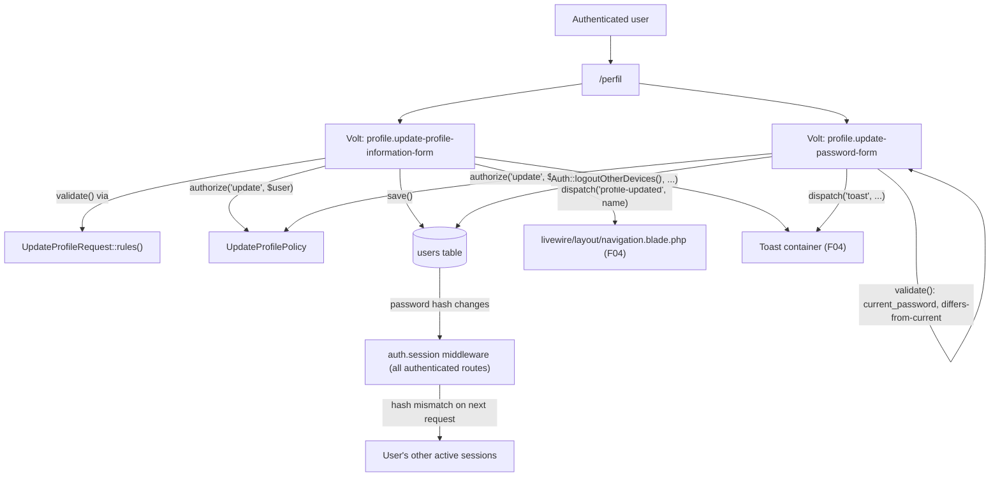

# Technical Specification: My Profile

## 1. Technical Overview

**What:** Turn the Breeze/Volt profile scaffold living at `/perfil` (renamed and left behaviorally untouched by F04) into the exact F11 contract: a read-only identity block (name, e-mail, account creation date), a "Dados da conta" form that only ever changes `name`, and an "Alterar senha" form that changes the password with current-password confirmation, a same-password rejection, and other-session invalidation. The Breeze-default e-mail-editing/verification flow and the account-deletion form are removed — neither appears anywhere in F11's Capabilities, and the PRD is explicit that the page carries exactly "two independent forms."

**Why:** F11 is the last consumer of the Breeze scaffold that F02 and F04 deliberately left alone — F04's spec flagged "whether the Breeze-default account-deletion form stays in scope" as a decision for this feature to make (see Section 3). The PRD's specific requirements — `logoutOtherDevices` after a password change, a policy as a second line of defense against an injected identifier, and pt-BR field-level messages distinct from the framework defaults — are exactly the kind of edge an evaluating engineer probes (PRD §3: "edits an ID in the URL to test IDOR").

**Complexity:** medium — no new database table or JSON API surface, but the feature spans a Form Request, a Policy (the codebase's first), a session-invalidation middleware newly applied to every authenticated route, two Livewire/Volt components rewritten for scope and behavior, a pt-BR message override, and a full rewrite of the existing test file.

### Scope

**Included:**
- Read-only display of the authenticated user's `name`, `email`, and `created_at` on `/perfil`
- "Dados da conta" form: `name` only, validated by a Form Request, save button disabled until the field is touched, pt-BR toast on success
- "Alterar senha" form: `current_password` + `password` + `password_confirmation`, with a pt-BR "incorrect current password" message, a "new password same as current" rejection, `logoutOtherDevices` invalidating every other session for the user while the current one stays active, and the same disabled-until-touched/toast behavior
- `UpdateProfilePolicy`, gating both forms as a second authorization layer on top of the fact that neither form ever reads a user identifier from the request
- Removal of the Breeze account-deletion form and the e-mail-editing/verification fields, confirmed against the PRD's exact "two forms" wording (see Section 3, first decision)

**Excluded (owned by other features):**
- The `/perfil` route itself, the page's placement in navigation, and the `profile-updated` browser event contract the navigation bar already listens for (F04)
- The `name`/`email`/`password` columns and the `users` table itself (F01/F02)
- The toast container and its `dispatch('toast', ...)` event contract (F04) — this feature only calls it
- Chat's consumption of the updated `name` in the registered-user directory (F12)

---

## 2. Architecture Impact

| Layer | Components |
|---|---|
| Livewire/Volt | `resources/views/livewire/profile/update-profile-information-form.blade.php` (rewritten), `resources/views/livewire/profile/update-password-form.blade.php` (rewritten) |
| Validation | `app/Http/Requests/UpdateProfileRequest.php` (new) |
| Authorization | `app/Policies/UpdateProfilePolicy.php` (new), `app/Providers/AppServiceProvider.php` (modified — registers the policy) |
| Middleware | `routes/web.php` (modified — `auth.session` added to every authenticated route) |
| Localization | `lang/pt_BR/validation.php` (modified — `current_password` override) |
| Views | `resources/views/perfil.blade.php` (modified — drops the deletion form) |
| Removed | `resources/views/livewire/profile/delete-user-form.blade.php` |
| Tests | `tests/Feature/ProfileTest.php` (rewritten) |

---

## 3. Technical Decisions

| Decision | Chosen Approach | Alternative Considered | Trade-off |
|---|---|---|---|
| Breeze account-deletion form | Remove `delete-user-form` entirely: the file, its `<livewire:>` inclusion in `perfil.blade.php`, and its four Pest tests | Keep it as an unlisted third form | PRD §6 F11 Capabilities says "Two independent forms with independent submit buttons," full stop — a third destructive action never mentioned in Capabilities, Experience, or Error Handling is scope the PRD doesn't ask for. F04's spec explicitly deferred this exact call to F11 (Section 1); this resolves it the same way F02 resolved the analogous Breeze-scaffold trim (removing `forgot-password`/`reset-password`/`verify-email`/`confirm-password`) |
| E-mail field | Drop it from the Livewire component entirely — no `email` public property, no validation rule, no write path. The template renders `auth()->user()->email` as plain greyed-out text with the helper copy "O e-mail não pode ser alterado." | Keep the Breeze `email` property but disable the input client-side | A disabled-but-present form field is still a Livewire property an attacker can `set()` directly on the component payload; removing the property removes the write path structurally instead of relying on a client-side disabled attribute. It also deletes the now-orphaned `MustVerifyEmail` conditional and `sendVerification()` method, since `User` never implements that contract (confirmed unused as of F02 §6) |
| Name validation source | A `UpdateProfileRequest` Form Request holding the `name` rule, instantiated directly inside the Volt component's `updateProfileInformation()` method (`$this->validate((new UpdateProfileRequest())->rules())`) rather than bound to a route | Keep the rule as an inline array on the Livewire component, as Breeze ships it | Mirrors the precedent F03 already set with `StoreUserRequest`: "Instantiated directly ... rather than bound to a route, so its rules stay authoritative even though registration itself runs through Livewire/Volt." PRD §6 F11 explicitly asks for "a Form Request," matching F03's pattern rather than reinventing one |
| "New password differs from current" | After the standard rules pass, an explicit `Hash::check($validated['password'], $user->password)` check throws a `ValidationException` on the `password` field with the exact PRD copy if it matches | A custom `Rule` object (e.g., `DifferentFromCurrentPassword`) | Laravel ships no built-in rule for "differs from an existing hash" since hash comparison isn't expressible as a declarative rule closure without the plaintext-vs-hash asymmetry; a single inline check after validation is simpler than a reusable rule object for a check used in exactly one place |
| Other-session invalidation | Call `Auth::logoutOtherDevices($validated['current_password'])` — the already-verified *current* password, which `logoutOtherDevices()` re-checks via `Hash::check()` and re-hashes onto the `password` column with a fresh salt, changing the stored hash string and so invalidating every other session's reference — then persist the actual new password with an explicit `$user->forceFill(['password' => Hash::make($validated['password'])])->save()`. Add the `auth.session` middleware alias — Laravel's own `AuthenticateSession` middleware — to every route already behind `auth` in `routes/web.php` | Call `Auth::user()->update(['password' => Hash::make(...)])` as Breeze ships it, without `auth.session` | `logoutOtherDevices($password)` verifies identity against the *current* hash — passing the new password there would fail that check and silently no-op, so the new password must still be persisted as a second write. `logoutOtherDevices()` also only has an observable effect when `AuthenticateSession` is active on the routes those other sessions will next request — the middleware compares each request's stored session password-hash reference against the user's current hash and force-logs-out on mismatch. Scoping it to `/perfil` alone would leave a stale session on `/chat` un-invalidated, so it goes on the whole authenticated route set the PRD's four destinations already share |
| `UpdateProfilePolicy` scope | A single `update(User $authUser, User $target): bool` method returning `$authUser->is($target)`, registered for the `User` model via `Gate::policy()` in `AppServiceProvider::boot()` (the codebase's first policy — Laravel's naming-convention auto-discovery would look for `UserPolicy`, not the PRD's named `UpdateProfilePolicy`, so registration must be explicit) | Skip the policy since both forms already scope every read/write through `Auth::user()` and never accept a user identifier from the request | PRD §6 F11 calls the policy out by name as "a second line of defense." It is redundant with the request-scoping by design — the same redundancy F10's `FavoritePolicy` will later apply to the pivot query — and is exactly the kind of defense-in-depth an evaluating engineer looks for when deliberately trying to tamper with an identifier (PRD §3) |
| Current-session self-healing after a password change | Inside `update-password-form`'s `updatePassword()`, after persisting the new password, explicitly write `request()->session()->put('password_hash_'.Auth::getDefaultDriver(), Auth::guard()->hashPasswordForCookie($user->getAuthPassword()))` — mirroring `AuthenticateSession::storePasswordHashInSession()` using only its public API (`hashPasswordForCookie()` is public on `SessionGuard`) | Add `auth.session` to Livewire's own `/livewire/update` route via `Livewire::setUpdateRoute()` in `AppServiceProvider::boot()`, so the middleware's own end-of-request refresh does this automatically | `AuthenticateSession` only refreshes a session's stored password-hash marker at the end of a request that itself passed through the middleware, and a password change runs inside a Livewire action against Livewire's own update route, which ships with only the `web` middleware group — without a fix, the very session that just changed its own password would read as stale and get logged out on its next page load, contradicting "the current session stays active." Rerouting Livewire's global update endpoint was considered but rejected: it changes middleware behavior for every Livewire action in the app (not just this one), and its precedence relative to Livewire's own default-route registration inside `AppServiceProvider::boot()` isn't something this change can verify without a running app. Writing the session key directly is scoped to exactly the one action that needs it |
| Success feedback | Replace Breeze's inline `<x-action-message on="...">Saved.</x-action-message>` widgets with `dispatch('toast', message: '...', type: 'success')`, using F04's established toast contract | Keep the inline "Saved." message | The PRD asks for the exact pt-BR copy ("Perfil atualizado.", "Senha alterada com sucesso.") in a toast, not an inline "Saved." label; F04 built the toast container specifically so every later feature would route success/error feedback through it rather than inventing its own widget |

---

## 4. Component Overview

### Backend

| File Path | New/Modified | Purpose | Key Responsibilities |
|---|---|---|---|
| `app/Http/Requests/UpdateProfileRequest.php` | New | Name-change validation | `name`: required, string, 2–255 characters; `authorize()` returns `true` (the policy is the authorization layer, this is validation only) |
| `app/Policies/UpdateProfilePolicy.php` | New | Second-line authorization for profile mutation | `update(User $authUser, User $target): bool` — true only when the target is the authenticated user |
| `app/Providers/AppServiceProvider.php` | Modified | Policy registration | `Gate::policy(User::class, UpdateProfilePolicy::class)` in `boot()` |

### Livewire/Volt

| File Path | New/Modified | Purpose | Key Responsibilities |
|---|---|---|---|
| `resources/views/livewire/profile/update-profile-information-form.blade.php` | Modified (rewritten) | "Dados da conta" form | Displays name/e-mail/creation date; validates and saves `name` only via `UpdateProfileRequest`; authorizes via `UpdateProfilePolicy`; dispatches `profile-updated` (consumed by F04's nav) and a success `toast`; disables its submit button until the field is touched |
| `resources/views/livewire/profile/update-password-form.blade.php` | Modified (rewritten) | "Alterar senha" form | Validates `current_password`/`password`/`password_confirmation`; rejects a new password identical to the current one; authorizes via `UpdateProfilePolicy`; calls `Auth::logoutOtherDevices()`; dispatches a success `toast`; clears all three fields on both success and failure; disables its submit button until a field is touched; `current_password` input suppresses browser autofill |

### Views and Routes

| File Path | New/Modified | Purpose | Key Responsibilities |
|---|---|---|---|
| `resources/views/perfil.blade.php` | Modified | Meu Perfil page | Drops the `<livewire:profile.delete-user-form />` include; the two remaining forms are unchanged in placement |
| `routes/web.php` | Modified | Route middleware | Every route currently behind `auth` (`/`, `/favoritos`, `/chat`, `/perfil`) additionally gets `auth.session`, so a password change's other-session invalidation is observable no matter which destination the stale session requests next |

### Localization

| File Path | New/Modified | Purpose | Key Responsibilities |
|---|---|---|---|
| `lang/pt_BR/validation.php` | Modified | Framework message override | Top-level `current_password` key set to "A senha atual está incorreta." (the framework's default `current_password` message carries no `:attribute` placeholder, so this is a plain top-level override, unlike F03's `custom.*` overrides) |

### Removed

| File Path | Reason |
|---|---|
| `resources/views/livewire/profile/delete-user-form.blade.php` | Account deletion is not one of F11's two forms (Section 3, first decision) |

### Database

No migration changes. This feature reads and writes the `users` table F01 created and depends on the `sessions` table's existing behavior (Section 6).

---

## 5. Exposed Interfaces

F11 exposes no JSON API. Its contract is two Livewire component round-trips and the policy/middleware layered on top of them.

### Endpoint: Update profile information

- **Method:** Livewire round-trip (`wire:submit="updateProfileInformation"`)
- **Path:** `/perfil`
- **Authentication:** `auth` + `auth.session`

**Request:**

| Field | Type | Required | Validation | Description |
|---|---|---|---|---|
| `name` | `string` | Yes | required, string, min:2, max:255 (`UpdateProfileRequest`) | New display name |

**Response:**

| Condition | Result |
|---|---|
| Valid | `auth()->user()->name` saved; `profile-updated` browser event dispatched with the new name; `toast` dispatched with "Perfil atualizado." |
| Validation failure | Field-level error on `name`; no write; toast not dispatched |
| Policy denial (structurally unreachable — no identifier is ever read from the request) | 403 |

### Endpoint: Update password

- **Method:** Livewire round-trip (`wire:submit="updatePassword"`)
- **Path:** `/perfil`
- **Authentication:** `auth` + `auth.session`

**Request:**

| Field | Type | Required | Validation | Description |
|---|---|---|---|---|
| `current_password` | `string` | Yes | required, string, `current_password` rule | Verified against the stored hash |
| `password` | `string` | Yes | required, string, `Password::defaults()`, confirmed, must differ from `current_password`'s hash | New password |
| `password_confirmation` | `string` | Yes | must match `password` | Confirmation field |

**Response:**

| Condition | Result |
|---|---|
| Valid | `Auth::logoutOtherDevices()` re-hashes the current password (invalidating other sessions), then the new bcrypt hash is persisted explicitly; current session stays authenticated; all other sessions for the user invalidated on their next request; all three fields cleared; `toast` dispatched with "Senha alterada com sucesso." |
| Wrong current password | Field-level error on `current_password`: "A senha atual está incorreta."; all three fields cleared; no write |
| New password equals current password | Field-level error on `password`: "A nova senha deve ser diferente da atual."; all three fields cleared; no write |
| Confirmation mismatch | Field-level error on `password_confirmation`; `current_password` preserved per PRD, `password`/`password_confirmation` cleared |

### Authorization contract: `UpdateProfilePolicy`

| Condition | Behavior |
|---|---|
| `authorize('update', Auth::user())` called from either form before mutating | `update()` returns `Auth::user()->is($target)` — always `true` here, since `$target` is always `Auth::user()` itself (no route or component ever binds a different user) |
| Any hypothetical future call site passing a different user | `update()` returns `false`; a `Livewire`/Laravel `AuthorizationException` renders as 403 |

### Session contract: `auth.session` middleware

| Condition | Behavior |
|---|---|
| A password change occurs | The user's password hash changes; `AuthenticateSession` compares each subsequent request's session-stored hash reference against the live value |
| A stale session (different device/tab) makes its next request to any of the four authenticated routes | Hash mismatch → that session is logged out and redirected to `/login`, per F02's existing guest-redirect contract |
| The session that performed the password change | Continues to match (its stored reference is refreshed as part of the same request), so it stays authenticated |

---

## 6. Data Model

No new migrations. This feature depends on columns the Laravel skeleton and F02 already established on the `users` table (see [F01's spec, Section 6](../F01-application-environment-and-delivery/spec.md#6-data-model) for the full column list).

### Table: `users` (existing)

| Column | Relevant to F11 because |
|---|---|
| `name` | The only field the "Dados da conta" form writes |
| `email` | Displayed read-only; never part of any validated or fillable set in this feature |
| `password` | Read by the `current_password` rule, rewritten by `Auth::logoutOtherDevices()` on a successful change |
| `created_at` | Displayed as the account creation date; no new column, already populated at registration (F03) |

### Session store (existing, `SESSION_DRIVER=database`)

| Detail | Relevant to F11 because |
|---|---|
| `AuthenticateSession` middleware's per-session password-hash reference | Not a `users` or `sessions` table column — it is a value the middleware itself stores inside the session payload on first authenticated request and compares thereafter. Adding `auth.session` to the route middleware is what makes `logoutOtherDevices()` observable at all (Section 3) |

---

## 7. Testing Strategy

### Test files

| Test File | Test Type | Target | Coverage Goal |
|---|---|---|---|
| `tests/Feature/ProfileTest.php` | Feature | `/perfil`, both Volt components, `UpdateProfilePolicy` | All F11 §9 acceptance criteria |

### `tests/Feature/ProfileTest.php` (rewritten)

| Test Function | Description | Assertions |
|---|---|---|
| `a página de perfil exibe nome, e-mail e data de criação da conta` | `GET /perfil` as an authenticated user | 200; both Volt components render; page shows the user's `name`, `email`, and formatted `created_at` |
| `o e-mail é exibido como somente leitura` | Render the account form | No `wire:model="email"` binding present; the read-only e-mail and helper copy are shown |
| `a barra de navegação está conectada ao evento profile-updated do formulário de perfil` | `GET /perfil` | The nav's `x-on:profile-updated.window` listener markup is present, proving the F04 integration point is wired (Alpine reactivity itself is outside Pest's reach) |
| `um usuário pode atualizar o próprio nome` | `Volt::test('profile.update-profile-information-form')->set('name', ...)->call('updateProfileInformation')` | No errors; `users.name` updated; `profile-updated` event dispatched with the new name; `toast` event dispatched with "Perfil atualizado." |
| `um nome inválido é rejeitado pela validação` | Set `name` to a 1-character string | Validation error on `name`; no write |
| `uma solicitação não pode alterar o nome ou e-mail de outro usuário` | Act as user A, update the form, assert user B's record | User B's `name`/`email` unchanged; only `Auth::user()` (user A) is ever touched |
| `a política nega a atualização de um usuário diferente do autenticado` | Call `UpdateProfilePolicy::update()` directly with two different `User` instances | Returns `false` for a mismatched pair, `true` for a matching pair |
| `uma senha atual correta permite a alteração de senha` | `Volt::test('profile.update-password-form')` with valid `current_password`/`password`/`password_confirmation` | No errors; all three fields cleared; `users.password` is a new bcrypt hash different from the previous one; `toast` dispatched with "Senha alterada com sucesso." |
| `uma senha atual incorreta é rejeitada com mensagem em português e nada é gravado` | Wrong `current_password` | Error on `current_password` equals "A senha atual está incorreta."; all three fields cleared; hash unchanged |
| `uma nova senha igual à atual é rejeitada` | `password` equals the current plaintext password | Error on `password` equals "A nova senha deve ser diferente da atual."; all three fields cleared; hash unchanged |
| `a confirmação de senha divergente é rejeitada preservando a senha atual digitada` | Mismatched `password_confirmation` | Error on `password`; `current_password` preserved in component state, `password`/`password_confirmation` cleared |
| `após a troca de senha uma sessão autenticada anterior é desconectada ao acessar uma rota protegida` | A real `GET /perfil` establishes this session's `password_hash_web` marker; the password is then changed via the Volt component; a second real `GET /perfil` is made | The second request redirects to `/login` and the client is a guest — proving a stale session's stored password reference is rejected once the hash changes |

### Acceptance-criteria traceability (PRD §9, F11)

- "Shows the current name, the read-only e-mail, and the account creation date" → display test
- "Saving a new name updates the record and the navigation reflects it without a manual reload" → name-update test + nav-wiring test
- "A password change with the correct current password succeeds and stores a new bcrypt hash different from the previous one" → password-success test
- "A wrong current password is rejected at field level and nothing is written" → wrong-current-password test
- "A new password identical to the current one is rejected with an explicit message" → same-password test
- "A request carrying another user's identifier or an `email` field changes nothing for either account" → cross-user test + read-only-e-mail test
- "After a successful password change, the current session stays active and other sessions for that user are invalidated" → other-session-invalidation test proves the "other sessions" half through a real HTTP round-trip; the "current session stays active" half is a code-level guarantee (Section 3, fourth decision) not exercised by this test — see Appendix, item 4

---

## Appendix: PRD Traceability

| PRD block | Spec destination |
|---|---|
| F11 Capabilities | Section 1 Scope, Section 4 Component Overview, Section 5 Exposed Interfaces |
| F11 Experience | Section 3 (toast decision), Section 5 response tables |
| F11 Error Handling | Section 3 (same-password, current-password decisions), Section 5 response tables |
| Section 8 Dependencies (F02, F04) | Section 1 Why, Section 2 diagram (`profile-updated`/`toast` consumed from F04) |
| Section 9 F11 acceptance criteria | Section 7 test traceability |
| F04's deferred "delete-account form" question | Section 3, first decision row |

## Appendix: Assumptions Requiring Review

1. **Account-deletion form removal.** F04's spec explicitly left this call to F11. This spec resolves it by removing the form, based on the PRD's literal "two independent forms" wording (Section 3). If the project owner wants deletion kept as an unlisted third capability, this is the point to override that call before implementation.
2. **`auth.session` applied to all four authenticated routes, not just `/perfil`.** This is necessary for `logoutOtherDevices()` to have any observable effect outside the profile page itself, but it is a session-behavior change touching routes F04/F07/F10/F12 also serve. No other feature's spec currently documents this middleware, so implementation should confirm it doesn't interact unexpectedly with F12's Reverb/Echo connection lifecycle (a WebSocket connection authenticated at page-load time is not itself subject to this middleware, but the underlying HTTP session it was issued from is).
3. **`current_password` message override is global, not scoped to F11.** Only F11 uses the `current_password` validation rule as of this feature's implementation, so a top-level override in `lang/pt_BR/validation.php` is safe today; a future feature reusing that rule would inherit the same pt-BR copy, which is very likely desirable but worth a second look if one appears.
4. **Test coverage for the current-session half of "sessions are invalidated" is indirect.** `Volt::test()` calls component methods directly and never runs the Livewire update route through the HTTP kernel, so no Pest test in this feature drives a real request through the `password_hash_web` self-healing write in `updatePassword()` (Section 3, fourth decision). The suite does verify, through a real HTTP round-trip, that a *stale* session's stored password reference is rejected once the hash changes (`tests/Feature/ProfileTest.php`, other-session-invalidation test) — the current-session half rests on code review of that write plus manual verification against a running app before this is considered done.
