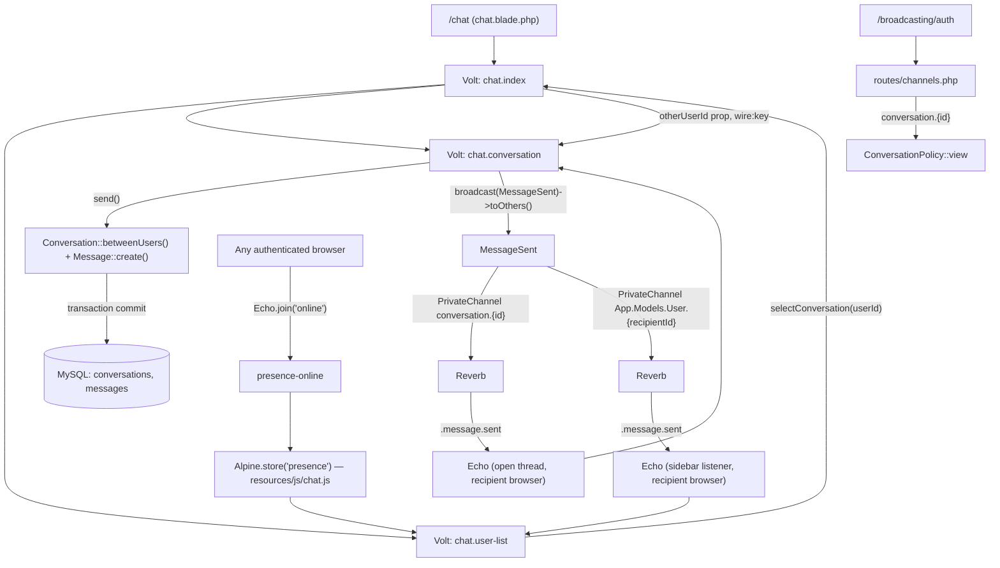
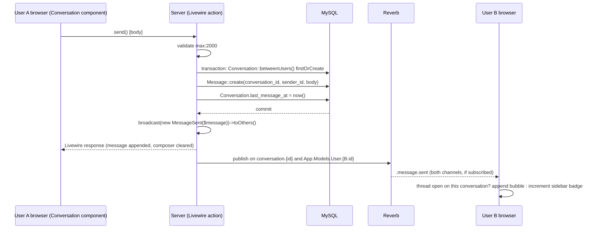

# Technical Specification: Real-time Chat

## 1. Technical Overview

**What:** A one-to-one messaging feature replacing the `/chat` placeholder (F04) with a two-column Livewire interface — a filterable, presence-aware user list on the left and a message thread on the right — backed by two new tables (`conversations`, `messages`), a `MessageSent` broadcast event, and channel authorization wired through Laravel Reverb. Every message is written to MySQL inside a transaction before it is broadcast; the conversation between any two users is a single, deterministically-identified row created on first send, never on first view. Presence ("who's online right now") is tracked entirely client-side through a Reverb presence channel — no `is_online` column exists anywhere in the schema.

**Why:** F12 is the PRD's other real-time surface besides the resilience story F05/F06 tell about PokeAPI, and it is the feature most likely to expose the two failure modes the PRD calls out by name for chat specifically: a private conversation leaking to a third party (closed here the same way F10 closes favorites IDOR — by deriving the conversation from the authenticated user's own identity, never from a client-supplied row id) and a WebSocket outage silently losing messages (closed by keeping message *persistence* on the ordinary Livewire/HTTP request path and treating broadcast delivery as a separate, best-effort step layered on top). F12 depends only on F01 (Reverb/Echo already wired by the Foundation), F02 (the `users` table it lists), and F04 (the shell and primitives it renders inside) — all already merged.

**Complexity:** complex — two new tables, a broadcast event with dual-channel delivery, channel authorization for both a private and a presence channel, three cooperating Livewire (Volt) components, new client-side JavaScript for presence and connection-state, and a test matrix spanning persistence, authorization, idempotent conversation creation, and event payload contracts.

### Scope

**Included (Core Scope):**
- `conversations` and `messages` tables; `Conversation` and `Message` Eloquent models
- A left-column user list (every other user, name filter, paginated 30) and a right-column conversation thread, as cooperating Volt components rendered by `/chat`
- Conversation creation on first message via a deterministic, ordered-pair `firstOrCreate`, so two users messaging each other never produce two rows regardless of who writes first
- Messages persisted inside a transaction before the `MessageSent` event is broadcast on the private `conversation.{id}` channel
- Full history on open (30 most recent messages, oldest to newest)
- Channel authorization in `routes/channels.php` restricting `conversation.{id}` to its two participants

**Included (Full Scope additions — confirmed in interview):**
- Online presence via a Reverb presence channel (wire name `presence-online`), converging within 5 seconds of connect/disconnect
- Per-conversation unread counters (capped display "99+") with read-marking on open, kept current on the sidebar even for a conversation that is not open, via a second, lightweight broadcast on each recipient's existing private notification channel
- Infinite scroll loading older history 30 messages at a time, anchored so the visible content does not jump

**Excluded (owned by other features):**
- The registered-user directory this feature reads (`id`, `name`, `email`, `created_at`) — F02's `users` table, unmodified
- The shell, navigation, `card`/`badge`/`empty-state`/`toast` primitives, and the global loading bar this feature renders inside — F04
- Any change to `/favoritos`, `/perfil`, or the Pokémon catalog — untouched by this feature
- Group conversations, attachments, message editing/deletion, typing indicators, and e-mail/push notifications — PRD §7 Out of Scope

---

## 2. Architecture Impact

| Layer | Components |
|---|---|
| Domain | `app/Models/Conversation.php`, `app/Models/Message.php` (new) |
| Events | `app/Events/MessageSent.php` (new) |
| Authorization | `app/Policies/ConversationPolicy.php` (new), `routes/channels.php` (modified — adds `conversation.{conversation}` and `online`) |
| Configuration | `config/chat.php` (new — message length, page sizes, unread cap), `config/reverb.php` unchanged, `.env.example` (modified — presence timing) |
| Livewire (Volt) | `resources/views/livewire/chat/index.blade.php`, `resources/views/livewire/chat/user-list.blade.php`, `resources/views/livewire/chat/conversation.blade.php` (new) |
| Pages | `resources/views/chat.blade.php` (modified — placeholder replaced with `<livewire:chat.index />`) |
| Client-side | `resources/js/chat.js` (new — presence roster and connection-state Alpine stores), `resources/js/app.js` (modified — import) |
| Database | 2 new migrations (`conversations`, `messages`), `database/factories/ConversationFactory.php`, `database/factories/MessageFactory.php` (new) |
| Consumed | F02 `users` table (registered-user directory) |
| Consumers | None declared in PRD §6 — F12 is a leaf feature |

**Message send-and-deliver sequence**

---

## 3. Technical Decisions

| Decision | Chosen Approach | Alternative Considered | Trade-off |
|---|---|---|---|
| Broadcast timing | `MessageSent implements ShouldBroadcastNow`, fired synchronously right after the persisting transaction commits | `ShouldBroadcast` (queued through the existing Horizon `default` queue) | A queued broadcast's delivery latency depends on worker throughput, which the PRD's <1s p95 delivery target doesn't budget for; `ShouldBroadcastNow` publishes to Reverb in-request. The message is already durably persisted before this call runs, so a broadcast failure here never risks data loss — see Section 7 |
| Sidebar reactivity for a conversation that is not open | `MessageSent` broadcasts on two private channels: `conversation.{id}` (full payload, consumed by an open thread) and the recipient's own `App.Models.User.{id}` channel (same payload, consumed by the user-list component to bump unread counts and reorder rows) | Have the user-list component subscribe to every visible conversation's channel simultaneously | Laravel's default `App.Models.User.{id}` channel already ships in `routes/channels.php` (framework default, unused until now); reusing it avoids up to 30 concurrent channel subscriptions per page load. `toOthers()` naturally excludes the sender's own connections from both channels |
| Conversation identity | Livewire's `chat.conversation` component takes a target **user** id as its prop and always resolves the conversation via `Conversation::betweenUsers(auth()->user(), $targetUser)`; no code path accepts a raw conversation id from a request or public property | Take a `conversationId` prop directly, looked up and authorized per-request | Structurally impossible to address another pair's conversation by guessing/tampering with an id — mirrors F10's `auth()->user()->favorites()` pattern. A `ConversationPolicy` is still added as the second line of defense on `send()`/`loadOlder()` and, primarily, for `routes/channels.php`'s authorization callback, since Echo's client *does* need a numeric id to subscribe to |
| Presence storage | No `is_online`/`last_seen_at` column anywhere; the online roster lives entirely in a browser-side Alpine store populated by Reverb's presence channel (`here`/`joining`/`leaving` callbacks) | Persist a heartbeat timestamp per user, polled or written on Echo connect/disconnect | Reverb's presence channel already tracks live socket membership authoritatively; a duplicated DB column would need constant writes and could drift from the actual socket state it's supposed to describe. Cost: presence resets to "unknown" for an instant on a hard page reload until the channel rejoins (sub-second in practice) |
| Presence convergence timing | `.env.example` sets `REVERB_APP_PING_INTERVAL=5` and `REVERB_APP_ACTIVITY_TIMEOUT=5` (down from the framework defaults of 60/30 in `config/reverb.php`) | Leave the framework defaults (60s ping / 30s activity timeout) | The PRD requires offline status within 5 seconds of an *ungraceful* disconnect (network loss, force-quit), not just a clean tab close (which fires an immediate close frame regardless of these settings). Meeting that literally requires tightening both values; the cost is more frequent ping traffic and less tolerance for a transient network hiccup before a connection is dropped. Flagged for revisit if this proves flaky under real network jitter — see Assumptions |
| History pagination direction | Keyset (cursor) pagination — `loadOlder()` fetches messages with `id < $oldestLoadedId`, descending, limit 30, then prepends after reversing | Offset-based `WithPagination`/`skip()` | A new incoming message while the user is scrolled up would shift every subsequent offset page in an offset scheme, duplicating or skipping rows; a cursor keyed on `id` is unaffected by concurrent inserts, and `messages` already has a `(conversation_id, id)` index for it |

---

## 4. Component Overview

### Domain and events

| File Path | New/Modified | Purpose | Key Responsibilities |
|---|---|---|---|
| `app/Models/Conversation.php` | New | Deterministic conversation row | `belongsTo` `userOne`/`userTwo`; `hasMany` `messages`; static `betweenUsers(User $a, User $b): Conversation` normalizes the pair (lower id → `user_one_id`) before `firstOrCreate`; scope `forUser($userId)` |
| `app/Models/Message.php` | New | A single chat message | `belongsTo` `conversation`, `belongsTo` `sender`; scope `unreadFor(int $userId)` (`sender_id != $userId AND read_at IS NULL`) |
| `app/Events/MessageSent.php` | New | Broadcast contract | `ShouldBroadcastNow`; `broadcastOn()` returns both channels from Section 3; `broadcastAs()` returns `message.sent`; `broadcastWith()` shapes the payload in Section 5 |
| `app/Policies/ConversationPolicy.php` | New | Participancy check | `view(User $user, Conversation $conversation): bool` — true only if `$user->id` is `user_one_id` or `user_two_id`; used by `routes/channels.php` and as a guard inside `send()`/`loadOlder()` |

### Livewire (Volt)

| File Path | New/Modified | Purpose | Key Responsibilities |
|---|---|---|---|
| `resources/views/livewire/chat/index.blade.php` | New | Page orchestrator | Holds the selected target user id; renders `user-list` and, when a target is selected, `conversation` keyed by that id, else an empty-state pane reading "Selecione uma conversa para começar." |
| `resources/views/livewire/chat/user-list.blade.php` | New | Left column | Query: every user except self, left-joined against `conversations` for sort/unread, name filter (`wire:model.live.debounce.300ms`, matching F07's convention), `WithPagination` at 30 per page; renders each row's presence dot from the client-side Alpine presence store (not a server round trip) and its unread badge from a per-row aggregate; listens on the recipient's personal channel to refresh reactively |
| `resources/views/livewire/chat/conversation.blade.php` | New | Right column | `mount()` resolves (never creates) the existing conversation for `(auth, otherUserId)` and marks its unread messages read in one query; loads the latest 30 messages; `send()` validates and persists per Section 2's sequence diagram; `loadOlder()` implements the keyset fetch from Section 3; exposes the dynamic Echo channel name so Livewire's built-in `#[On('echo-private:...')]` listener (re-evaluated per render) picks up the conversation id as soon as it exists |

### Pages and client-side

| File Path | New/Modified | Purpose | Key Responsibilities |
|---|---|---|---|
| `resources/views/chat.blade.php` | Modified | `/chat` page | Replaces F04's `<x-empty-state message="Em construção.">` body with `<livewire:chat.index />`, keeping the same `<x-app-layout>` wrapper and header slot |
| `resources/js/chat.js` | New | Presence + connection-state stores | `Alpine.store('presence', { onlineIds: Set })` populated by `Echo.join('online').here()/.joining()/.leaving()`; `Alpine.store('realtime', { connected: true })` bound to Reverb's connection `state_change` event, backing the reconnecting banner |
| `resources/js/app.js` | Modified | Bootstrap | Adds `import './chat'` alongside the existing `./echo` import |

### Database

| Migration File | Tables Affected | Operation | Notes |
|---|---|---|---|
| `2026_08_16_000004_create_conversations_table.php` | `conversations` | CREATE | Must run before `messages` |
| `2026_08_16_000005_create_messages_table.php` | `messages` | CREATE | Foreign key to `conversations.id` |

### Factories

| File Path | New/Modified | Purpose | Key Responsibilities |
|---|---|---|---|
| `database/factories/ConversationFactory.php` | New | Test data | Creates two distinct `User` factories, normalizes the pair, optional `->withMessages(n)` state |
| `database/factories/MessageFactory.php` | New | Test data | Belongs to a `Conversation` and a participant `sender`; `unread()`/`read()` states |

---

## 5. Exposed Interfaces

F12 has no REST/JSON API. Its surface is a broadcast event, two channel authorization callbacks, and three Livewire components' public entry points.

### Broadcast event: `MessageSent`

| Aspect | Value |
|---|---|
| Interface | `ShouldBroadcastNow` |
| Dispatch | `broadcast(new MessageSent($message))->toOthers()`, called only after the persisting transaction has committed |
| Channels | `new PrivateChannel("conversation.{$message->conversation_id}")`, `new PrivateChannel("App.Models.User.{$recipientId}")` |
| Broadcast name | `message.sent` |

**Payload (`broadcastWith()`):**

| Field | Type | Description |
|---|---|---|
| `id` | `integer` | Message id |
| `conversation_id` | `integer` | Owning conversation |
| `sender_id` | `integer` | Author's user id |
| `sender_name` | `string` | Author's current `name`, denormalized at broadcast time |
| `body` | `string` | Message text, already escaped by Blade at render — never interpreted as HTML client-side either |
| `created_at` | `string` (ISO 8601) | Timestamp for the bubble |

### Channel authorization: `conversation.{conversation}`

- **Registered in:** `routes/channels.php`
- **Binding:** implicit route-model binding resolves `{conversation}` to a `Conversation` instance
- **Callback:** `fn (User $user, Conversation $conversation) => $user->can('view', $conversation)`, delegating to `ConversationPolicy::view`
- **On denial:** `/broadcasting/auth` responds 403; Echo's subscription rejects, no events are delivered

### Channel authorization: `online` (presence — wire name `presence-online`)

- **Registered in:** `routes/channels.php`, as `Broadcast::channel('online', ...)`
- **Callback:** any authenticated user is authorized; returns `['id' => $user->id, 'name' => $user->name]`, the shape Echo's `.here()`/`.joining()`/`.leaving()` callbacks receive
- **Client subscription:** `Echo.join('online')` — Echo prepends `presence-` to the wire channel name automatically; this is *not* typed into the server-side registration

### Livewire component contracts

| Component | Entry point | Behavior |
|---|---|---|
| `chat.index` | `selectConversation(int $userId)` | Sets the active target user id; the `conversation` child remounts (fresh `wire:key`) against the new target |
| `chat.user-list` | `render()` | Applies the name filter and pagination described in Section 4; each row exposes a presence-store binding and its unread count |
| `chat.conversation` | `mount(int $otherUserId)` | Resolves the existing conversation (if any) without creating one; marks visible messages read |
| `chat.conversation` | `send()` | Validates `body` (`required`, `max:2000`); persists per Section 2; broadcasts; appends the message to the rendered list |
| `chat.conversation` | `loadOlder()` | Keyset-fetches the previous 30 messages ahead of the oldest currently loaded id |

---

## 6. Data Model

### Table: `conversations`

| Column | Type | Nullable | Default | Description |
|---|---|---|---|---|
| `id` | `bigint unsigned` | No | auto-increment | Primary key |
| `user_one_id` | `bigint unsigned` | No | — | FK → `users.id`, cascade delete; always the lower of the two participant ids |
| `user_two_id` | `bigint unsigned` | No | — | FK → `users.id`, cascade delete; always the higher of the two participant ids |
| `last_message_at` | `timestamp` | Yes | `NULL` | Denormalized for the user-list sort (Section 3); set on every new message |
| `created_at` / `updated_at` | `timestamp` | Yes | `NULL` | — |

**Indexes and constraints:**

| Name | Columns | Type | Purpose |
|---|---|---|---|
| `conversations_pkey` | `id` | btree (PK) | Unique identifier |
| `conversations_user_one_id_user_two_id_unique` | `user_one_id`, `user_two_id` | btree (unique) | `firstOrCreate()` conflict target — guarantees exactly one row per pair |
| `conversations_ordered_pair_check` | — | CHECK (`user_one_id < user_two_id`) | DB-level backstop that the pair is always canonically ordered, mirroring the app-level normalization in `betweenUsers()`; supported since MySQL 8.0.16 (this project targets MySQL 8.0) |
| `conversations_user_one_id_foreign` / `conversations_user_two_id_foreign` | → `users.id` | FK, cascade delete | Referential integrity |

### Table: `messages`

| Column | Type | Nullable | Default | Description |
|---|---|---|---|---|
| `id` | `bigint unsigned` | No | auto-increment | Primary key |
| `conversation_id` | `bigint unsigned` | No | — | FK → `conversations.id`, cascade delete |
| `sender_id` | `bigint unsigned` | No | — | FK → `users.id`, cascade delete |
| `body` | `varchar(2000)` | No | — | Plain text; PRD caps at 2000 characters, enforced by both `max:2000` validation and the column width |
| `read_at` | `timestamp` | Yes | `NULL` | Set when the recipient opens the conversation |
| `created_at` / `updated_at` | `timestamp` | Yes | `NULL` | `created_at` is the ordering key for history and the keyset cursor |

**Indexes:**

| Index Name | Columns | Type | Purpose |
|---|---|---|---|
| `messages_pkey` | `id` | btree (PK) | Unique identifier and keyset cursor |
| `messages_conversation_id_id_index` | `conversation_id`, `id` | btree | History page load and `loadOlder()`'s keyset query |
| `messages_conversation_id_sender_id_read_at_index` | `conversation_id`, `sender_id`, `read_at` | btree | Unread-count aggregate per conversation/recipient |
| `messages_conversation_id_foreign` / `messages_sender_id_foreign` | → `conversations.id` / `users.id` | FK, cascade delete | Referential integrity |

### Migration ordering

`conversations` → `messages`, enforced by filename timestamp, since `messages` foreign-keys `conversations.id`.

---

## 7. Failure Modes and Error Handling

Derived from the PRD's F12 (and the relevant F01) Error Handling blocks.

| Failure | Detection | Behaviour | Surfaced as |
|---|---|---|---|
| Reverb unreachable while composing | `resources/js/chat.js`'s `realtime` store observes a non-connected Echo state | The yellow reconnecting banner shows; `send()` is a normal Livewire (HTTP) action and is entirely unaffected — see Section 3's broadcast-timing decision, message persistence never depends on the WebSocket being up | "Conexão em tempo real perdida. Reconectando..." banner; Echo's own reconnect logic retries; the banner clears once `presence-online` re-authorizes |
| Reverb container down at page load (F01) | Echo's initial connection attempt fails | Handled the same as the case above — no unhandled JS exception, the page renders normally with the banner shown from the first tick | Same banner, present immediately rather than after a failed send |
| Message body exceeds 2000 characters | Client: composer disables the send control once `strlen(body) > 2000`; Server: `send()`'s `max:2000` validation rule | Client-side prevention plus a server-side reject if the control is bypassed (devtools, replayed request) | "Máximo de 2000 caracteres."; a bypassed request receives a 422 validation error, nothing persisted |
| Non-participant subscribes to `conversation.{id}` | `ConversationPolicy::view` returns `false` | `/broadcasting/auth` responds 403 | No events delivered to that socket |
| Attempt to post into a conversation the user does not belong to | Structurally prevented — see Section 3's conversation-identity decision — but defensively re-checked via `ConversationPolicy` inside `send()`/`loadOlder()` before any write or read | `abort(403)`, nothing persisted, nothing broadcast | Livewire renders the component's 403 response; no partial state |
| Broadcast failure after a successful write | The `broadcast(...)->toOthers()` call is wrapped; any exception it throws is caught and logged, never re-thrown | The message is already committed and visible to the sender; the recipient sees it on their next reconnect, conversation open, or reload (the history query never depends on the broadcast having succeeded) | `Log::error()` with the conversation id and exception message; no retry (retrying risks a duplicate broadcast, and the data is not at risk — only the live push is) |
| Two users message each other for the first time, from either side, possibly near-simultaneously | `Conversation::betweenUsers()`'s ordered-pair `firstOrCreate` plus the DB unique index on `(user_one_id, user_two_id)` | Exactly one row survives regardless of send order or a race between two near-simultaneous first messages; a losing `firstOrCreate` insert falls back to the winning row via the unique-index catch, matching F10's documented idempotency pattern | No duplicate conversation, no exception surfaced to either sender |
| Message body containing HTML | Blade's default `{{ $message->body }}` escaping (never `{!! !!}`), applied identically to history and to the live-appended bubble | Renders as literal text | No script execution, no broken markup |

---

## 8. Testing Strategy

### Test files

| Test File | Test Type | Target | Coverage Goal |
|---|---|---|---|
| `tests/Feature/Chat/UserListTest.php` | Feature | `chat.user-list` | Exclusion of self, sort, filter, pagination, unread badge and cap |
| `tests/Feature/Chat/ConversationTest.php` | Feature | `chat.conversation`, `Conversation`, `Message` | History, send, read-marking, infinite scroll, validation, idempotent creation |
| `tests/Feature/Chat/MessageSentEventTest.php` | Feature | `MessageSent` | Channels, broadcast name, payload shape |
| `tests/Feature/Chat/ChannelAuthorizationTest.php` | Feature | `routes/channels.php` | `conversation.{id}` and `online` authorization, participant vs. non-participant |
| `tests/Feature/PlaceholderPagesTest.php` | Feature (modified) | `/chat` | Removes the two F04-authored chat-placeholder assertions, now superseded by the tests above |

### `tests/Feature/Chat/UserListTest.php`

| Test Function | Description | Assertions |
|---|---|---|
| `a lista de conversas exclui o próprio usuário` | Renders `chat.user-list` for an authenticated user among several | The authenticated user's own row never appears |
| `usuários com mensagem mais recente aparecem primeiro, o restante em ordem alfabética` | Seeds conversations with different `last_message_at` values, plus users with none | Order matches: most-recent-message-first, then alphabetical for the rest |
| `o filtro por nome restringe a lista` | Sets the search term | Only matching users render |
| `a lista pagina a cada 30 usuários` | Seeds 31+ other users | Page 1 shows 30; page 2 shows the remainder |
| `o contador de não lidas aparece por conversa e satura em 99+` | Seeds a conversation with 150 unread messages from the other participant | Badge shows "99+"; a conversation with 3 unread shows "3" |

### `tests/Feature/Chat/ConversationTest.php`

| Test Function | Description | Assertions |
|---|---|---|
| `abrir uma conversa inexistente não cria nenhuma linha` | Mounts `chat.conversation` for two users who never messaged | `Conversation::count()` stays 0; the component renders an empty history |
| `enviar a primeira mensagem cria a conversa e a mensagem` | Calls `send()` from a fresh pair | Exactly 1 `conversations` row, 1 `messages` row, `last_message_at` set |
| `duas mensagens entre os mesmos usuários, em qualquer ordem, produzem uma única conversa` | User A messages B, then B messages A (fresh pair) | `Conversation::count()` stays 1 throughout |
| `o histórico carrega as 30 mensagens mais recentes em ordem cronológica` | Seeds 45 messages | Initial render shows the last 30, oldest to newest |
| `rolar até o topo carrega as 30 mensagens anteriores` | Calls `loadOlder()` after the initial load | 30 additional, older messages prepended; no duplicate or skipped row at the boundary |
| `abrir a conversa marca como lidas as mensagens do outro participante` | Seeds unread messages from the other user, then mounts the component | Their `read_at` is set in one query; the sender's own messages are untouched |
| `uma mensagem com mais de 2000 caracteres é rejeitada mesmo contornando o controle do cliente` | Calls `send()` directly with a 2001-character body | Validation error on `body`; no row created |
| `o corpo da mensagem com html é renderizado como texto literal` | Sends a body containing `<script>` | Rendered output contains the escaped entities, not an executable tag |
| `um usuário não pode carregar o histórico de uma conversa da qual não participa` | Attempts `loadOlder()`/mount against a conversation between two other users | 403, no messages returned |

### `tests/Feature/Chat/MessageSentEventTest.php`

| Test Function | Description | Assertions |
|---|---|---|
| `o evento é transmitido nos canais privados da conversa e do destinatário` | Instantiates `MessageSent` with a factory-built message | `broadcastOn()` returns a `PrivateChannel` named `conversation.{id}` and one named `App.Models.User.{recipientId}` |
| `o evento é nomeado message.sent` | Same instance | `broadcastAs()` equals `message.sent` |
| `o payload transmitido contém os campos esperados` | Same instance | `broadcastWith()` matches the Section 5 field table, including the denormalized `sender_name` |
| `enviar uma mensagem despacha o evento MessageSent` | `Event::fake([MessageSent::class])`, calls `send()` | `Event::assertDispatched(MessageSent::class, fn ($e) => $e->message->id === ...)` |

### `tests/Feature/Chat/ChannelAuthorizationTest.php`

| Test Function | Description | Assertions |
|---|---|---|
| `um participante é autorizado no canal da própria conversa` | `POST /broadcasting/auth` as a participant with `channel_name=private-conversation.{id}` | 200 |
| `um usuário que não participa é negado no canal da conversa` | Same request as a third user | 403; matches the PRD/F13 cross-referenced acceptance criterion |
| `qualquer usuário autenticado é autorizado no canal de presença` | `POST /broadcasting/auth` with `channel_name=presence-online` | 200; response body includes the user's `id`/`name` |
| `um convidado não é autorizado em nenhum dos dois canais` | Same requests without authentication | 403/redirect, per the `auth` middleware already covering `/broadcasting/auth` |

### Cross-Feature Integration coverage

The PRD's Section 9 Cross-Feature Integration criterion — *"The registered user directory owned by authentication (F02) is the source of the chat user list (F12): a user created through registration (F03) appears in another user's chat list on the next load, with the name shown matching the one saved in the profile (F11)"* — is partially covered here: `UserListTest` proves the list reads live from `users` with no separate directory/cache. The registration-to-list and profile-name-update-to-list legs of that criterion depend on F03 and F11 respectively and are exercised end-to-end once those features are merged (F13, wave 8) rather than duplicated here with stand-ins for their behavior.

---

## Appendix: PRD Traceability

| PRD block | Spec destination |
|---|---|
| F12 Consumes (F02 registered user directory) | Section 2 diagram, Section 4 `chat.user-list` |
| F12 Core Scope | Section 1 Scope → Included (Core), Section 4/5/6 |
| F12 Full Scope additions | Section 1 Scope → Included (Full), Section 3 (presence, dual-channel notify, keyset pagination) |
| F12 Capabilities | Section 3 Technical Decisions, Section 4 Component Overview, Section 6 Data Model |
| F12 Experience | Section 2 sequence diagram, Section 4 component responsibilities |
| F12 Error Handling | Section 7 Failure Modes and Error Handling |
| F01 Error Handling (Reverb container down) | Section 7, second row |
| Section 8 Foundation Features (F01/F02/F04 entries, consumed by F12) | Section 1 Why |
| Section 9 F12 acceptance criteria | Section 8 test files |
| Section 9 Cross-Feature Integration (F02→F12, F03/F11 legs) | Section 8 "Cross-Feature Integration coverage" note |

## Appendix: Assumptions Requiring Review

1. **The 5-second presence-convergence target is met exactly for graceful disconnects** (tab close, navigation, logout — an immediate WebSocket close frame) but only approximately for an *ungraceful* one (network loss, force-kill), which converges within `REVERB_APP_ACTIVITY_TIMEOUT` (tuned to 5s per Section 3). Tightening ping/activity timing this far trades in more ping traffic and less tolerance for ordinary network jitter; worth revisiting against real usage if reconnect churn proves noisy.
2. **Livewire's dynamic Echo channel name (`#[On('echo-private:conversation.{conversationId},...')]`) is expected to re-subscribe automatically once `conversationId` changes from `null` to a real id** after the first message creates the conversation, since Livewire 3 recomputes its listener list on every render. This needs verification during implementation; if the client doesn't resubscribe without a manual page interaction, a small `$this->js()` call re-invoking Echo's subscription after `send()`'s first successful call closes the gap.
3. **`ShouldBroadcastNow`'s synchronous Reverb publish adds a small, un-budgeted amount of latency to the sender's own Livewire response.** Expected to be negligible (a local socket/HTTP call to the `reverb` container), but not separately load-tested by this feature's Pest suite, which has no mechanism to measure real broadcast latency.
4. **The `App.Models.User.{id}` channel is reused, not newly introduced** — it already exists in `routes/channels.php` as a Laravel framework default (present before F12, currently unused by any feature). This spec treats "modified" for that file as "one new authorization callback added" (`conversation.{conversation}` and `online`), not a rename of the existing one.
