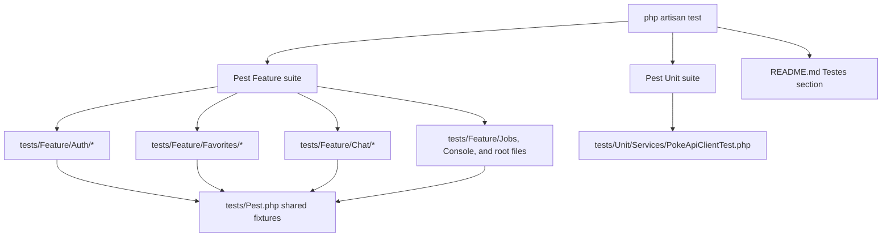

# Technical Specification: Automated Test Suite

## 1. Technical Overview

**What:** Close the two remaining gaps between the Pest suite that already exists in this repository and F13's PRD acceptance criteria, then document the suite's true coverage with full traceability. Every prior wave (F02–F12) wrote its own Pest coverage as part of its own implementation commit rather than deferring all testing to a dedicated final pass, so by the time F13 starts, `php artisan test` already reports **176 passed (617 assertions) across 25 files in 14.51s** — comfortably past the PRD's ≥35 cases / ≥10 files / <90s thresholds. The two concrete gaps are: (1) `tests/Feature/Auth/AuthenticationTest.php` still carries 5 test names left over from the Laravel Breeze scaffold in plain English, which violates the "tests named as readable pt-BR sentences" acceptance criterion; and (2) `README.md`'s "Testes" section still reads "A suíte completa de 35+ casos é escopo da F13" — forward-looking language written during F01, now stale since F13 is the feature closing that scope.

**Why:** F13 is not a from-zero test-writing effort here — the PRD's Core Scope and Full Scope capability lists (authentication, registration validation, search-with-cache, favorites idempotency, cross-user IDOR authorization, chat channel authorization, PokeAPI client retry/timeout behavior, and factories for all 6 models) are already implemented and passing. Re-implementing any of it would duplicate existing, working coverage. What remains is closing the two named gaps and producing the traceability record (this document's Testing Strategy section) an evaluator can use to verify the PRD's Section 9 acceptance checklist against real file/test names rather than prose claims.

**Scope (Core + Full, per interview):**
- **Included:** rename the 5 leftover English test names to pt-BR sentences; rewrite the README "Testes" section to state final measured numbers and drop the forward-looking phrasing; a full traceability audit mapping every F13 Core Scope + Full Scope capability and every Section 9 F13 acceptance bullet to the specific existing test file(s) and test name(s) that satisfy it; a final verification run confirming the suite still passes green under the 90s budget after the two edits.
- **Excluded:** any new test infrastructure (no meta-test that counts other tests — see Technical Decisions); a CI/CD pipeline (explicitly out of scope per PRD Section 7); any coverage beyond what Core + Full Scope calls for — the audit found no missing coverage category, only the two naming/documentation gaps above.

## 2. Architecture Impact

**Affected components:**

| Component | Path | Change |
|---|---|---|
| Auth feature tests | `tests/Feature/Auth/AuthenticationTest.php` | Rename 5 test descriptions (behavior/assertions unchanged) |
| Delivery documentation | `README.md` (`## Testes` section) | Rewrite to state final suite numbers, drop stale forward-looking sentence |

No application code, routes, models, migrations, or Livewire components are touched. No new files are created.



## 3. Technical Decisions

| Decision | Chosen Approach | Alternative Considered | Trade-off |
|---|---|---|---|
| How to satisfy the numeric acceptance criteria (≥35 cases, ≥10 files, <90s) | Document the actually-measured numbers (176 tests / 25 files / 14.51s) in this spec and in the README | Write a Pest test that introspects the filesystem and asserts test/file counts | A self-counting meta-test is brittle — it needs updating every time any unrelated feature adds a test — and it tests the test runner rather than product behavior. The PRD's own Experience narrative for F13 describes the evaluator reading Pest's summary output directly, which already carries this evidence. |
| Renaming the 5 leftover Breeze test names | Rename in place; assertions and test bodies untouched | Delete and rewrite as new pt-BR tests from scratch | Renaming preserves existing, already-correct coverage. Rewriting risks silently dropping an assertion for no behavioral benefit. |
| README "Testes" section | Rewrite the existing section in place | Leave the stale text and add a second, separate section | PRD F01's acceptance criteria require the README to document "what was delivered and what was left out and why." One accurate section serves that without duplicating or contradicting itself. |
| Scope | Core + Full (per interview) | Core only | Every Full Scope item (IDOR tests, chat channel authorization tests, the PokeAPI client retry/timeout unit test) is already implemented and passing, so specifying Full Scope costs nothing and matches the true state of the repository. |

## 4. Component Overview

| File Path | New/Modified | Purpose | Key Responsibilities |
|---|---|---|---|
| `tests/Feature/Auth/AuthenticationTest.php` | Modified | Replace 5 English Breeze-default test descriptions with pt-BR sentences | No change to `beforeEach`/assertions/dataset providers — only the string literal passed to `test(...)` for the 5 named cases |
| `README.md` | Modified | Refresh the `## Testes` section (currently around the "Problemas comuns" heading) | State the measured final numbers (test count, file count, duration); remove "A suíte completa de 35+ casos é escopo da F13"; add a `php artisan test --filter=<Group>` usage example, mirroring the PRD's Experience narrative |

API Contracts and Data Model sections are omitted: F13 introduces no endpoints, no broadcast channels, and no schema changes.

## 5. Testing Strategy

This section **is** the deliverable of F13: a traceability audit from every PRD capability/acceptance bullet to the concrete test(s) that already satisfy it, plus the two remediation items.

### 5.1 Suite-level facts (measured via `docker exec pokelink-app php artisan test`)

| Metric | PRD threshold | Measured |
|---|---|---|
| Test cases | ≥ 35 | 176 |
| Test files | ≥ 10 | 25 |
| Duration | < 90s | 14.51s |
| Assertions | — | 617 |
| Outbound network calls | 0 | 0 (`Http::preventStrayRequests()` / `Http::fake()` throughout; no test reaches the network) |
| Test database | in-memory SQLite, documented as test-only | Confirmed in `phpunit.xml` (`DB_CONNECTION=sqlite`, `DB_DATABASE=:memory:`) and README's existing "Testes" prose |

**Note on the PRD's "Pest 3" reference:** `composer.json` (an F01-era decision) locks `pestphp/pest ^4.7`. This spec does not change that lock — it is out of F13's scope — but records the discrepancy here for traceability rather than silently treating the PRD text as literal.

### 5.2 Capability → test traceability

| PRD requirement (Section 6/9) | Test file(s) | Representative test name(s) |
|---|---|---|
| Authentication: successful login, failed login (generic message), guest redirect, logout invalidates session, throttling after 5 failed attempts | `tests/Feature/Auth/AuthenticationTest.php` | *(post-rename, see 5.3)* login renders; valid credentials authenticate; invalid password rejected; `um convidado que acessa uma rota protegida é redirecionado...`; `a sexta tentativa de login em um minuto é bloqueada...`; `logout invalida a sessão...` |
| Session expiry mid-action → 419 handling | `tests/Feature/Auth/SessionExpiryTest.php` | 2 cases covering the 419→login redirect path |
| Registration: successful creation with hashed password, duplicate e-mail rejected, short password rejected, mismatched confirmation rejected, plaintext never persisted, double-submit creates one user, mass-assignment blocked | `tests/Feature/Auth/RegistrationTest.php` | `a senha é persistida como hash bcrypt e nunca em texto puro`; `um e-mail já cadastrado é rejeitado...`; `uma senha com menos de 8 caracteres é rejeitada...`; `a confirmação de senha divergente é rejeitada...`; `duas submissões rápidas com o mesmo e-mail criam exatamente um usuário`; `um payload com campos inesperados nunca alcança o modelo` |
| Search with cache: repeated identical interaction performs 0 outbound calls, name search returns matching subset, type filter constrains through the pivot, filters combine with AND, filter change resets pagination to page 1 | `tests/Feature/PokemonSearchTest.php` | `com acesso de rede bloqueado, busca, filtro de tipo e paginação continuam funcionando` (`Http::assertNothingSent()`); `a busca por nome é case e acento insensível...`; `selecionar um tipo restringe os resultados ao pivot`; `nome e tipo combinados usam semântica AND`; `qualquer mudança de filtro reseta a paginação para a página 1` |
| PokeAPI client cache hit (no second outbound call within TTL) | `tests/Unit/Services/PokeApiClientTest.php` | `uma resposta bem-sucedida é escrita no cache e a segunda chamada não faz requisição` |
| Favorites idempotency: favoriting creates exactly 1 row, favoriting twice still yields 1 row, unfavoriting removes it, favorites page lists only the authenticated user's rows | `tests/Feature/Favorites/FavoriteToggleTest.php`, `tests/Feature/Favorites/FavoritesPageTest.php` | `clicar na estrela de um card cria exatamente uma linha e preenche a estrela`; `clicar duas vezes na mesma estrela deixa exatamente uma linha no banco`; `a pagina lista apenas os favoritos do usuario autenticado` |
| Authorization (IDOR): user A removing user B's favorite → 403, row intact; user A never sees user B's favorites; user A cannot update user B's profile via injected identifier; non-participant denied on `conversation.{id}` | `tests/Feature/Favorites/FavoriteAuthorizationTest.php`, `tests/Feature/ProfileTest.php`, `tests/Feature/Chat/ChannelAuthorizationTest.php` | `um usuario nao consegue remover o favorito de outro usuario`; `usuario a nunca ve os favoritos do usuario b na propria listagem`; `uma solicitação não pode alterar o nome ou e-mail de outro usuário`; `a política nega a atualização de um usuário diferente do autenticado`; `um usuário que não participa é negado no canal da conversa` |
| PokeAPI client: 500 retried 3× then reported unavailable; 404 not retried | `tests/Unit/Services/PokeApiClientTest.php` | `um 500 é retentado e reportado indisponível após esgotar as tentativas`; `um 404 não é retentado` |
| Factories for User, Pokemon, Type, Favorite, Conversation, Message exist; no test depends on the production seeder | `database/factories/*.php` | `UserFactory`, `PokemonFactory`, `TypeFactory`, `FavoriteFactory`, `ConversationFactory`, `MessageFactory` all present |

**On the seeder exception:** two tests legitimately call `$this->seed(...)` — `PokemonSyncCommandTest` (`o seeder despacha o job de sincronização na fila padrão`) and `BootSmokeTest` (asserting the documented README credentials actually authenticate). Both are testing the seeder/boot path itself as the PRD's F01 and F06 acceptance criteria require, not using the seeder as fixture setup for unrelated coverage. This is consistent with, not a violation of, "no test depends on the production seeder."

### 5.3 Remediation: `tests/Feature/Auth/AuthenticationTest.php` renames

| Current name (Breeze default, English) | New name (pt-BR) |
|---|---|
| `login screen can be rendered` | `a tela de login renderiza o componente volt` |
| `users can authenticate using the login screen` | `um usuário se autentica com credenciais válidas pelo formulário de login` |
| `users can not authenticate with invalid password` | `um usuário não se autentica com senha inválida` |
| `navigation menu can be rendered` | `a barra de navegação renderiza para um usuário autenticado` |
| `users can logout` | `um usuário autenticado consegue fazer logout` |

No other `test(...)` calls in the suite carry non-pt-BR names (verified by scanning all 25 files); these 5 are the complete gap.

### 5.4 Remediation: README "Testes" section

Target content (replacing the existing section, keeping the surrounding "Problemas comuns" heading order intact):

```
## Testes

docker compose exec app php artisan test

A suíte roda contra um SQLite em memória (configurado em `phpunit.xml`), uma escolha
exclusiva de teste — a aplicação em si roda sobre MySQL. Nenhum teste acessa a rede.

176 casos (617 assertions) em 25 arquivos, ~15s — cobrindo autenticação, registro,
shell, busca com cache, detalhes, favoritos (incluindo idempotência e autorização
cross-user), perfil, chat (incluindo autorização de canal), sincronização do catálogo
e o cliente PokeAPI (retry, timeout, circuito, rate limit).

Para rodar um grupo específico:

docker compose exec app php artisan test --filter=Favorite
```

The exact prose is illustrative; the implementing step must keep the numbers in sync with whatever the verification run in Plan Stage 3 actually measures.

### 5.5 Post-remediation verification

After both edits land, re-run `docker compose exec app php artisan test` (or the container-exec equivalent used in this environment) and confirm:
- All tests still pass (renamed tests must show identical pass/fail behavior to before the rename)
- Total test/file counts are unchanged or higher, duration remains under 90s
- No `test(...)` call in the suite has a non-pt-BR description

---

## Appendix: PRD Traceability

| PRD block | Spec section |
|---|---|
| Core Scope (auth, registration, search-with-cache, favorites idempotency) | §5.2 rows 1–5 |
| Full Scope additions (IDOR, chat channel auth, PokeAPI retry/timeout unit test) | §5.2 rows 6–7 |
| Capabilities (Pest 3/PHPUnit, ≥35 cases/≥10 files, `Http::fake`, factories, seeder independence) | §5.1, §5.2 |
| Experience (`php artisan test`, `--filter=Favorite`) | §5.4 |
| Section 9 F13 acceptance criteria | §5.1 (numeric bullets), §5.2 (coverage bullets), §5.3 (naming bullet) |
| Section 9 Cross-Feature Integration | None of the 8 listed criteria name F13 as consumer or provider — F13's role is proving criteria already attributed to F05–F12, which §5.2 traces back to their owning features' test files |

## Appendix: Assumptions Requiring Review

- **Pest 3 vs Pest 4.7:** the PRD's Capabilities text says "Pest 3 on top of PHPUnit"; the repository (locked at F01) runs `pestphp/pest ^4.7`. Treated as a pre-existing, out-of-scope decision — recorded, not changed.
- **No meta-test for the numeric thresholds:** the ≥35/≥10/<90s criteria are satisfied by measured fact, documented in this spec and in the README, rather than by a self-asserting test. See Technical Decisions.
- **Seeder-calling tests are not violations:** `PokemonSyncCommandTest` and `BootSmokeTest` call `$this->seed(...)` to test the seeder/boot path itself (F01/F06 concerns), not to provision fixtures for unrelated assertions. Interpreted as compliant with "no test depends on the production seeder."
