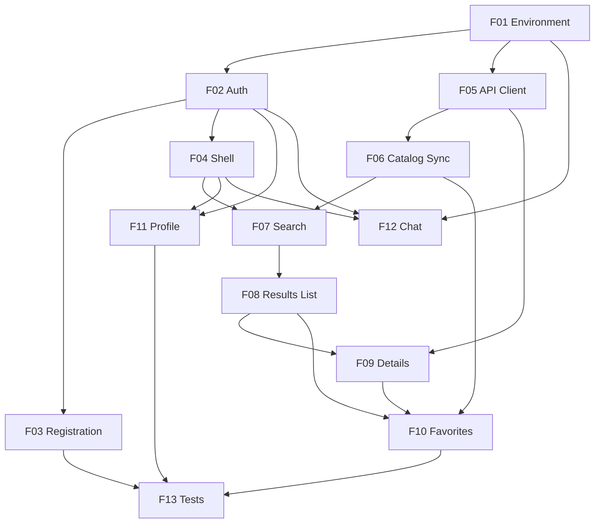

# PokéLink

## 1. Executive Summary

PokéLink is a full-stack Laravel web application that turns the public PokeAPI catalog into a private, authenticated experience where each user searches Pokémon, inspects their details, curates a personal favorites collection, and talks in real time with other users of the platform. Everything except login and registration lives behind authentication, and every piece of user-owned data — favorites, profile, conversations — is strictly scoped to its owner.

The product serves two audiences at once. For the **Pokémon enthusiast**, it is a fast, responsive catalog: type-to-search over ~1350 Pokémon with 300 ms debounce, paginated result cards, a rich detail modal, one-click favoriting, and a direct-message chat that updates without page reloads. For the **evaluating engineer**, it is a demonstration of engineering judgment: a resilient PokeAPI integration (timeout, retry with exponential backoff, rate limiting, Redis cache), a locally synchronized catalog so the product keeps working when the third-party API is down, Eloquent modeling with an idempotent N:N favorites relationship, authorization policies that close IDOR gaps, and a Pest suite covering the critical paths.

Architecturally, a queued job syncs a lightweight catalog (national number, name, types, sprite) from PokeAPI into MySQL at seed time, making search and pagination pure Eloquent queries — fast, predictable, and immune to upstream outages. Full Pokémon details are fetched on demand through a hardened HTTP client and cached in Redis for 24 hours. Real-time messaging runs over Laravel Reverb with Livewire and Echo on private and presence channels. The entire stack — app, MySQL, Redis, queue worker, and WebSocket server — boots from a single `docker compose up -d`, migrates and seeds itself, and presents a login screen with documented credentials.

## 2. Problem and Opportunity

### The Problem

**Third-party API fragility breaks the product**
- Calling PokeAPI on every keystroke of a live-search field generates 10–15 requests for a single word typed, hitting upstream throttling within seconds
- A naive integration returns a fatal error page when PokeAPI is slow or unreachable, making the entire application unusable for a dependency the product does not control
- Without an explicit timeout, a hanging upstream request holds a PHP-FPM worker until the default socket timeout, cascading into a stalled application under minimal load
- Repeated fetches of identical, effectively immutable data (a Pokémon's type never changes) waste both latency budget and upstream quota

**User data leaks across accounts**
- Favorites and profile endpoints that trust an ID from the URL let any authenticated user read or mutate another user's records — the classic IDOR failure
- Chat messages delivered on a shared or guessable broadcast channel expose private conversations to every connected client
- A password-change form without an ownership check allows account takeover from inside the application

**Environments that cannot be reproduced**
- Setup instructions with hidden manual steps ("create the database", "run this command first", "install Redis") cost the evaluator 30+ minutes before the first screen renders
- Missing `.env.example` entries surface as runtime exceptions instead of clear boot-time failures
- Local database state drifting from migrations makes bugs impossible to reproduce between machines

**Communication requires manual refresh**
- Polling for new messages every few seconds multiplies database queries by the number of open tabs while still showing messages seconds late
- Without persistence, refreshing the page destroys the conversation history
- Without presence information, a user has no idea whether the person they are writing to is even connected

**Quality claims that cannot be verified**
- "It works" without automated tests means every regression is discovered by a human, in production
- Authorization rules with no test coverage silently break the moment a route or policy is refactored
- Cache behavior with no test coverage regresses into per-request upstream calls without anyone noticing

### The Opportunity

PokéLink answers each of these directly. Against **API fragility**, the catalog is synchronized once into MySQL, so search, filtering, and pagination never touch the network; detail fetches go through a single hardened HTTP client with a 10-second total timeout, 3 retries with exponential backoff (200/400/800 ms), a 60 requests-per-minute limiter, and a 24-hour Redis cache — and when the upstream still fails, the interface says so in plain Portuguese instead of crashing.

Against **data leakage**, every user-owned resource is reached through the authenticated user's relationship rather than a URL identifier, authorization policies gate every mutation, chat rides on private and presence channels authorized server-side, and feature tests assert that user A receives a 403/404 when reaching for user B's data.

Against **irreproducible environments**, one `docker compose up -d` boots the full stack, waits for the database healthcheck, runs `migrate --seed`, and yields a working login screen with two documented accounts. Against **manual refresh**, Reverb broadcasts persisted messages to private channels with presence indicators and unread counters. Against **unverifiable quality**, a Pest suite exercises authentication, registration validation, favorites idempotency, cross-user authorization, and cache behavior — asserting with `Http::fake` that a repeated search performs zero additional upstream calls.

The differentiator is that resilience is not a decoration on top of a happy path: the local catalog makes the core browsing experience *fully functional with PokeAPI offline*, which is exactly the property that matters when the same team integrates e-mail, SMS, and WhatsApp gateways.

## 3. Target Audience

### Primary Users

**Pokémon Enthusiast (end user)**
- Arrives knowing roughly what they want — a name fragment like "char" or a type like "fogo" — and expects results while still typing, not after pressing a button
- Curates a personal collection over multiple sessions and expects favorites to survive logout, with no risk of seeing or affecting anyone else's list
- Wants to talk to other users about what they found, in the same tab, without reloading or losing the conversation history

**Evaluating Engineer (technical reviewer)**
- Clones the repository and expects a working application within minutes, from a single documented command, with credentials in the README
- Reads code before clicking: looks for small reusable Livewire components, Form Requests, Policies, Service/Action separation, and meaningful test names
- Deliberately probes the edges — disconnects the network to see how PokeAPI unavailability is handled, edits an ID in the URL to test IDOR, favorites the same Pokémon twice to test idempotency

### Behavioral Profile

Both profiles are impatient with latency and unforgiving of silent failure. They interpret a spinner that never resolves, a blank list with no explanation, or a stack trace on screen as the same thing: a broken product. Both work primarily on desktop browsers at 1280px and above but will resize or open on a phone at least once, so a broken narrow layout is noticed immediately. Both judge the product within the first 60 seconds — the enthusiast by whether the first search feels instant, the engineer by whether the environment booted without intervention.

## 4. Objectives

**Guarantee** a reproducible environment that any reviewer can run without manual intervention
- 100% of the boot procedure fits in a single command (`docker compose up -d`), with zero manual steps between clone and login screen
- Cold boot from `git clone` to a rendered login screen completes in under 5 minutes on a 50 Mbps connection
- `docker compose down -v && docker compose up -d` reproduces a clean, migrated, and seeded environment 100% of the time

**Insulate** the product from PokeAPI latency and unavailability
- Search, type filtering, pagination, and the favorites page remain 100% functional with PokeAPI unreachable
- A typed 8-character search query triggers 0 outbound PokeAPI requests
- A repeated Pokémon detail view within the 24-hour TTL triggers 0 outbound PokeAPI requests (cache hit rate above 95% after warm-up)
- No outbound request exceeds 10 seconds total; transient failures are retried up to 3 times before surfacing an error

**Isolate** every user's data from every other user
- 100% of user-owned reads and writes (favorites, profile, conversations) are scoped through the authenticated user's relationship
- 0 endpoints accept a user identifier from the request as an authorization source
- Feature tests prove that user A receives a 403 or 404 on 100% of attempts to read or mutate user B's favorites, profile, or messages

**Deliver** real-time messaging with no page reload and no message loss
- A sent message appears in the recipient's open conversation in under 1 second (p95) without any page reload
- 100% of messages are persisted before broadcast, so full history survives logout and reload
- Presence status for a connected user reflects within 5 seconds of connect or disconnect

**Prove** correctness on the critical paths with automated tests
- A minimum of 35 test cases across authentication, registration, search with cache, favorites, profile, and authorization
- 100% of the critical paths named in the specification (authentication, favorites, search with cache) have at least one passing feature test
- The full suite runs green in under 90 seconds via `php artisan test`

## 5. User Stories

### F01. Application Environment and Delivery
- As an evaluator, I want to boot the entire stack with a single command so that I can reach the login screen without installing PHP, MySQL, or Redis on my machine
- As an evaluator, I want the database to migrate and seed itself on first boot so that there are no hidden manual steps
- As an evaluator, I want ADMIN and USER credentials documented in the README so that I can log in immediately and compare what two different accounts see
- As an evaluator, I want a complete `.env.example` so that I never have to guess a missing configuration key
- As the system, I want to wait for the database healthcheck before migrating so that first boot does not fail on a race condition

### F02. Authentication and Session Management
- As a user, I want to log in with e-mail and password so that I can reach my own content
- As a user, I want to log out from any page so that I can leave my session safely on a shared machine
- As a visitor, I want to be redirected to the login screen when I open an internal URL so that private data is never exposed
- As a user, I want to be sent back to the page I originally requested after logging in so that I do not lose my place
- As the system, I want to throttle repeated failed login attempts so that credentials cannot be brute-forced

### F03. User Registration
- As a visitor, I want to create an account with name, e-mail, and password so that I can use the platform
- As a visitor, I want to see field-level validation messages in Portuguese so that I know exactly what to correct
- As a visitor, I want to be told when an e-mail is already registered so that I go to the login screen instead
- As a visitor, I want to be logged in automatically after registering so that I do not have to type my credentials twice
- As the system, I want to store only a password hash so that a database dump never exposes plaintext credentials

### F04. Application Shell and Navigation
- As a user, I want a persistent navigation bar with Início, Favoritos, Chat, and Meu Perfil so that every area is one click away
- As a user, I want the current section highlighted so that I always know where I am
- As a user, I want the layout to stay usable on my phone so that I can browse away from my desk
- As a user, I want a consistent loading indicator during Livewire round-trips so that I know the interface is working

### F05. Resilient PokeAPI Client
- As the system, I want every PokeAPI call to run through a single client with timeout and retry so that a slow upstream never blocks a request indefinitely
- As the system, I want successful responses cached in Redis so that identical data is never fetched twice within its TTL
- As the system, I want outbound calls rate-limited so that the product never gets throttled or blocked by PokeAPI
- As the system, I want upstream failures logged with the endpoint, status, and attempt count so that incidents can be diagnosed after the fact

### F06. Pokémon Catalog Sync
- As the system, I want to synchronize the full Pokémon catalog into the local database during seeding so that the product works without PokeAPI
- As the system, I want the sync to run as a queued job so that seeding does not block on network latency
- As an evaluator, I want to watch the sync job in Horizon so that I can see the queue infrastructure actually being used
- As an evaluator, I want to re-run the sync without creating duplicates so that the catalog stays consistent

### F07. Pokémon Search
- As a user, I want results to filter as I type so that I find a Pokémon without pressing any button
- As a user, I want to filter by type so that I can browse every fire or water Pokémon at once
- As a user, I want to combine a name fragment with a type so that I can narrow a long list quickly
- As a user, I want to clear all filters with one click so that I can start a new search immediately
- As a user, I want a clear message when nothing matches so that I know the search worked and simply found nothing
- As a user, I want my active search preserved in the URL so that I can reload or share the exact result set

### F08. Results List and Pagination
- As a user, I want results as cards with image, name, national number, and types so that I can recognize a Pokémon at a glance
- As a user, I want results paginated so that a 1300+-item catalog never floods the page
- As a user, I want to click any card to open its details so that browsing feels direct
- As a user, I want skeleton placeholders while results load so that the layout does not jump
- As a user, I want to close a Pokémon's details and land exactly where I was so that I do not lose my position

### F09. Pokémon Details
- As a user, I want a Pokémon details view with image, name, number, types, abilities, base stats, height, and weight so that I get the full picture in one place
- As a user, I want the details to open instantly for a Pokémon I already viewed so that revisiting is not penalized
- As a user, I want a clear, non-technical message when the detail cannot be loaded so that I understand it is temporary
- As a user, I want a "não encontrado" state for a Pokémon that does not exist so that a bad slug does not look like a crash

### F10. Favorites
- As a user, I want to favorite a Pokémon directly from a result card so that I do not have to open it first
- As a user, I want to favorite or unfavorite from the detail modal so that the action is available wherever I am
- As a user, I want the star to change state immediately so that I get instant confirmation
- As a user, I want a dedicated Favoritos page so that my collection has a permanent home
- As a user, I want to filter within my favorites so that a large collection stays navigable
- As a user, I want to remove a favorite from that page so that I can prune my list
- As the system, I want favoriting the same Pokémon twice to be a no-op so that the collection never contains duplicates

### F11. My Profile
- As a user, I want to see my current name and e-mail so that I can confirm which account I am using
- As a user, I want to change my name so that my identity in the chat user list is up to date
- As a user, I want to change my password with current-password confirmation so that a hijacked session cannot lock me out
- As a user, I want explicit success feedback after saving so that I know the change took effect

### F12. Real-time Chat
- As a user, I want a list of the other users on the platform so that I can choose who to talk to
- As a user, I want to see who is online right now so that I know whether to expect a fast reply
- As a user, I want to send a direct message and see it appear immediately so that the conversation feels live
- As a user, I want incoming messages to appear without reloading so that I do not have to refresh
- As a user, I want the full conversation history when I open a chat so that context is never lost
- As a user, I want to scroll up to load older messages so that long conversations remain accessible
- As a user, I want an unread counter per conversation so that I can see who is waiting on me
- As the system, I want each conversation broadcast on a private channel so that no third party can subscribe to it

### F13. Automated Test Suite
- As an evaluator, I want to run the whole suite with one command so that I can verify the claims in the README
- As an evaluator, I want tests proving a repeated search performs no extra PokeAPI calls so that cache behavior is provable, not asserted in prose
- As an evaluator, I want tests proving user A cannot touch user B's data so that authorization is verified rather than assumed
- As an evaluator, I want tests proving that double-favoriting creates a single row so that idempotency is enforced by more than a comment

## 6. Functionalities

### F01. Application Environment and Delivery

**Capabilities:**
- A single `docker compose up -d` boots 6 services: `app` (PHP 8.3-FPM with Laravel 12), `web` (Nginx 1.27, published on host port 8000), `mysql` (MySQL 8.0), `redis` (Redis 7-alpine), `queue` (Horizon worker), and `reverb` (WebSocket server on host port 8080)
- `mysql` and `redis` expose Compose healthchecks; the `app` entrypoint polls the MySQL healthcheck at 2-second intervals for up to 60 seconds before proceeding
- On first boot the entrypoint runs `php artisan migrate --seed --force`, then `php artisan storage:link` and `php artisan optimize`; a marker file on the persisted volume prevents reseeding on subsequent restarts
- The seeder creates exactly 2 accounts: `admin@pokelink.test` / `password` and `user@pokelink.test` / `password`. Both are ordinary accounts — the ADMIN label exists only so the reviewer can hold two sessions side by side and verify data isolation; it grants no additional screens or permissions
- `.env.example` ships every key required to boot (app, database, Redis, cache, queue, broadcasting, Reverb credentials) with values that work as-is inside Compose; no placeholder requires manual editing
- Redis backs both `CACHE_STORE` and `QUEUE_CONNECTION`; Horizon is exposed at `/horizon`
- `README.md` documents: prerequisites (Docker 24+, Compose v2), the boot command, the application URL `http://localhost:8000`, both credential pairs, technical decisions taken, and an explicit list of what was delivered and what was left out and why
- `docker compose down -v && docker compose up -d` returns a clean, migrated, seeded environment

**Experience:** The reviewer clones the repository, copies `.env.example` to `.env` (a single documented step, also covered by the entrypoint if the file is absent), and runs `docker compose up -d`. Compose pulls images and starts services; `app` blocks on the MySQL healthcheck while printing "aguardando banco de dados..." to the container log. Once healthy, migrations run, the seeder creates the two accounts, and the catalog sync job (F06) is dispatched to the queue where the Horizon worker picks it up. The reviewer opens `http://localhost:8000`, is redirected to `/login`, and signs in with credentials copied from the README. Total elapsed time from clone to first screen is under 5 minutes on a 50 Mbps connection.

**Error Handling:**
- Host port 8000 or 3306 already in use: Compose fails on bind; the README documents the `APP_PORT` and `DB_PORT` overrides in `.env` and the exact error string to look for
- MySQL not healthy within 60 seconds: the entrypoint exits non-zero with "banco de dados não respondeu em 60s — verifique os logs do serviço mysql", so the failure is explicit at boot rather than a 500 page later
- Migration failure: the entrypoint aborts before seeding and leaves the database untouched by the seeder, printing the failing migration name
- Catalog sync job failing while the app is otherwise healthy: the application still boots and login works; search shows the empty-catalog state (F07) with instructions to run `php artisan pokemon:sync`
- Reverb container down: the application remains fully usable and the chat screen shows the disconnected banner defined in F12, rather than throwing on page load

### F02. Authentication and Session Management

**Provides:**
- Registered user directory (id, name, e-mail, registration date) (used by F12)

**Capabilities:**
- Built on Laravel Breeze with the Livewire stack; session-based authentication with database-backed sessions
- Every route except `/login`, `/register`, and static assets sits behind the `auth` middleware; authenticated users hitting `/login` or `/register` are redirected to `/`
- The four main authenticated routes (`/`, `/pokemon/{slug}`, `/favoritos`, `/chat`, `/perfil`) additionally run `auth.session`, which compares the session's stored password hash against the live value on every request — this is what makes F11's other-session invalidation after a password change take effect everywhere, not only on `/perfil`
- Login accepts e-mail and password plus an optional "lembrar-me" checkbox extending the session to 30 days
- Failed attempts are throttled at 5 per minute per e-mail + IP combination; exceeding the limit locks the pair for 60 seconds
- Failure messages are deliberately generic ("As credenciais informadas não conferem.") and never reveal whether the e-mail exists
- Logout is a POST with CSRF protection that invalidates the session and regenerates the token
- The intended URL is stored before redirecting a guest to login and restored after a successful sign-in

**Experience:** A guest opening any internal URL lands on `/login` with the message "Faça login para continuar." The form shows two fields and a submit button that enters a disabled loading state on click. On success the user is redirected to their originally intended URL, or to `/` (search) if there was none. On failure the message renders above the form, the password field clears, and the e-mail is preserved. When throttled, the message becomes "Muitas tentativas. Tente novamente em N segundos." with a live countdown. The persistent navigation exposes a logout item inside the user menu.

**Error Handling:**
- Wrong password or unknown e-mail: identical generic message, HTTP 422 on the Livewire round-trip, no user enumeration
- More than 5 failed attempts in a minute: 429 with the remaining lockout seconds surfaced in the interface
- Expired or invalidated session during an action: Livewire receives a 419, the page reloads onto `/login` with "Sua sessão expirou. Faça login novamente." rather than silently discarding the action
- Session store unreachable (Redis/MySQL down): a 503 error page in Portuguese instead of a raw exception trace
- Manual navigation to `/login` while authenticated: redirect to `/`, so the back button cannot produce a duplicated session

### F03. User Registration

**Capabilities:**
- Public route `/register` with three fields plus confirmation: `name`, `email`, `password`, `password_confirmation`
- Validation lives in a Form Request (`StoreUserRequest`): `name` required, string, 2–255 characters; `email` required, RFC-valid, max 255, unique on `users`; `password` required, minimum 8 characters, confirmed, and validated against Laravel's default `Password` rules
- The password is hashed with bcrypt through the model's `hashed` cast — plaintext is never written, logged, or returned
- Validation messages are localized to pt-BR through the `lang/pt_BR` files
- Successful registration creates the user, fires the `Registered` event, logs the user in, and redirects to `/`
- Live validation on blur for `email` and `password` so errors surface before submission

**Experience:** The visitor reaches `/register` from the "Criar conta" link on the login screen. Fields are validated on blur: an invalid e-mail shows "Informe um e-mail válido." beneath the field with a red border; a short password shows "A senha deve ter pelo menos 8 caracteres."; a mismatched confirmation shows "A confirmação de senha não confere." The submit button is disabled and shows a spinner while the request is in flight, preventing double submission. On success the user lands directly on the search page, already authenticated, with the toast "Conta criada com sucesso. Bem-vindo(a), {nome}!"

**Error Handling:**
- E-mail already registered: field-level message "Este e-mail já está cadastrado." with a link to `/login`, no account created
- Password confirmation mismatch: field-level message; the two password fields clear, the name and e-mail are preserved
- Double submission from a fast double-click: the disabled button plus a unique index on `users.email` guarantee exactly one account is created
- Database write failure mid-registration: the transaction rolls back, no partial user row remains, and the interface shows "Não foi possível criar sua conta agora. Tente novamente."
- Payload with unexpected fields (for example `role` or `id`): the Form Request only passes validated attributes to `User::create`, so mass assignment cannot escalate anything

### F04. Application Shell and Navigation

**Capabilities:**
- A single Blade layout wraps every authenticated page: fixed top navigation bar, main content container capped at 1280px, and a footer showing the application version
- Navigation exposes exactly 4 destinations: Início (`/`), Favoritos (`/favoritos`), Chat (`/chat`), and Meu Perfil (`/perfil`), plus a user menu with the current user's name and the logout action
- The active destination is highlighted by route pattern, so `/pokemon/{slug}` keeps Início highlighted
- Below 1024px the navigation collapses into an Alpine.js-driven hamburger menu; cards reflow from 4 columns (≥1280px) to 3 (≥1024px), 2 (≥640px), and 1 below that
- A global `wire:loading` progress bar appears at the top of the viewport for any Livewire round-trip exceeding 200 ms
- Tailwind CSS drives all styling; shared UI primitives (button, input, card, badge, modal, empty state, toast) are extracted as Blade components and reused by every feature
- Toast notifications appear top-right, auto-dismiss after 4 seconds, and stack to a maximum of 3

**Experience:** After login the user sees the navigation bar with their name on the right and Início highlighted. Clicking any destination performs a full page navigation with the shell rendered identically, so nothing shifts. On a 375px-wide phone the hamburger opens a full-width vertical menu with the same 4 destinations. During any server round-trip a thin animated bar runs across the top of the screen; individual features add their own local skeletons on top of it.

### F05. Resilient PokeAPI Client

**Provides:**
- Paginated Pokémon index responses (national number, name, resource URL) and type rosters (type name, member Pokémon names) (used by F06)
- Full Pokémon detail payloads (national number, name, sprites, types, abilities, base stats, height, weight, species flavor text) (used by F09)

**Core Scope:**
- A single `PokeApiClient` service wrapping Laravel's `Http::` client, with connect and total timeouts, retry with exponential backoff, and a Redis read-through cache with per-resource TTLs

**Full Scope additions:**
- Outbound rate limiting, a short-circuit window after consecutive failures, and structured logging of every upstream failure

**Capabilities:**
- One service class is the only place in the codebase allowed to reach `https://pokeapi.co/api/v2`; feature code depends on the service, never on `Http::` directly
- Timeouts: 5 seconds to connect, 10 seconds total per attempt
- Retries: up to 3 attempts on connection errors and on HTTP 429/500/502/503/504, with exponential backoff of 200 ms, 400 ms, and 800 ms; HTTP 404 is never retried and is translated into a dedicated "not found" result
- Outbound rate limiting at 60 requests per minute across the whole application via `RateLimiter`; when the limit is reached the client waits for the window instead of failing, up to the 10-second budget
- Read-through Redis cache keyed as `pokeapi:{resource}:{identifier}`, with TTLs of 24 hours for Pokémon details, 24 hours for the index listing, and 24 hours for type rosters
- After 5 consecutive upstream failures within 60 seconds, the client short-circuits for 30 seconds and returns the unavailable result immediately instead of spending the retry budget
- Every failure logs endpoint, HTTP status, attempt number, and elapsed milliseconds at `warning`; a short-circuit logs at `error`
- The client returns one of three explicit outcomes — success with payload, not found, or unavailable — so callers never have to interpret exceptions

**Experience:** This feature has no direct interface. Its behavior is observable through the states it produces elsewhere: instant repeat views (cache hit), a temporary unavailability warning inside the detail modal (unavailable), and a "não encontrado" state in that same modal (not found). Response times for cached resources stay under 20 ms; uncached detail fetches complete in 200–800 ms typically and never exceed 10 seconds.

**Error Handling:**
- Connection refused or DNS failure: 3 attempts with backoff, then the unavailable outcome, logged with the endpoint — no exception escapes to the user
- HTTP 429 from PokeAPI: honored as retryable with backoff; if all attempts are exhausted, the unavailable outcome is returned and the event is logged at `error`
- HTTP 404: returned immediately as the not found outcome, without retries and without caching a negative result for more than 5 minutes
- Malformed or non-JSON response body: treated as unavailable, the raw body's first 500 characters are logged, and nothing is written to cache
- Redis unavailable: the client degrades to direct upstream calls, logs the cache failure once per minute rather than per request, and never fails the user-facing request because of a cache outage

### F06. Pokémon Catalog Sync

**Consumes:**
- F05: paginated Pokémon index responses (national number, name, resource URL) and type rosters (type name, member Pokémon names)

**Provides:**
- Local Pokémon catalog rows (national number, name, slug, types, sprite URL) (used by F07, F10)
- Type vocabulary (18 canonical type names with pt-BR labels) (used by F07)

**Core Scope:**
- A queued job that populates the `pokemon` and `pokemon_type` tables from the PokeAPI index and type rosters, dispatched automatically during seeding and re-runnable without duplicates

**Full Scope additions:**
- Horizon dashboard exposure, per-batch progress logging, and a schedulable weekly refresh command

**Capabilities:**
- The `pokemon` table stores national number (primary key), name, slug, sprite URL, and timestamps; types are normalized into a `types` table and a `pokemon_type` pivot, so a Pokémon can carry 1 or 2 types
- The sync makes exactly 19 upstream calls: 1 index call (`/pokemon?limit=100000&offset=0`) and 18 type roster calls (`/type/{name}`), covering all ~1350 Pokémon currently in PokeAPI's catalog (the exact count grows as PokeAPI adds entries; the sync is unbounded by any hardcoded total)
- Sprite URLs are derived deterministically from the national number using the official artwork path, so no per-Pokémon detail call is needed at sync time
- The job is dispatched by the database seeder onto the `default` queue and is processed by the Horizon worker; the seeder itself never blocks on network I/O
- Writes go through `upsert` on the national number, making the job fully idempotent — running it twice yields the same row count and updates nothing that has not changed
- The job carries `$tries = 3`, `$backoff = [10, 30, 60]` seconds, and a 300-second timeout; batches of 500 rows are written per query
- An artisan command `php artisan pokemon:sync` runs the same job on demand and prints the number of Pokémon and types created or updated
- A complete sync from an empty database finishes in under 60 seconds
- The 18 type names are stored with their pt-BR labels (fogo, água, planta, elétrico, and so on) alongside the canonical English slugs used by PokeAPI

**Experience:** The reviewer sees the sync happen without triggering it: after `docker compose up -d`, the seeder dispatches the job, and Horizon at `/horizon` shows it moving from pending to completed within a minute. During that window the search screen shows the "catálogo sincronizando..." state with a hint to check Horizon, and it refreshes automatically once rows exist. Running `php artisan pokemon:sync` a second time prints "1350 Pokémon sincronizados (0 criados, 1350 atualizados)" and creates no duplicates.

**Error Handling:**
- PokeAPI unavailable during sync: the job fails, retries 3 times with 10/30/60-second backoff, and lands in `failed_jobs` with the failing endpoint; the application stays usable and search shows the empty-catalog state
- Partial failure after some types were written: the `upsert` strategy means a re-run completes the missing rows without duplicating existing ones
- Job exceeding its 300-second timeout: it is killed and retried; no half-written batch is left, because each 500-row batch is a single atomic statement
- Queue worker not running: the job stays queued and search shows the syncing state instead of an empty list with no explanation; the README documents `php artisan pokemon:sync` as the synchronous fallback
- Unexpected schema change upstream (missing `results` key): the job fails fast with a descriptive exception naming the endpoint rather than writing malformed rows

### F07. Pokémon Search

**Consumes:**
- F06: local Pokémon catalog rows (national number, name, slug, types, sprite URL); type vocabulary (18 canonical type names with pt-BR labels)

**Provides:**
- Filtered and ordered catalog query (matched rows with national number, name, slug, types, sprite URL, total match count, active filter state) (used by F08)

**Core Scope:**
- Live text search by name with debounce and a single-select type filter, both resolved against the local catalog

**Full Scope additions:**
- Filters mirrored into the URL query string, a one-click clear-all control, and a result count summary

**Capabilities:**
- The search field is bound with `wire:model.live.debounce.300ms`, so a request fires 300 ms after the last keystroke and never per character
- Text matching is a case-insensitive and accent-insensitive `LIKE '%term%'` against the `name` column, backed by an index on `name`; a single character is enough to search
- The type filter is a select populated from the 18 types with pt-BR labels; selecting a type constrains results through the `pokemon_type` pivot
- Name and type filters combine with AND semantics; results are ordered by national number ascending
- Both filters are mirrored into the URL query string (`?q=char&tipo=fogo`) via Livewire's `#[Url]` attribute, so the result set is reloadable and shareable
- Changing any filter resets pagination to page 1
- Search executes 0 outbound PokeAPI requests — it never leaves the local database
- A "Limpar filtros" button appears whenever at least one filter is active and resets both plus the page in a single round-trip
- Above the results the component shows "N Pokémon encontrados" using the total match count

**Experience:** The user lands on `/` with the search field focused and the full catalog listed. Typing "char" produces, 300 ms after the last keystroke, the four Charmander-line entries plus Charjabug — with a skeleton state rendered during the round-trip so the grid never collapses. Selecting "Fogo" in the type select narrows the same query to fire types. The header reads "5 Pokémon encontrados" and the URL becomes `/?q=char&tipo=fogo`; reloading restores exactly that state. When nothing matches, the results area shows the empty state: an illustration, the message "Nenhum Pokémon encontrado para 'xyz'.", and a "Limpar filtros" button. If the catalog table is still empty because the sync job has not finished, the area instead shows "Catálogo sincronizando... isso leva menos de um minuto." with a spinner and auto-refresh every 5 seconds.

### F08. Results List and Pagination

**Consumes:**
- F07: filtered and ordered catalog query (matched rows with national number, name, slug, types, sprite URL, total match count, active filter state)

**Provides:**
- Selected Pokémon slug, carried via the `open-pokemon` browser event (used by F09); since the modal opens over the grid with no route change, no page-return context needs to be handed off
- Rendered result card slots for the favorite toggle (Pokémon national number, slug, name) (used by F10)

**Capabilities:**
- Results render as a responsive card grid: 4 columns at ≥1280px, 3 at ≥1024px, 2 at ≥640px, 1 below
- Each card shows the official artwork sprite, the name capitalized, the zero-padded national number (`#0006`), and one colored badge per type using the pt-BR label
- Pagination uses Livewire's `WithPagination` trait at 20 items per page, with the page number carried in the query string
- The paginator renders previous/next controls plus numbered links with ellipsis, and displays "Exibindo X–Y de Z"
- Requesting a page beyond the last one redirects to the last valid page rather than rendering an empty grid
- Sprite images are lazy-loaded (`loading="lazy"`) with a fixed aspect-ratio box, so the grid never reflows as images arrive; a broken sprite URL falls back to a neutral silhouette placeholder
- The whole card is clickable and keyboard-focusable; clicking dispatches an `open-pokemon` browser event carrying the slug to the detail modal component (F09), which opens over the current grid — the search/favorites page itself is never left, so the current page number and filters need no explicit hand-off
- During a filter or page change, 20 skeleton cards occupy the grid so page height stays stable

**Experience:** The default view shows 20 cards from the top of the catalog with "Exibindo 1–20 de 1350" below the grid. Clicking page 3 scrolls to the top of the results and swaps the grid contents while the skeleton is visible for the duration of the round-trip. Hovering a card raises it slightly and reveals the favorite star in the top-right corner. Clicking anywhere else on the card opens the Pokémon's details in a modal layered on top of the grid. With filters active, the paginator recalculates against the filtered total, and the URL keeps `?q=`, `?tipo=`, and `?page=` together.

### F09. Pokémon Details

**Consumes:**
- F05: full Pokémon detail payloads (national number, name, sprites, types, abilities, base stats, height, weight, species flavor text)
- F08: selected Pokémon slug, carried via the `open-pokemon` browser event

**Provides:**
- Detail modal header slot for the favorite toggle (Pokémon national number, slug, name, sprite URL) (used by F10)

**Capabilities:**
- Implemented as a modal (`livewire:pokemon.detail-modal`), not a standalone routed page: a card dispatches an `open-pokemon` event carrying the slug, the modal resolves it against the local catalog first for an instant header (sprite, name, number, types), then lazy-loads the full payload from the PokeAPI client on `wire:init`, which serves it from the 24-hour Redis cache when warm. `/pokemon/{slug}` still exists as a route, kept for shareable/bookmarkable deep links and backward compatibility — it redirects to `/?pokemon={slug}`, and the search page's `mount()` reads that query param to auto-open the same modal on load
- The modal displays, across three tabs (Visão geral / Estatísticas / Movimentos): official artwork, name, zero-padded national number, type badges, height in metres and weight in kilograms converted from the decimetre/hectogram units PokeAPI returns, base experience, genus, and the pt-BR species flavor text on the "Visão geral" tab alongside 4 headline stats (HP, Ataque, Defesa, Velocidade), a computed type-effectiveness ("Fraquezas") panel driven by `config('pokemon.type_matchups')`, up to 6 abilities with hidden abilities marked "(oculta)", and an evolution chain when one exists; all 6 base stats (HP, Ataque, Defesa, Ataque Especial, Defesa Especial, Velocidade) as labeled bars on the "Estatísticas" tab; a move list on the "Movimentos" tab
- Base stat bars are color-coded in 3 bands: below 60, 60–99, and 100 or above
- Because the modal opens over the results grid without a route change, there is no "Voltar aos resultados" navigation to reconstruct — closing the modal (✕ button) simply returns to the exact page, scroll position, and filters the user never left
- A cached detail renders in under 100 ms server-side; an uncached one typically takes 200–800 ms and shows a skeleton in the meantime
- A slug absent from the local catalog still attempts an upstream lookup before concluding it does not exist, so a Pokémon added to PokeAPI after the last sync is still viewable

**Experience:** Clicking a card opens the modal with the artwork and quick facts on the left and the tabbed data panel on the right at desktop widths, stacking vertically on narrower viewports. The favorite star sits beside the name. Opening the same Pokémon a second time renders immediately from cache, with no visible loading state. When the payload cannot be loaded, the tab content is replaced by a compact warning block: "Não foi possível carregar os detalhes agora." with a "Tentar novamente" button; if even the local catalog has no row for the slug, the whole modal instead shows "Não foi possível carregar os detalhes agora. O serviço de dados está temporariamente indisponível." The name, number, types, and sprite already resolved locally remain visible while only the upstream-sourced sections retry, so the modal is never blank.

**Error Handling:**
- PokeAPI unavailable: the warning block described above, with any locally-resolved header data still rendered and a retry button that re-runs the fetch without closing the modal
- Slug not present locally and returning 404 upstream: the modal shows "Pokémon não encontrado." in place of the detail content, rather than a dedicated page or a stack trace
- Malformed upstream payload missing `stats` or `abilities`: the sections that cannot be rendered show "Informação indisponível." rather than throwing on a missing array key
- Request exceeding the 10-second budget: the unavailable state is shown instead of an indefinite spinner
- Sprite URL returning 404: the neutral silhouette placeholder is shown so the layout keeps its shape

### F10. Favorites

**Consumes:**
- F06: local Pokémon catalog rows (national number, name, slug, types, sprite URL)
- F08: rendered result card slots for the favorite toggle (Pokémon national number, slug, name)
- F09: detail modal header slot for the favorite toggle (Pokémon national number, slug, name, sprite URL)

**Core Scope:**
- An idempotent favorite toggle available on result cards and the detail modal, a dedicated `/favoritos` page listing the user's collection, and removal from that page

**Full Scope additions:**
- Text filtering and a sort control (mais recentes, nome, número) within favorites

**Capabilities:**
- Persistence is a many-to-many Eloquent relationship: `users` N:N `pokemon` through a `favorites` pivot carrying `user_id`, `pokemon_id`, and `created_at`
- A composite unique index on (`user_id`, `pokemon_id`) plus `firstOrCreate` on the write path guarantees idempotency at both the application and database levels — favoriting twice never produces a second row
- Every read and write is scoped through `auth()->user()->favorites()`; no route, Livewire action, or query accepts a user identifier from the request
- A `FavoritePolicy` gates the detach action, and the pivot query itself is already user-scoped, so an attempt against another user's favorite yields 403
- The toggle updates optimistically in the interface and reconciles with the server response; a failed write reverts the visual state
- `/favoritos` lists the collection as the same card component used in results, ordered by most recently favorited, paginated at 20 per page
- A text filter on the favorites page matches names within the collection only, with the same 300 ms debounce as the main search
- The navigation shows the current favorite count as a badge, capped at "99+"
- Favorites survive logout and are visible only to their owner: two accounts favoriting the same Pokémon produce two independent pivot rows

**Experience:** Hovering a result card reveals an outlined star in its top-right corner. Clicking it fills the star gold instantly and shows the toast "Adicionado aos favoritos." while the write happens in the background; the navigation badge increments in the same round-trip. Clicking a filled star empties it and shows "Removido dos favoritos." The detail modal carries the same control beside the name. The Favoritos page opens with the collection in reverse-chronological order by default, with a name filter, a type filter, and a sort control ("Mais recentes", "Nome (A-Z)", "Número") at the top; with an empty collection it shows the empty state "Você ainda não favoritou nenhum Pokémon." plus a "Buscar Pokémon" button linking to `/`. Removing an item from either surface is a single click — the same optimistic toggle used to add it, no confirmation step — and the card fades out of the `/favoritos` grid immediately, without a full page reload.

**Error Handling:**
- Double-click on the star or a duplicated request: `firstOrCreate` plus the unique index yield exactly one row; the interface converges on the filled state with no duplicate toast
- Write failure (database unreachable): the optimistic state reverts, the star returns to its previous appearance, and the toast reads "Não foi possível salvar o favorito. Tente novamente."
- Attempt to remove a favorite belonging to another user by tampering with the emitted identifier: the user-scoped query finds no row, the policy denies, and a 403 is returned with nothing mutated
- Favoriting a Pokémon whose catalog row was removed between page render and click: a 404 with "Este Pokémon não está mais disponível." and the card is removed from the grid
- Guest attempting the toggle after session expiry: the `auth` middleware returns 419/401 and the interface redirects to login, preserving the intended URL

### F11. My Profile

**Capabilities:**
- Route `/perfil` shows the authenticated user's name, e-mail, and account creation date; the e-mail is displayed read-only
- Two independent forms with independent submit buttons: "Dados da conta" (name) and "Alterar senha" (current password, new password, confirmation)
- Name validation lives in a Form Request (`UpdateProfileRequest`): required, string, 2–255 characters
- Password change requires the current password (validated with the `current_password` rule), a new password of at least 8 characters that is confirmed and different from the current one; the new value is stored as a fresh bcrypt hash
- After a successful password change, other sessions for the same user are invalidated via `logoutOtherDevices` while the current session stays active
- Both forms operate exclusively on `auth()->user()`; no user identifier is ever read from the request, and an `UpdateProfilePolicy` gates the update as a second line of defense
- The password fields clear on both success and failure, and the browser is instructed not to autofill the current-password field

**Experience:** The profile page presents the two cards stacked vertically, each with its own save button that is disabled until a field changes. Saving the name shows the toast "Perfil atualizado." and the navigation immediately reflects the new name. In the password card, a wrong current password shows "A senha atual está incorreta." under that field with the other fields preserved; a successful change shows "Senha alterada com sucesso." and clears all three fields. The e-mail field is rendered greyed out with the helper text "O e-mail não pode ser alterado."

**Error Handling:**
- Wrong current password: field-level message, no write, and the failed attempt logged with the user id
- New password identical to the current one: "A nova senha deve ser diferente da atual."
- Confirmation mismatch: field-level message with the current-password field preserved so the user only retypes the new pair
- Request carrying an unexpected `user_id` or `email`: ignored entirely — the update targets `auth()->user()` and the Form Request whitelists only `name` or the password trio, so cross-user modification is impossible
- Session expiring between page load and submit: 419 handled by redirecting to login with "Sua sessão expirou. Faça login novamente." and no partial write

### F12. Real-time Chat

**Consumes:**
- F02: registered user directory (id, name, e-mail, registration date)

**Core Scope:**
- A user list, one-to-one conversations on private channels, messages persisted before broadcast, and full history on open

**Full Scope additions:**
- Online presence indicators, per-conversation unread counters with read marking, and infinite scroll over older history

**Capabilities:**
- Broadcasting runs on Laravel Reverb with Laravel Echo on the client; Livewire components subscribe through Echo listeners and re-render on incoming events
- `/chat` shows a left column listing every other user (the current user excluded), sorted by most recent message then alphabetically, paginated at 30, with a name filter
- Presence is tracked on a `presence-online` channel; each listed user carries a green dot when connected and "offline" text otherwise, converging within 5 seconds of connect or disconnect
- A conversation is a `conversations` row with a deterministic participant pair, created on first message via `firstOrCreate` on the ordered user-id pair so two people never end up with two conversations
- Messages are stored in `messages` (conversation_id, sender_id, body, read_at, timestamps) with a maximum body length of 2000 characters; the composer shows a live counter from 1800 characters onward
- Every message is persisted inside a transaction and only then broadcast through a `MessageSent` event on the private channel `conversation.{id}` — and, so the recipient's user list updates even when that conversation is not open (unread badge, first message of a brand-new conversation), also on their personal private channel `App.Models.User.{id}` — so a broadcast failure can never produce a message the recipient sees but the database does not have
- Channel authorization in `routes/channels.php` verifies that the authenticated user is one of the two participants; a non-participant subscription is rejected server-side
- History loads the 30 most recent messages on open, ordered oldest to newest, with older pages fetched 30 at a time when the user scrolls to the top
- Unread counters count messages where the current user is not the sender and `read_at` is null; opening a conversation marks its visible messages read in a single query, and the badge caps its display at "99+"
- Broadcast events use `toOthers()` so the sender's optimistic bubble is never duplicated
- Message bodies are escaped on render; no HTML, markdown, or attachments are interpreted

**Experience:** Opening `/chat` shows the user list on the left and an empty state on the right reading "Selecione uma conversa para começar." Users currently connected show a green dot next to their name; users with unread messages show a blue count badge. Selecting a user loads the conversation: the current user's messages align right on a colored background, the other user's align left on a neutral background, each with a timestamp, and the view auto-scrolls to the newest message. Typing and pressing Enter sends; the bubble appears immediately in a subtle pending state and settles once the server confirms. On the recipient's screen — with the same conversation open — the message appears in under a second with no reload; with a different conversation open, their badge for that sender increments instead. Scrolling to the top of the thread loads the previous 30 messages, keeping the scroll anchored so the view does not jump. If the WebSocket connection drops, a yellow banner reads "Conexão em tempo real perdida. Reconectando..." and Echo retries automatically; sending still works over HTTP while disconnected, and the banner disappears once presence is re-established.

**Error Handling:**
- Reverb unreachable: the reconnecting banner is shown, message send falls back to the normal HTTP round-trip so nothing is lost, and the thread reconciles on reconnect
- Message exceeding 2000 characters: the send button is disabled with "Máximo de 2000 caracteres." and the request is rejected server-side even if the client control is bypassed
- Attempt to subscribe to `conversation.{id}` as a non-participant: channel authorization returns 403 and no events are delivered
- Attempt to post into a conversation the user does not belong to: 403 from the policy, nothing persisted, nothing broadcast
- Broadcast failure after a successful write: the message is already persisted and appears for the recipient on their next poll or reload; the failure is logged at `error` with the conversation id rather than being retried into a duplicate

### F13. Automated Test Suite

**Core Scope:**
- Pest feature tests covering authentication, registration validation, search with cache behavior, and favorites idempotency

**Full Scope additions:**
- Cross-user authorization (IDOR) tests, chat channel authorization tests, and a unit test for the PokeAPI client's retry and timeout behavior

**Capabilities:**
- Pest 3 on top of PHPUnit, run with `php artisan test` or `./vendor/bin/pest`; the whole suite finishes in under 90 seconds
- A minimum of 35 test cases across at least 10 test files, using `RefreshDatabase`; the test connection is an in-memory SQLite database, documented in the README as a test-only choice while the application itself runs on MySQL
- Every PokeAPI interaction is stubbed with `Http::fake`; the suite never reaches the network
- Authentication coverage: successful login, failed login with a generic message, guest redirect from a protected route, logout invalidating the session, throttling after 5 failed attempts
- Registration coverage: successful creation with a hashed password, duplicate e-mail rejected, short password rejected, mismatched confirmation rejected, plaintext password never persisted
- Search with cache coverage: a repeated identical search performs 0 outbound calls (`Http::assertSentCount`), a name search returns the matching subset, a type filter constrains through the pivot, filters combine with AND semantics, changing a filter resets pagination to page 1
- Favorites coverage: favoriting creates exactly 1 pivot row, favoriting the same Pokémon twice still yields 1 row, unfavoriting removes it, the favorites page lists only the authenticated user's rows
- Authorization (IDOR) coverage: user A removing user B's favorite gets 403 with the row intact, user A reading `/favoritos` never sees user B's Pokémon, user A cannot update user B's profile by injecting a user identifier, a non-participant is denied on `conversation.{id}` channel authorization — the global test config forces `BROADCAST_CONNECTION=null` (whose channel `auth()` is a no-op), so these specific tests opt into a `useReverbBroadcaster()` Pest helper to exercise the real `routes/channels.php` authorization callback instead
- PokeAPI client coverage: a 500 response is retried 3 times then reported unavailable, a 404 is not retried and is reported not found, a successful response is written to cache and the second call performs no request
- Model factories exist for `User`, `Pokemon`, `Type`, `Favorite`, `Conversation`, and `Message`, so no test depends on seeded production data
- Delivered well past the 35-case floor: 189 Pest test cases (760 assertions) across 24 files, running in ~15 seconds
- Beyond Pest, `gates/*.sh` wraps a static-analysis suite not named anywhere else in this PRD — Pint (style), Larastan/PHPStan level 5, PHP Insights, Deptrac (enforces that only `app/Jobs` depends on `app/Services/PokeApi`), PHPCPD (duplication), and `composer audit` — plus a handful of Playwright visual-regression specs (`tests/Browser/`) for the shell, header, chat, and the pokemon detail modal. `.github/workflows/` runs one job per gate (plus a `boot` job that runs `gates/init.sh` end-to-end) in parallel on every PR — see [`CLAUDE.md`](../CLAUDE.md) for the full breakdown. This CI layer was added after the PRD's original "no CI/CD" call (§7) as a project-level quality investment, not a requirement any user story above asked for

**Experience:** The reviewer runs `docker compose exec app php artisan test` and sees Pest's grouped output by feature file, each test named as a readable sentence ("um usuário não pode remover o favorito de outro usuário"). The run ends green with the total count and elapsed time. `php artisan test --filter=Favorite` narrows to the favorites group for focused inspection.

## 7. Out of Scope

**Administration and roles**
- No admin panel, role/permission system, or user management screens — the seeded ADMIN account is an ordinary user distinguished only by its label
- No moderation, banning, reporting, or audit log for chat content

**Account and identity**
- No password recovery by e-mail, e-mail verification, or e-mail address change (password change while authenticated is in scope)
- No social/OAuth login, two-factor authentication, or single sign-on
- No avatar upload or public user profiles

**Catalog depth**
- The detail modal (F09) does show a read-only evolution chain, move list, base experience, genus, and a computed type-effectiveness ("Fraquezas") panel for the Pokémon being viewed — these were added after the PRD's original scope call and are documented in F09 above
- Still out of scope: items, berries, locations, or generation filters
- No team builder, battle simulator, damage calculator, or interactive/standalone type effectiveness matrix — F09's "Fraquezas" panel is a single Pokémon's computed weaknesses, not a browsable matrix
- No user-generated content about Pokémon: no ratings, comments, notes, or custom tags on favorites

**Search sophistication**
- No fuzzy or typo-tolerant matching, no dedicated search engine (Meilisearch, Elasticsearch, Laravel Scout) — matching is `LIKE` against the local catalog
- No search by ability, base stat range, or national-number range
- No autocomplete dropdown or search history

**Chat scope**
- No group conversations, channels, or threads — one-to-one only
- No file, image, audio, or emoji-picker attachments; message bodies are plain text
- No message editing, deletion, reactions, or forwarding
- No typing indicator
- No e-mail or push notifications for unread messages

**Platform and operations**
- No native mobile applications, PWA installability, or offline mode
- No public cloud deployment: delivery is the local `docker-compose` stack, not Railway, Render, or Fly.io
- No production observability stack beyond Horizon, no multi-region or autoscaling concerns. (CI was in fact added post-hoc as a quality safety net — see the note below — but it stops at running checks on every PR; there is no CD/deploy pipeline)
- No internationalization: the interface ships in pt-BR only, with no language switcher

## 8. Dependency Graph

| # | Feature | Priority | Dependencies |
|---|---------|----------|--------------|
| F01 | Application Environment and Delivery | 1 | None |
| F02 | Authentication and Session Management | 1 | F01 |
| F03 | User Registration | 1 | F02 |
| F04 | Application Shell and Navigation | 1 | F02 |
| F05 | Resilient PokeAPI Client | 1 | F01 |
| F06 | Pokémon Catalog Sync | 1 | F05 |
| F07 | Pokémon Search | 1 | F04, F06 |
| F08 | Results List and Pagination | 1 | F07 |
| F09 | Pokémon Details | 1 | F05, F08 |
| F10 | Favorites | 1 | F06, F08, F09 |
| F11 | My Profile | 2 | F02, F04 |
| F12 | Real-time Chat | 1 | F01, F02, F04 |
| F13 | Automated Test Suite | 2 | F03, F10, F11 |

### Foundation Features
These features set up shared project infrastructure. In a greenfield project they must be implemented sequentially before or alongside any feature that depends on them:
- **F01 Application Environment and Delivery** — scaffolds the Laravel 12 project and the `docker-compose` stack (PHP-FPM, Nginx, MySQL, Redis, queue worker, Reverb), the `.env.example` contract, and the migrate/seed boot sequence every other feature runs on
- **F02 Authentication and Session Management** — installs the Breeze/Livewire auth layer, the `users` table and session storage, and the `auth` middleware that gates every subsequent route
- **F04 Application Shell and Navigation** — establishes the base Blade layout, routing conventions, Tailwind configuration, and the shared UI component primitives (button, input, card, badge, modal, empty state, toast) reused across all screens
- **F05 Resilient PokeAPI Client** — establishes the single outbound HTTP client with timeout, retry, rate limiting, and the Redis cache and queue conventions that every catalog feature relies on

### Execution Waves
Features within the same wave can be built in parallel. A wave starts only after every feature in earlier waves is complete.

**Note:** Foundation features (see "Foundation Features" above) cannot run in parallel in a greenfield project even if they appear together in a wave — they share scaffolding files and must be implemented sequentially until the base is in place.

- **Wave 1**: F01
- **Wave 2**: F02, F05
- **Wave 3**: F03, F04, F06
- **Wave 4**: F07, F12, F11
- **Wave 5**: F08
- **Wave 6**: F09
- **Wave 7**: F10
- **Wave 8**: F13

### Priority levels
- **1** = Essential — product does not work without it
- **2** = Important — significant value addition
- **3** = Desirable — incremental improvement

## 9. Acceptance Criteria

### F01. Application Environment and Delivery
- [x] `docker compose up -d` starts all 6 services and the login screen answers on `http://localhost:8000` with no further commands
- [x] Migrations and seeding run automatically on first boot; a container restart does not reseed or duplicate the two accounts
- [x] Logging in with `admin@pokelink.test` / `password` and with `user@pokelink.test` / `password` both succeed using only the README
- [x] `.env.example` contains every key the application reads; booting from a straight copy of it requires no manual edit
- [x] `docker compose down -v && docker compose up -d` produces a clean, migrated, seeded environment
- [x] The entrypoint exits with an explicit Portuguese message when MySQL is not healthy within 60 seconds, instead of failing later with a 500
- [x] README documents prerequisites, the boot command, the URL, both credential pairs, technical decisions, and what was left out and why

### F02. Authentication and Session Management
- [x] A guest opening `/`, `/favoritos`, `/chat`, `/perfil`, or `/pokemon/{slug}` is redirected to `/login`
- [x] Login with valid credentials redirects to the originally intended URL, or to `/` when there was none
- [x] Login with a wrong password and login with an unregistered e-mail produce the identical generic message
- [x] A sixth failed attempt within one minute is blocked with a message showing the remaining lockout seconds
- [x] Logout invalidates the session; pressing back afterwards lands on `/login`, not on cached authenticated content
- [x] An authenticated user opening `/login` or `/register` is redirected to `/`
- [x] "Lembrar-me" keeps the session alive across a browser restart for 30 days

### F03. User Registration
- [x] Registering with a valid name, e-mail, and confirmed password creates the account and logs the user in automatically
- [x] The persisted `password` column is a bcrypt hash; the plaintext value appears nowhere in the database or logs
- [x] An already-registered e-mail is rejected at field level with a link to login, and no second account is created
- [x] A password under 8 characters and a mismatched confirmation are each rejected with a specific pt-BR message
- [x] All validation messages render in pt-BR and are attached to the field that caused them
- [x] Two rapid submissions of the same form create exactly one user

### F04. Application Shell and Navigation
- [x] Every authenticated page renders the same shell with the 4 destinations Início, Favoritos, Chat, and Meu Perfil
- [x] The active destination is highlighted, and `/pokemon/{slug}` keeps Início highlighted
- [x] At 375px width the navigation collapses to a hamburger menu exposing the same 4 destinations
- [x] The global loading bar appears for any Livewire round-trip longer than 200 ms and disappears on completion
- [x] Toasts appear top-right, auto-dismiss after 4 seconds, and never stack more than 3

### F05. Resilient PokeAPI Client
- [x] No file outside the PokeAPI service reaches `pokeapi.co` directly
- [x] A request that never connects is retried 3 times with 200/400/800 ms backoff and then reported as unavailable, with no exception surfacing to the user
- [x] An HTTP 404 is returned as "not found" on the first attempt, with no retries
- [x] A second identical request within the 24-hour TTL performs 0 outbound calls
- [x] No single upstream attempt exceeds 10 seconds total or 5 seconds to connect
- [x] With Redis stopped, requests still succeed against the upstream and the cache failure is logged at most once per minute
- [x] After 5 consecutive failures inside 60 seconds, the next call returns unavailable immediately without spending the retry budget

### F06. Pokémon Catalog Sync
- [x] After `docker compose up -d`, the `pokemon` table holds roughly 1350 rows (the live PokeAPI catalog size at sync time) and every row has a name, slug, sprite URL, and at least 1 type
- [x] The full sync makes exactly 19 upstream calls and completes in under 60 seconds from an empty database
- [x] Running `php artisan pokemon:sync` a second time changes the row count by 0 and creates no duplicates
- [x] The job is dispatched by the seeder and visibly processed by the queue worker in Horizon, not executed inline
- [x] A failing sync retries 3 times with 10/30/60-second backoff, lands in `failed_jobs`, and leaves the application usable
- [x] The 18 types are stored with both their PokeAPI slug and their pt-BR label

### F07. Pokémon Search
- [x] Typing an 8-character query fires at most 1 server round-trip after the last keystroke, never one per character
- [x] A name search is case-insensitive and matches partial fragments ("char" returns Charmander)
- [x] Selecting a type constrains results to Pokémon carrying that type
- [x] A name fragment combined with a type returns only rows satisfying both
- [x] Any filter change resets pagination to page 1
- [x] A search matching nothing shows the empty state naming the term, plus a "Limpar filtros" button
- [x] Active filters are reflected in the URL, and reloading that URL restores the identical result set
- [x] With outbound network access blocked, search, type filtering, and pagination all still work
- [x] With an empty catalog table, the search area shows the syncing state instead of a bare empty list

### F08. Results List and Pagination
- [x] Each card shows the sprite, the capitalized name, the zero-padded national number, and one badge per type
- [x] Exactly 20 cards render per page and "Exibindo X–Y de Z" matches the active filter's total
- [x] The grid renders 4/3/2/1 columns at 1280px/1024px/640px/below without horizontal scrolling
- [x] Requesting a page beyond the last redirects to the last valid page instead of an empty grid
- [x] Clicking a card opens its detail modal over the grid without a route change; the card is reachable and activatable by keyboard
- [x] Skeleton cards occupy the grid during filter and page changes, and the page height does not jump
- [x] A broken sprite URL renders the silhouette placeholder without breaking the card layout

### F09. Pokémon Details
- [x] The page shows artwork, name, zero-padded number, types, abilities with hidden ones marked, the 6 base stats as bars, height in metres, and weight in kilograms
- [x] Height and weight are correctly converted from PokeAPI's decimetres and hectograms
- [x] The second view of the same Pokémon renders from cache with no outbound call
- [x] With PokeAPI unavailable, the page still shows name, number, types, and sprite from the local catalog plus the warning block and a working retry button
- [x] A slug that exists neither locally nor upstream renders "Pokémon não encontrado." inside the detail modal, not a stack trace
- [x] Closing the detail modal returns to the exact results page, scroll position, and filters the user had, since opening it never navigates away from `/` or `/favoritos`
- [x] A payload missing `stats` or `abilities` renders "Informação indisponível." for that section instead of erroring

### F10. Favorites
- [x] Clicking the star on a result card creates exactly 1 pivot row and fills the star immediately
- [x] Clicking the star twice for the same Pokémon leaves exactly 1 pivot row in the database
- [x] The favorite state is consistent between the result card and the detail modal for the same Pokémon
- [x] `/favoritos` lists only the authenticated user's Pokémon, ordered by most recently favorited, 20 per page
- [x] Two different accounts favoriting the same Pokémon each see only their own collection
- [x] Removing a favorite (one click, no confirmation step) removes the card without a full page reload
- [x] A tampered removal request targeting another user's favorite returns 403 and leaves that row intact
- [x] A failed write reverts the optimistic star state and shows the retry message
- [x] The navigation badge reflects the current count and displays "99+" above 99
- [x] Favorites persist across logout and login

### F11. My Profile
- [x] The profile page shows the current name, the read-only e-mail, and the account creation date
- [x] Saving a new name updates the record and the navigation reflects it without a manual reload
- [x] A password change with the correct current password succeeds and stores a new bcrypt hash different from the previous one
- [x] A wrong current password is rejected at field level and nothing is written
- [x] A new password identical to the current one is rejected with an explicit message
- [x] A request carrying another user's identifier or an `email` field changes nothing for either account
- [x] After a successful password change, the current session stays active and other sessions for that user are invalidated

### F12. Real-time Chat
- [x] `/chat` lists every user except the current one, filterable by name and paginated at 30
- [ ] A user connected in another browser appears with an online indicator within 5 seconds, and offline within 5 seconds of disconnect
- [ ] A message sent from one browser appears in the recipient's open conversation in under 1 second with no reload
- [x] Every delivered message exists in the `messages` table before it is broadcast
- [x] Reopening a conversation after logout and login shows the full prior history
- [x] Scrolling to the top loads the previous 30 messages while keeping the scroll position anchored
- [x] A message arriving for a conversation that is not open increments that conversation's unread badge; opening it clears the badge
- [x] A body over 2000 characters is blocked in the interface and rejected server-side when the control is bypassed
- [x] A user who is not a participant is denied on `conversation.{id}` channel authorization and receives no events
- [x] Stopping the Reverb container shows the reconnecting banner, message sending still persists over HTTP, and the banner clears on reconnect
- [x] Two users writing to each other for the first time produce exactly 1 conversation row, not 2
- [x] A message body containing HTML renders as literal text

### F13. Automated Test Suite
- [x] `php artisan test` runs green with at least 35 test cases across at least 10 files, in under 90 seconds
- [x] No test performs a real network call; every PokeAPI interaction is stubbed with `Http::fake`
- [x] A test asserts that a repeated identical search performs 0 additional outbound calls
- [x] A test asserts that favoriting the same Pokémon twice leaves exactly 1 pivot row
- [x] A test asserts that user A receives 403 when removing user B's favorite and that the row survives
- [x] A test asserts that user A cannot update user B's profile by injecting a user identifier
- [x] A test asserts that a non-participant is denied on `conversation.{id}` channel authorization
- [x] A test asserts that a 500 upstream response is retried 3 times and then reported unavailable, and that a 404 is not retried
- [ ] Tests are named as readable pt-BR sentences and grouped by feature file
- [x] Factories exist for User, Pokemon, Type, Favorite, Conversation, and Message, and no test depends on the production seeder

### Cross-Feature Integration
- [x] The index and type roster responses returned by the PokeAPI client (F05) populate the local catalog rows and type vocabulary written by the sync job (F06), producing ~1350 Pokémon each with 1 or 2 types
- [x] The catalog rows and type vocabulary written by the sync (F06) are the exact source the search (F07) queries: a Pokémon present in `pokemon` is findable by name fragment, and the type select is populated from the 18 stored types with their pt-BR labels
- [x] The filtered query produced by the search (F07) — matched rows, total match count, and active filter state — drives the result grid and paginator (F08): the card count, the "Exibindo X–Y de Z" line, and the number of pages all match the filtered total
- [x] The full detail payload returned by the PokeAPI client (F05) renders in the detail modal (F09) with sprites, types, abilities, base stats, height, and weight populated from that payload
- [x] Clicking a card in the results grid (F08) opens the correct Pokémon in the detail modal (F09) over that same grid, and closing it restores the same page number and filters with no navigation round-trip
- [x] The catalog rows from the sync (F06) render the favorites page (F10) cards with the same name, number, types, and sprite shown in search results
- [x] The favorite toggle rendered into result cards (F08) writes and reads the same pivot row as the toggle in the detail modal (F09): favoriting from a card shows the Pokémon as favorited when its detail modal is opened, and vice versa
- [x] The registered user directory owned by authentication (F02) is the source of the chat user list (F12): a user created through registration (F03) appears in another user's chat list on the next load, with the name shown matching the one saved in the profile (F11)
